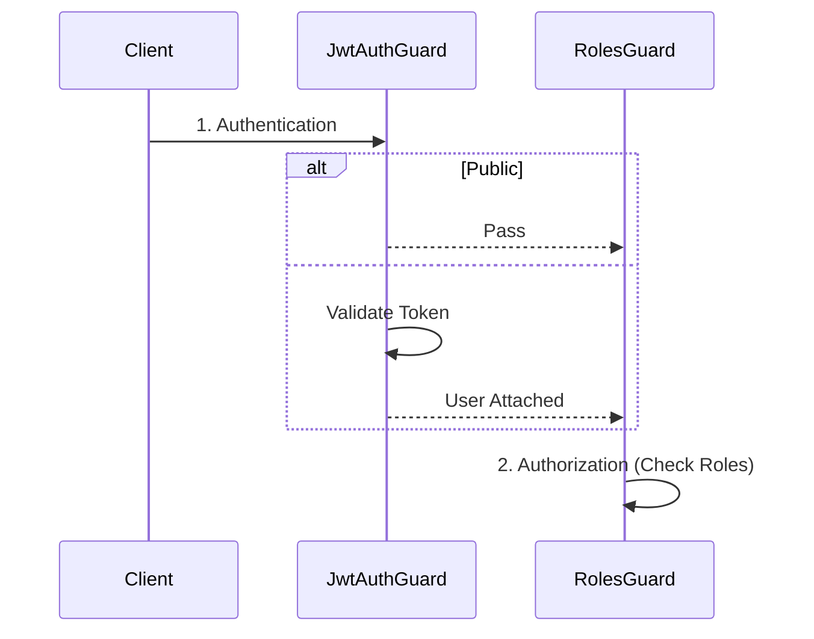
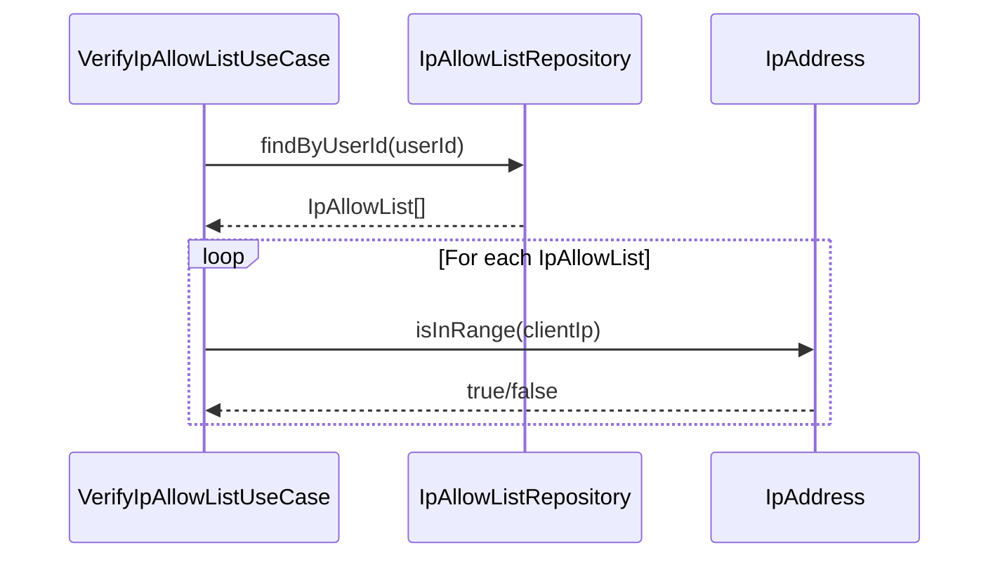
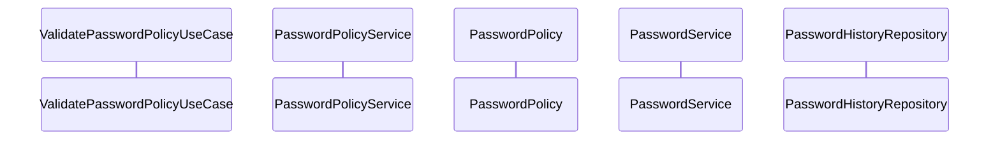

### 13-10. ガードパイプラインと型の一貫性（PR #35）

**学習元**: PR #35 - Task 3.3: RBAC実装設計（Geminiレビュー指摘）

#### ガード実行パイプラインの明確化

**問題**: シーケンス図などで、認可ガード（`RolesGuard`）が認証ガード（`JwtAuthGuard`）を直接呼び出すように描くと、NestJSの実行モデル（パイプライン処理）と矛盾し、誤解を招く。

**解決策**:
1. **グローバルガードの順序定義**: `AppModule` に両方のガードを登録し、実行順序を明確にする（認証 → 認可）。
2. **依存関係の分離**: `RolesGuard` は `JwtAuthGuard` を呼び出すのではなく、前のパイプラインで処理された結果（`request.user`）を利用する設計にする。
3. **公開エンドポイントの扱い**: `JwtAuthGuard` 側で `@Public` を検知し、認証エラーをスローせずに通過させる（Optional Auth）。



**理由**:
- フレームワークの仕組みに沿った正確な設計
- 各ガードの責務の明確化（認証と認可の分離）

#### クラス図における型表記

**問題**: クラス図などの設計書で `String` のような言語固有のクラス型とプリミティブ型 `string` が混在すると、実装時に混乱する。

**解決策**: TypeScript/JavaScriptのコンテキストでは、プリミティブ型には小文字の `string`, `number`, `boolean` を使用し、コードの実装と一致させる。

**理由**:
- 設計と実装の一貫性維持

### 13-11. 設定値のハードコーディング回避と命名規則（PR #36）

**学習元**: PR #36 - RBAC実装とRedisセッション管理（Geminiレビュー指摘）

#### 設定値の動的取得

**問題**: ユースケース層（`LoginUseCase`など）でトークンの有効期限などの設定値をハードコーディング（例: `const expiresIn = 1800;`）すると、環境変数や設定ファイルによる変更が反映されず、柔軟性が損なわれる。

**解決策**:
1. **サービス経由の取得**: 設定値を管理するサービス（`JwtService`など）にゲッターメソッドを追加し、そこから値を取得する。
2. **ConfigServiceの利用**: サービス自体も `ConfigService` を注入して環境変数から値を読み込むようにする。

```typescript
// Bad
const expiresIn = 1800;

// Good
const expiresIn = this.jwtService.getExpiresIn();
```

**理由**:
- 環境ごとの設定変更への対応
- 設定の一元管理

#### パラメータの命名規則

**問題**: メソッドの引数名に `pass` のような省略形を使用すると、可読性が低下し、意図が伝わりにくくなる。

**解決策**: `password` のように省略せずに記述する。

**理由**:
- コードの可読性と保守性の向上
- チーム開発における共通認識の維持

### 13-12. バックアップコードのライフサイクル管理と責務分離（PR #37）

**学習元**: PR #37 - MFA機能実装設計（Geminiレビュー指摘）

#### バックアップコードの提供タイミング

**問題**: MFAセットアップ時にバックアップコードを生成して返却すると、検証前にコードが漏洩するリスクがある。また、検証が完了しない場合に不要なコードが生成される。

**解決策**: バックアップコードは検証成功後にのみ生成・永続化し、その時点で一度だけ返却する。

```typescript
// Bad: セットアップ時にバックアップコードを生成
SetupMfaUseCase -> BackupCodeService.generateCodes()
SetupMfaUseCase -> return { qrCodeUrl, backupCodes, tempToken }

// Good: 検証成功後にバックアップコードを生成
VerifyMfaUseCase -> TotpService.verifyToken()
VerifyMfaUseCase -> BackupCodeService.generateCodes() // 検証成功後
VerifyMfaUseCase -> MfaRepository.saveBackupCodes()
VerifyMfaUseCase -> return { message, backupCodes }
```

**理由**:
- セキュリティ向上（検証前のコード漏洩防止）
- リソース効率（検証が完了しない場合の無駄な生成を防止）

#### バックアップコード管理APIの明確化

**問題**: バックアップコードの再生成機能が設計に含まれているが、API仕様が不明確。

**解決策**:
1. **バックアップコード一覧取得API**: 実際のコード値は返さず、使用済み/未使用の状態のみを返却する。
2. **バックアップコード再生成API**: パスワード確認を必須とし、既存コードを無効化してから新規コードを生成する。

**理由**:
- セキュリティ向上（コード値の再表示を防止）
- ユーザビリティ向上（状態確認と再生成の明確な分離）

#### ドメインモデルとインフラストラクチャ層の責務分離

**問題**: `BackupCodeService` がDomain層とInfrastructure層のどちらに属するか不明確。

**解決策**:
- **Domain層**: `BackupCode` Value Object（ビジネスロジック、バリデーション）
- **Infrastructure層**: `BackupCodeService`（技術的な詳細：生成アルゴリズム、ハッシュ化）

```typescript
// Domain Layer - Value Object (ビジネスロジックのみ)
class BackupCode {
  private constructor(private readonly code: string) {}
  static create(code: string): BackupCode { 
    // バリデーション: 形式チェック（例: /^[A-Z0-9]{4}-[A-Z0-9]{4}$/）
    if (!this.isValidFormat(code)) {
      throw new Error('Invalid backup code format');
    }
    return new BackupCode(code);
  }
  getValue(): string { return this.code; }
  equals(other: BackupCode): boolean { return this.code === other.code; }
  private static isValidFormat(code: string): boolean { /* validation logic */ }
}

// Infrastructure Layer - Service (技術的な詳細)
class BackupCodeService {
  // 技術的な実装: ランダム文字列生成アルゴリズム
  generateCodes(count: number): string[] { 
    // 外部ライブラリや技術的な詳細を含む
    return Array.from({ length: count }, () => this.generateRandomCode());
  }
  // 技術的な実装: bcryptハッシュ化
  hashCode(code: string): string { 
    return bcrypt.hashSync(code, 10);
  }
  // 技術的な実装: ハッシュ比較
  verifyCode(code: string, hash: string): boolean { 
    return bcrypt.compareSync(code, hash);
  }
}
```

**理由**:
- Onion Architectureの原則に従った明確な責務分離
- テスト容易性の向上（Domain層の独立性）
- 技術的な詳細の変更がDomain層に影響しない

#### ユースケースの役割の明確化

**問題**: 複数のユースケースが混在し、各ユースケースの責務が不明確になる。

**解決策**: 各ユースケースは単一の責務を持つように設計し、必要に応じて他のユースケースを呼び出す。

```typescript
// Bad: 1つのユースケースが複数の責務を持つ
class VerifyMfaUseCase {
  execute(userId, code, type) {
    // 検証処理
    // バックアップコード生成処理 ← 別の責務
    // 永続化処理
  }
}

// Good: 責務を分離
class VerifyMfaUseCase {
  constructor(
    private generateBackupCodesUseCase: GenerateBackupCodesUseCase
  ) {}
  
  execute(userId, code, type) {
    // 検証処理のみ
    if (this.verifyCode(code)) {
      // 必要に応じて他のユースケースを呼び出す
      if (type === 'SETUP') {
        return this.generateBackupCodesUseCase.execute(userId);
      }
    }
  }
}

class GenerateBackupCodesUseCase {
  execute(userId) {
    // バックアップコード生成・永続化のみ
  }
}
```

**理由**:
- 単一責任の原則（SRP）に従う
- テスト容易性の向上
- 再利用性の向上

### 13-13. TOTP仕様の明確化とデータベース設計の冗長性排除（PR #37）

**学習元**: PR #37 - MFA機能実装設計（Geminiレビュー指摘）

#### TOTPハッシュアルゴリズムの明確化

**問題**: TOTPのアルゴリズム仕様が簡潔すぎて、将来の拡張性や互換性について不明確。

**解決策**: RFC 6238の仕様を明確に記載し、デフォルトアルゴリズムと将来の拡張性について説明を追加する。

```markdown
### TOTP仕様

- **アルゴリズム**: HMAC-SHA1（RFC 6238準拠、デフォルト）
  - 注: RFC 6238ではHMAC-SHA256、HMAC-SHA512もサポートされているが、互換性のためHMAC-SHA1を使用
  - 将来的にアルゴリズムを変更する場合は、OTPAUTH URIの `algorithm` パラメータで指定可能
```

**理由**:
- 実装時の混乱を防止
- 将来の拡張性を考慮した設計の明確化

#### データベース設計の冗長性排除

**問題**: `backup_codes` テーブルに `used` (boolean) と `used_at` (timestamp) の両方があると、データの冗長性が発生し、整合性の問題が生じる可能性がある。

**解決策**: `used` フラグを削除し、`used_at` の有無で使用状態を判定する。

```sql
-- Bad: 冗長な設計
CREATE TABLE backup_codes (
  id UUID PRIMARY KEY,
  user_id UUID NOT NULL,
  code_hash VARCHAR(255) NOT NULL,
  used BOOLEAN NOT NULL DEFAULT false,  -- 冗長
  used_at TIMESTAMP NULL,               -- used_at があれば used = true
  created_at TIMESTAMP NOT NULL
);

-- Good: 冗長性を排除
CREATE TABLE backup_codes (
  id UUID PRIMARY KEY,
  user_id UUID NOT NULL,
  code_hash VARCHAR(255) NOT NULL,
  used_at TIMESTAMP NULL,  -- NULL = 未使用、値あり = 使用済み
  created_at TIMESTAMP NOT NULL
);
```

**理由**:
- データの整合性向上（単一の真実の源）
- ストレージの節約
- クエリの簡素化（`used_at IS NULL` で未使用を判定）

#### 設計書間の一貫性確保

**問題**: クラス図、シーケンス図、API仕様、データベーススキーマの間で不整合があると、実装時に混乱が生じる。

**解決策**: 
1. データベーススキーマ変更時は、関連する全ての設計書を同時に更新する
2. レビュー時に設計書間の整合性を確認する
3. 変更履歴を追跡しやすくするため、設計書を一括で更新する

**理由**:
- 実装時の混乱防止
- 設計の信頼性向上

### 13-14. セキュリティ強化とエラーハンドリングの改善（PR #38）

**学習元**: PR #38 - MFA E2Eテストの修正とバックアップコード検証ロジックの改善（Geminiレビュー指摘）

#### 暗号学的に安全な乱数生成

**問題**: バックアップコードのようなセキュリティ上重要な値の生成に `Math.random()` を使用すると、予測可能な値が生成されるリスクがある。

**解決策**: Node.jsの `crypto` モジュールの `randomInt()` を使用して、暗号学的に安全な乱数を生成する。

```typescript
// Bad: 予測可能な乱数生成
code += characters.charAt(Math.floor(Math.random() * characters.length));

// Good: 暗号学的に安全な乱数生成
import { randomInt } from 'crypto';
code += characters.charAt(randomInt(characters.length));
```

**理由**:
- セキュリティ強化（予測不可能な値の生成）
- 暗号学的に安全な乱数生成のベストプラクティスに準拠

#### タイミング攻撃対策

**問題**: バックアップコード検証時に、有効なコードが見つかるとすぐにループを終了すると、コードの位置によって応答時間が変わり、タイミング攻撃に対して脆弱になる。

**解決策**: `Promise.all` を使用して全ての未使用コードを並行して検証し、応答時間がコードの位置に依存しないようにする。

```typescript
// Bad: 順次検証でタイミング攻撃に脆弱
for (const record of allRecords) {
  if (record.usedAt !== null) continue;
  const isCodeValid = await this.backupCodeService.verify(code, record.codeHash);
  if (isCodeValid) {
    await this.mfaRepository.markBackupCodeAsUsed(userId, record.codeHash);
    break; // 早期終了でタイミング情報が漏洩
  }
}

// Good: 並行検証でタイミング攻撃を緩和
const verificationPromises = allRecords
  .filter((record) => record.usedAt === null)
  .map(async (record) => ({
    isMatch: await this.backupCodeService.verify(code, record.codeHash),
    hash: record.codeHash,
  }));

const verificationResults = await Promise.all(verificationPromises);
const validResult = verificationResults.find((result) => result.isMatch);
if (validResult) {
  await this.mfaRepository.markBackupCodeAsUsed(userId, validResult.hash);
}
```

**理由**:
- セキュリティ強化（タイミング攻撃の緩和）
- 応答時間の一貫性確保

#### NestJSの組み込み例外の使用

**問題**: 汎用的な `Error` クラスを使用すると、コントローラー層でエラーメッセージ文字列に依存した分岐が必要になり、コードの堅牢性と保守性が低下する。

**解決策**: NestJSの組み込み例外（`NotFoundException`, `ConflictException`, `UnauthorizedException`, `BadRequestException` など）を使用する。

```typescript
// Bad: 汎用的なErrorクラス
if (!user) {
  throw new Error('User not found');
}
if (user.mfaEnabled) {
  throw new Error('MFA is already enabled');
}

// Good: NestJSの組み込み例外
import { NotFoundException, ConflictException } from '@nestjs/common';
if (!user) {
  throw new NotFoundException('User not found');
}
if (user.mfaEnabled) {
  throw new ConflictException('MFA is already enabled');
}
```

**理由**:
- エラーハンドリングの一貫性向上
- HTTPステータスコードの自動設定
- コントローラー層でのエラーメッセージ文字列解析が不要

#### ユースケースの自己完結性

**問題**: ユースケースが `userId` を引数に取るが、そのユーザーが存在するかどうかの検証が行われていない場合、後続の処理で予期しないエラーが発生する可能性がある。

**解決策**: ユースケースは自己完結しているべきであり、入力の妥当性を検証する。`IUserRepository` を注入し、`execute` メソッドの冒頭でユーザーの存在確認を行う。

```typescript
// Bad: ユーザー存在確認なし
@Injectable()
export class GenerateBackupCodesUseCase {
  constructor(
    @Inject('IMfaRepository')
    private readonly mfaRepository: IMfaRepository,
  ) {}
  
  public async execute(userId: string): Promise<GenerateBackupCodesResult> {
    const codes = this.backupCodeService.generateCodes();
    // ユーザーが存在しない場合のエラーハンドリングがない
  }
}

// Good: ユーザー存在確認を追加
@Injectable()
export class GenerateBackupCodesUseCase {
  constructor(
    @Inject('IUserRepository')
    private readonly userRepository: IUserRepository,
    @Inject('IMfaRepository')
    private readonly mfaRepository: IMfaRepository,
  ) {}
  
  public async execute(userId: string): Promise<GenerateBackupCodesResult> {
    const user = await this.userRepository.findById(userId);
    if (!user) {
      throw new NotFoundException('User not found');
    }
    const codes = this.backupCodeService.generateCodes();
  }
}
```

**理由**:
- 早期エラー検出
- ユースケースの自己完結性向上
- デバッグの容易性向上

#### 依存性注入の一貫性

**問題**: モジュール内のプロバイダーで、依存性の注入方法に一貫性がない。一部のプロバイダーはクラス名で直接注入されているが、他の多くは文字列トークンを使用している。

**解決策**: クラスベースのDIに統一する。クラス名で直接提供されているプロバイダー（`TotpService`, `QrCodeService`, `BackupCodeService`, `GenerateBackupCodesUseCase` など）は、`@Inject()` デコレータを削除してクラス名で直接注入する。インターフェース（`IUserRepository`, `IMfaRepository` など）やファクトリで提供されるプロバイダー（`PasswordService`, `JwtService` など）は文字列トークンを使用する。

```typescript
// Bad: 文字列トークンとクラス名が混在
@Injectable()
export class SetupMfaUseCase {
  constructor(
    @Inject('IUserRepository')
    private readonly userRepository: IUserRepository,
    @Inject('TotpService')  // クラス名で提供されているのに文字列トークンを使用
    private readonly totpService: TotpService,
    @Inject('QrCodeService')  // クラス名で提供されているのに文字列トークンを使用
    private readonly qrCodeService: QrCodeService,
  ) {}
}

// Good: クラスベースのDIに統一
@Injectable()
export class SetupMfaUseCase {
  constructor(
    @Inject('IUserRepository')  // インターフェースは文字列トークン
    private readonly userRepository: IUserRepository,
    private readonly totpService: TotpService,  // クラス名で直接注入
    private readonly qrCodeService: QrCodeService,  // クラス名で直接注入
  ) {}
}
```

**理由**:
- 型安全性の向上
- コードの簡潔性向上
- 文字列トークンの重複定義の解消
- 保守性の向上

#### 未使用コードの削除

**問題**: 未使用のメソッドやインポートが残っていると、混乱を招き、保守の負担となる。

**解決策**: 未使用のコードは削除する。特に、インターフェースで定義されていないメソッドや、どこからも使用されていないメソッドは削除する。

```typescript
// Bad: 未使用のメソッドが残っている
export class MfaRepository implements IMfaRepository {
  public async findBackupCodeByHash(
    userId: string,
    codeHash: string,
  ): Promise<BackupCodeRecord | null> {
    // このメソッドはインターフェースで定義されておらず、使用されていない
  }
}

// Good: 未使用のメソッドを削除
export class MfaRepository implements IMfaRepository {
  // findBackupCodeByHashメソッドを削除
}
```

**理由**:
- コードの可読性向上
- 保守の負担軽減
- 混乱の防止

#### 冗長なコメントの削除

**問題**: 実装が完了しているにもかかわらず、TODOコメントや冗長なコメントが残っていると、混乱を招く。

**解決策**: 実装が完了している場合は、TODOコメントや冗長なコメントを削除する。

```typescript
// Bad: 実装済みなのにTODOコメントが残っている
} else {
  // ログイン検証成功時は、バックアップコードを使用済みとしてマーク（バックアップコードの場合）
  if (type === MfaVerificationType.BACKUP_CODE) {
    // TODO: 使用したバックアップコードを特定してマーク
    // 現在の実装では、どのハッシュが使用されたかを特定できない
  }
  return { success: true };
}

// Good: 実装済みの場合はコメントを削除
} else {
  // ログイン検証成功時
  // バックアップコードの場合は、上記の検証処理で既に使用済みとしてマークされている
  return { success: true };
}
```

**理由**:
- コードの可読性向上
- 混乱の防止
- 保守の負担軽減

### 13-14. Guardの適用タイミングとログイン時のIP検証（PR #39）

**学習元**: PR #39 - IP AllowList機能の詳細設計（Geminiレビュー指摘）

#### Guardは認証前に動作するため、ログインエンドポイントには適用できない

**問題**: Guardはコントローラーのメソッドが実行される「前」に動作するため、ログインエンドポイントに適用すると、ユーザー認証が完了しておらず`userId`を取得できません。そのため、Guard内でIP検証を行うことは困難です。

**解決策**: ログイン時のIP検証は`LoginUseCase`内で認証成功後に実行する。

```typescript
// Bad: Guardでログイン時のIP検証を試みる（認証前にuserIdが取得できない）
@Injectable()
export class IpAllowListGuard implements CanActivate {
  async canActivate(context: ExecutionContext): Promise<boolean> {
    const userId = request.user?.sub; // ログイン前は取得できない
    // ...
  }
}

// Good: LoginUseCase内で認証成功後にIP検証
@Injectable()
export class LoginUseCase {
  async execute(email: string, password: string, clientIp: string): Promise<LoginResult> {
    // パスワード認証
    const user = await this.userRepository.findByEmail(email);
    // ...
    
    // 認証成功後、IP検証
    const isAllowed = await this.verifyIpAllowListUseCase.execute(user.id, clientIp);
    if (!isAllowed) {
      throw new ForbiddenException('Access denied from this IP address');
    }
    
    // JWTトークン生成
    return { accessToken, ... };
  }
}
```

**理由**:
- Guardの実行タイミングと認証フローの整合性
- 実装時の誤解を防ぐ

#### グローバルガードとして登録する際の注意

**問題**: `IpAllowListGuard`をグローバルガード（`APP_GUARD`）として登録すると、認証前のパブリックなエンドポイント（ログイン画面など）へのアクセスもブロックしてしまいます。

**解決策**: IP検証が必要なエンドポイントにのみ適用するか、`LoginUseCase`内で処理する設計を採用する。

**理由**:
- パブリックエンドポイントへの影響を回避
- 設計の一貫性

#### Value ObjectとServiceの責務分担

**問題**: `IpAddress` Value Objectと`IpAddressService`の間で、責務の重複が見られる。`validate`や`isInRange`といったメソッドが両方のクラスに存在しており、どちらが主たる責務を負うのかが不明確。

**解決策**: Value Objectの関心事をクラス内にカプセル化するため、バリデーション、CIDRパース、範囲チェック（`isInRange`）などのロジックは`IpAddress` Value Objectに集約する。`IpAddressService`は、外部ライブラリとの連携など、よりインフラストラクチャ層に近い純粋な技術的処理に特化させる。

```typescript
// Good: Value Object内にバリデーションと範囲チェックをカプセル化
export class IpAddress {
  private readonly value: string;
  private readonly cidr?: number;

  constructor(value: string) {
    this.validate(value); // Value Object内でバリデーション
    this.value = value;
    this.parseCidr(value); // Value Object内でCIDRパース
  }

  public isInRange(ip: string): boolean {
    // Value Object内で範囲チェック
    // CIDR記法の場合、指定されたIPアドレスが範囲内かチェック
    // 単一IPアドレスの場合は完全一致をチェック
  }

  private validate(value: string): void {
    // IPv4/IPv6形式、CIDR記法の検証
  }
}

// Good: Serviceは外部ライブラリとの連携に特化
@Injectable()
export class IpAddressService {
  public createFromString(value: string): IpAddress {
    // 外部ライブラリ（ipaddr.js等）を使用して検証
    // IpAddress Value Objectのファクトリメソッドとして機能
    return new IpAddress(value);
  }
}
```

**理由**:
- ドメイン駆動設計の原則に沿った設計
- Value Objectの不変性と正当性を維持する責務の明確化
- 設計の一貫性

#### データベースインデックスの最適化

**問題**: `ip_address`カラムに対する個別のインデックス`idx_ip_allowlists_ip_address`は、冗長である可能性があります。`UNIQUE(user_id, ip_address)`制約により、`(user_id, ip_address)`の複合インデックスが既に作成されます。

**解決策**: IPアドレスの重複チェックや検索は、通常`user_id`とセットで行われるため、複合インデックスで効率的に処理できます。単独の`ip_address`インデックスは、全ユーザーを横断してIPアドレスを検索するような特殊なケースでなければ削除する。

**理由**:
- インデックスの冗長性を排除
- スキーマのシンプル化
- パフォーマンスへの影響を最小化

#### APIレスポンス形式の簡素化

**問題**: 一覧取得APIのレスポンス形式について、`ipAllowLists`というキーでラップされていますが、ページネーションのメタデータを含まない場合、よりシンプルな形式も検討の余地がある。

**解決策**: ページネーション（`limit`, `offset`など）のメタデータを含まない場合、クライアント側での扱いを容易にするため、レスポンスボディのルートを直接配列 `[...]` にする。将来的にページネーションを導入する計画がある場合は、オブジェクト形式を維持する。

**理由**:
- クライアント側での扱いの容易さ
- レスポンス形式の簡素化

### 13-15. データベースインデックスの冗長性排除とRESTful API設計（PR #39）

**学習元**: PR #39 - IP AllowList機能の詳細設計（Geminiレビュー指摘）

#### データベースインデックスの冗長性排除

**問題**: `UNIQUE(user_id, ip_address)`制約により、`(user_id, ip_address)`の複合インデックスが既に作成されます。多くのデータベース（PostgreSQLやMySQLなど）では、複合インデックスの先頭カラム（この場合は`user_id`）に対するクエリでも、その複合インデックスが効率的に利用されます。

**解決策**: `user_id`カラムの個別インデックスは冗長であり、削除してもパフォーマンスに影響はありません。

```sql
-- Bad: 冗長なインデックス
CREATE TABLE ip_allowlists (
  user_id UUID NOT NULL,
  ip_address VARCHAR(45) NOT NULL,
  UNIQUE(user_id, ip_address)
);
CREATE INDEX idx_ip_allowlists_user_id ON ip_allowlists(user_id); -- 冗長

-- Good: 複合インデックスのみ
CREATE TABLE ip_allowlists (
  user_id UUID NOT NULL,
  ip_address VARCHAR(45) NOT NULL,
  UNIQUE(user_id, ip_address) -- これにより複合インデックスが作成される
);
```

**理由**:
- ストレージ使用量の削減
- 書き込み（INSERT/UPDATE/DELETE）時のインデックス更新コストの削減
- スキーマの簡素化

#### RESTful API設計: DELETE操作のレスポンス

**問題**: `DELETE`操作の成功時にステータスコード`200 OK`とメッセージを含むJSONボディを返却しているが、クライアントに返すべきコンテンツがない場合、よりRESTfulな設計が推奨される。

**解決策**: `DELETE`操作が成功し、クライアントに返すべきコンテンツがない場合、ステータスコード`204 No Content`と空のボディを返す。

```typescript
// Bad: 200 OK with message
@Delete(':id')
async remove(@Param('id') id: string) {
  await this.removeIpAllowListUseCase.execute(userId, id);
  return { message: 'IP address removed from allowlist successfully' };
}

// Good: 204 No Content
@Delete(':id')
@HttpCode(HttpStatus.NO_CONTENT)
async remove(@Param('id') id: string) {
  await this.removeIpAllowListUseCase.execute(userId, id);
  // 空のボディを返す（何も返さない）
}
```

**理由**:
- クライアントはレスポンスボディをパースする必要がなくなり、処理がシンプルになる
- APIの意図がより明確になる（「削除が成功し、返すコンテンツはない」）
- RESTのベストプラクティスに準拠

#### シーケンス図における責務分担の明確化

**問題**: シーケンス図で`VerifyIpAllowListUseCase`が`IpAddressService`の`isInRange`メソッドを呼び出すように描かれているが、設計方針では`isInRange`のようなドメインロジックは`IpAddress` Value Object内にカプセル化する方針が示されている。

**解決策**: `VerifyIpAllowListUseCase`は、取得した各`IpAddress` Value Objectの`isInRange(clientIp)`メソッドを直接呼び出して検証を行う。



**理由**:
- ドメインロジックがValue Objectに集約される
- `IpAddressService`はVOの生成（ファクトリ）や外部ライブラリとの連携といったインフラ層の責務に特化
- 設計の一貫性を保つ

### 13-16. パスワードポリシー設計におけるValue ObjectとServiceの責務分担（PR #40）

**学習元**: PR #40 - パスワードポリシー機能の詳細設計（Geminiレビュー指摘）

#### Value ObjectとServiceの責務分担

**問題**: `PasswordPolicy` Value Objectと`PasswordPolicyService`の間で、責務の重複が見られる。`validateComplexity`や`checkComplexity`といったメソッドが両方のクラスに存在しており、どちらが主たる責務を負うのかが不明確。

**解決策**: Value Objectの関心事をクラス内にカプセル化するため、バリデーション、複雑さチェック（`validate`、`checkComplexity`）などのロジックは`PasswordPolicy` Value Objectに集約する。`PasswordPolicyService`は、Value Objectの生成（ファクトリメソッド）やパスワード強度スコア計算など、よりインフラストラクチャ層に近い純粋な技術的処理に特化させる。

```typescript
// Good: Value Object内にバリデーションと複雑さチェックをカプセル化
export class PasswordPolicy {
  private readonly minLength: number;
  private readonly maxLength: number;
  private readonly requireUppercase: boolean;
  private readonly requireLowercase: boolean;
  private readonly requireNumbers: boolean;
  private readonly requireSymbols: boolean;
  private readonly historyCount: number;

  constructor(
    minLength: number,
    maxLength: number,
    requireUppercase: boolean,
    requireLowercase: boolean,
    requireNumbers: boolean,
    requireSymbols: boolean,
    historyCount: number,
  ) {
    this.minLength = minLength;
    this.maxLength = maxLength;
    this.requireUppercase = requireUppercase;
    this.requireLowercase = requireLowercase;
    this.requireNumbers = requireNumbers;
    this.requireSymbols = requireSymbols;
    this.historyCount = historyCount;
  }

  public validate(password: string): ComplexityResult {
    // Value Object内でバリデーションと複雑さチェック
    const errors: string[] = [];
    
    if (password.length < this.minLength) {
      errors.push(`Password must be at least ${this.minLength} characters long`);
    }
    if (password.length > this.maxLength) {
      errors.push(`Password must be at most ${this.maxLength} characters long`);
    }
    if (this.requireUppercase && !/[A-Z]/.test(password)) {
      errors.push('Password must contain at least one uppercase letter');
    }
    if (this.requireLowercase && !/[a-z]/.test(password)) {
      errors.push('Password must contain at least one lowercase letter');
    }
    if (this.requireNumbers && !/[0-9]/.test(password)) {
      errors.push('Password must contain at least one number');
    }
    if (this.requireSymbols && !/[!@#$%^&*()_+\-=\[\]{}|;:,.<>?]/.test(password)) {
      errors.push('Password must contain at least one symbol');
    }
    
    return {
      isValid: errors.length === 0,
      errors,
    };
  }
}

// Good: ServiceはValue Objectの生成（ファクトリ）や技術的な処理に特化
@Injectable()
export class PasswordPolicyService {
  public createPasswordPolicy(): PasswordPolicy {
    // 設定値からPasswordPolicy Value Objectを生成
    return new PasswordPolicy(
      parseInt(process.env.PASSWORD_MIN_LENGTH || '8', 10),
      parseInt(process.env.PASSWORD_MAX_LENGTH || '128', 10),
      process.env.PASSWORD_REQUIRE_UPPERCASE !== 'false',
      process.env.PASSWORD_REQUIRE_LOWERCASE !== 'false',
      process.env.PASSWORD_REQUIRE_NUMBERS !== 'false',
      process.env.PASSWORD_REQUIRE_SYMBOLS !== 'false',
      parseInt(process.env.PASSWORD_HISTORY_COUNT || '5', 10),
    );
  }

  public calculateStrengthScore(password: string): number {
    // 技術的なアルゴリズムによる強度スコア計算
    // 長さ、文字種の多様性、一般的なパターンの回避などを考慮
    let score = 0;
    // ... スコア計算ロジック
    return Math.min(100, score);
  }
}
```

**理由**:
- ドメイン駆動設計の原則に沿った設計
- Value Objectの不変性と正当性を維持する責務の明確化
- 設計の一貫性（IP AllowList設計と同様の原則）

#### パスワード履歴管理の責務分担

**問題**: パスワード履歴のチェックが`PasswordPolicyService`に含まれているが、これはRepositoryの責務であるべき。

**解決策**: パスワード履歴の保存・取得・検証は`PasswordHistoryRepository`の責務とする。`PasswordPolicyService`は技術的な処理（強度スコア計算など）に特化する。

```typescript
// Good: Repositoryが履歴管理を担当
@Injectable()
export class PasswordHistoryRepository implements IPasswordHistoryRepository {
  public async checkPasswordInHistory(
    userId: string,
    passwordHash: string,
    count: number,
  ): Promise<boolean> {
    const history = await this.getPasswordHistory(userId, count);
    return history.some((hash) => hash === passwordHash);
  }

  public async deleteOldHistory(userId: string, keepCount: number): Promise<void> {
    // 最新N個を保持し、古い履歴を削除
    // ...
  }
}
```

**理由**:
- 責務の明確化（Repositoryはデータアクセス、Serviceは技術的処理）
- 設計の一貫性

### 13-17. 設計ドキュメントの一貫性確保（PR #40）

**学習元**: PR #40 - パスワードポリシー機能の詳細設計（Geminiレビュー指摘）

#### Value Objectのメソッドの冗長性排除

**問題**: `PasswordPolicy` Value Objectに`validate`と`checkComplexity`の両方が存在し、責務が重複している。

**解決策**: Value Objectのメソッドは一貫性を保つため、`validate`メソッドのみに統一する。`checkComplexity`は削除する。

```typescript
// Bad: 冗長なメソッド
export class PasswordPolicy {
  public validate(password: string): ValidationResult { ... }
  public checkComplexity(password: string): ValidationResult { ... } // 冗長
}

// Good: validateメソッドのみ
export class PasswordPolicy {
  public validate(password: string): ValidationResult { ... }
}
```

**理由**:
- メソッドの一貫性
- 責務の明確化

#### Value Objectの戻り値型の明確化

**問題**: `ComplexityResult`に`strengthScore`が含まれているが、これはValue ObjectではなくServiceが計算する技術的な値である。

**解決策**: Value Objectの戻り値型は`ValidationResult`（`isValid`と`errors`のみ）とし、`strengthScore`はServiceが計算して別途返す。

```typescript
// Bad: Value Objectが技術的な値を含む
export class ValidationResult {
  isValid: boolean;
  errors: string[];
  strengthScore: number; // Serviceが計算する技術的な値
}

// Good: Value Objectはドメインロジックのみ
export class ValidationResult {
  isValid: boolean;
  errors: string[];
}

// Serviceが強度スコアを計算
@Injectable()
export class PasswordPolicyService {
  public calculateStrengthScore(password: string): number {
    // 技術的なアルゴリズム
  }
}
```

**理由**:
- Value Objectの責務の明確化（ドメインロジックのみ）
- Serviceの責務の明確化（技術的な処理）

#### テスト戦略における責務の正確な記述

**問題**: テスト戦略で「PasswordPolicyService: パスワード複雑さチェック」と記述されているが、これはValue Objectの責務である。

**解決策**: テスト戦略では各コンポーネントの実際の責務を正確に記述する。

```markdown
### ユニットテスト

- **PasswordPolicy Value Object**: ポリシー設定のバリデーション、不変性、パスワードの複雑さチェック
- **PasswordPolicyService**: Value Objectの生成（ファクトリ）、パスワード強度スコア計算
```

**理由**:
- テスト戦略の正確性
- 実装者の混乱を防ぐ

#### シーケンス図における参加者の明確化

**問題**: シーケンス図で`PasswordPolicy`や`PasswordService`が欠けており、データフローが不明確。

**解決策**: シーケンス図には、実際に呼び出されるすべての参加者を含める。



**理由**:
- データフローの明確化
- 設計ドキュメント間の一貫性

#### APIレスポンス形式の一貫性確保

**問題**: パスワード強度チェックAPIのレスポンス形式において、検証失敗時と成功時でレスポンス構造が異なる可能性がある。

**解決策**: APIレスポンス形式は一貫性を保つため、常に同じ構造を返す。検証失敗時でも`isReused`フィールドを含める（`false`を返す）。

```json
// Good: 一貫したレスポンス構造
{
  "isValid": false,
  "errors": [...],
  "strengthScore": 45,
  "isReused": false  // 検証失敗時も含める
}
```

**理由**:
- APIレスポンス形式の一貫性
- クライアント側での処理の簡素化

#### データフロー記述の完全性

**問題**: データフローの記述において、パスワード履歴チェックなどの重要なステップが省略されている。

**解決策**: データフローには、シーケンス図で示されているすべてのステップを含める。

```markdown
### パスワード強度チェックフロー

1. クライアントが `POST /api/v1/auth/password/validate` を呼び出し
2. `PasswordController` がリクエストを受信
3. `ValidatePasswordPolicyUseCase` が実行される
4. パスワードの複雑さチェック（PasswordPolicy Value Object経由）
5. パスワード強度スコアを計算（PasswordPolicyService経由）
6. パスワードをハッシュ化（PasswordService経由）
7. パスワード履歴をチェック（PasswordHistoryRepository経由）
8. 検証結果、強度スコア、再利用フラグを返却
```

**理由**:
- データフロー記述の完全性
- 実装者の理解を助ける

### 13-18. ダッシュボード設計における責務の明確化と依存性逆転の原則（PR #41）

**学習元**: PR #41 - ダッシュボード機能の詳細設計（Geminiレビュー指摘）

#### データ集計ロジックの責務分担

**問題**: データ集計ロジックの所在が、ユースケースとリポジトリの間で曖昧になっている。`DashboardRepository`が集計ロジックを持つのか、`GetDashboardDataUseCase`が持つのかが不明確。

**解決策**: データ集計ロジックはApplication層のUse Caseが担当する。Repositoryはデータの取得のみを担当し、集計は行わない。

```typescript
// Bad: Repositoryが集計ロジックを持つ
@Injectable()
export class DashboardRepository implements IDashboardRepository {
  public async getDashboardData(userId: string): Promise<DashboardData> {
    // 集計ロジックがRepositoryにある（責務が曖昧）
    const user = await this.userRepository.findById(userId);
    const mfaSecret = await this.mfaRepository.getSecret(userId);
    // ...
    return DashboardData.create(...);
  }
}

// Good: Use Caseが集計ロジックを持つ
@Injectable()
export class GetDashboardDataUseCase {
  constructor(
    @Inject('IUserRepository')
    private readonly userRepository: IUserRepository,
    @Inject('IMfaRepository')
    private readonly mfaRepository: IMfaRepository,
    @Inject('IIpAllowListRepository')
    private readonly ipAllowListRepository: IIpAllowListRepository,
  ) {}

  public async execute(userId: string): Promise<DashboardData> {
    // 並列実行で高速化
    const [user, mfaSecret, ipAllowListCount] = await Promise.all([
      this.userRepository.findById(userId),
      this.mfaRepository.getSecret(userId),
      this.ipAllowListRepository.countByUserId(userId),
    ]);

    if (!user) {
      throw new NotFoundException('User not found');
    }

    // 集計ロジックはUse Case内で実行
    return this.aggregateData(user, mfaSecret, ipAllowListCount);
  }

  private aggregateData(
    user: User,
    mfaSecret: string | null,
    ipAllowListCount: number,
  ): DashboardData {
    return DashboardData.create(
      user.id,
      user.email,
      user.role,
      user.mfaEnabled,
      ipAllowListCount,
      user.createdAt,
      null, // lastLoginAt（将来実装）
      null, // loginAttemptCount（将来実装）
    );
  }
}
```

**理由**:
- 責務の明確化（Repositoryはデータ取得、Use Caseはビジネスロジック）
- Onion Architectureの原則に沿った設計

#### 依存性逆転の原則（DIP）の遵守

**問題**: クラス図において、アプリケーション層がインフラストラクチャ層の具象クラス（`DashboardRepository`）に依存しており、依存性逆転の原則に反している。

**解決策**: Application層はDomain層のインターフェース（`IUserRepository`、`IMfaRepository`、`IIpAllowListRepository`）に依存する。具象クラスには依存しない。

```typescript
// Bad: 具象クラスに依存
@Injectable()
export class GetDashboardDataUseCase {
  constructor(
    private readonly dashboardRepository: DashboardRepository, // 具象クラス
  ) {}
}

// Good: インターフェースに依存
@Injectable()
export class GetDashboardDataUseCase {
  constructor(
    @Inject('IUserRepository')
    private readonly userRepository: IUserRepository, // インターフェース
    @Inject('IMfaRepository')
    private readonly mfaRepository: IMfaRepository, // インターフェース
    @Inject('IIpAllowListRepository')
    private readonly ipAllowListRepository: IIpAllowListRepository, // インターフェース
  ) {}
}
```

**理由**:
- 依存性逆転の原則（DIP）の遵守
- テスタビリティの向上
- 実装の交換可能性

#### ドキュメント間の一貫性確保

**問題**: シーケンス図とクラス図で、`DashboardRepository`の扱いが異なっており、設計の意図が不明確になっている。

**解決策**: すべての設計ドキュメントで一貫した設計を反映する。`DashboardRepository`は将来の統計情報永続化のために予約されているが、初期実装では使用しないことを明記する。

```markdown
**注意**: 初期実装では、`GetDashboardDataUseCase`が既存のRepository（`IUserRepository`、`IMfaRepository`、`IIpAllowListRepository`）を直接使用してデータを集計します。`DashboardRepository`は将来の統計情報永続化のために予約されていますが、初期実装では使用しません。
```

**理由**:
- 設計ドキュメント間の一貫性
- 実装者の混乱を防ぐ
- 将来の拡張性を明確化

#### レイヤー構成図における依存関係の明確化

**問題**: README.mdのレイヤー構成図において、初期実装で使用しない`IDashboardRepository`や`DashboardRepository`が含まれており、依存関係が不明確。

**解決策**: レイヤー構成図には、初期実装で実際に使用するコンポーネントのみを含める。将来実装のコンポーネントは別途説明する。

```markdown
### レイヤ構成

```
┌─────────────────────────────────────┐
│  Presentation Layer                 │
│  - DashboardController (New)       │
│  - DTOs (DashboardDto, etc.)       │
└──────────────┬──────────────────────┘
               │ 依存
┌──────────────▼──────────────────────┐
│  Application Layer                  │
│  - GetDashboardDataUseCase (New)   │
└──────────────┬──────────────────────┘
               │ 依存
┌──────────────▼──────────────────────┐
│  Domain Layer                       │
│  - DashboardData Value Object (New)│
│  - IUserRepository (Existing)      │
│  - IMfaRepository (Existing)        │
│  - IIpAllowListRepository (Future)  │
└──────────────┬──────────────────────┘
               │ 依存
┌──────────────▼──────────────────────┐
│  Infrastructure Layer               │
│  - UserRepository (Existing)       │
│  - MfaRepository (Existing)        │
│  - IpAllowListRepository (Future)  │
└─────────────────────────────────────┘
```

**注意**: 初期実装では、`GetDashboardDataUseCase`が既存のRepositoryインターフェースを直接使用します。`IDashboardRepository`と`DashboardRepository`は将来の統計情報永続化のために予約されていますが、初期実装では使用しません。
```

**理由**:
- レイヤー構成図の明確化
- 初期実装のスコープの明確化
- 実装者の混乱を防ぐ

#### 将来実装フィールドの明確化

**問題**: `lastLoginAt`や`loginAttemptCount`などのフィールドが、Value ObjectやDTOに含まれているが、初期実装のスコープに含まれるかどうかの記述が揺れている。

**解決策**: 初期実装で含まれるフィールドと将来実装で追加されるフィールドを明確に分けて記述する。初期実装では、将来実装のフィールドは`null`を返すことを明記する。

```markdown
#### 初期実装で含まれるフィールド

- `userId`: ユーザーID
- `email`: メールアドレス
- `role`: ユーザーロール
- `mfaEnabled`: MFA有効化状態
- `ipAllowListCount`: IP AllowList数（初期実装では0を返す）
- `accountCreatedAt`: アカウント作成日時

#### 将来実装で追加されるフィールド

- `lastLoginAt`: 最終ログイン日時（初期実装では`null`を返す）
- `loginAttemptCount`: ログイン試行回数（初期実装では`null`を返す）
```

**理由**:
- 初期実装のスコープの明確化
- 実装者の混乱を防ぐ
- 将来の拡張性を明確化

### 13-19. ダッシュボード設計におけるデータ取得の最適化とスタブ実装の明確化（PR #41）

**学習元**: PR #41 - ダッシュボード機能の詳細設計（Geminiレビュー指摘）

#### MFA状態取得の最適化

**問題**: MFA有効状態の取得ロジックについて、`IMfaRepository.getSecret(userId)`を呼び出す現在の設計は冗長である可能性がある。`User`エンティティに既に`mfaEnabled`プロパティが存在するため、別途Repositoryを呼び出す必要はない。

**解決策**: MFA状態は`User`エンティティの`mfaEnabled`プロパティから直接取得する。`IMfaRepository`を呼び出す必要はない。

```typescript
// Bad: 冗長なRepository呼び出し
@Injectable()
export class GetDashboardDataUseCase {
  constructor(
    @Inject('IUserRepository')
    private readonly userRepository: IUserRepository,
    @Inject('IMfaRepository')
    private readonly mfaRepository: IMfaRepository, // 不要
  ) {}

  public async execute(userId: string): Promise<DashboardData> {
    const [user, mfaSecret] = await Promise.all([
      this.userRepository.findById(userId),
      this.mfaRepository.getSecret(userId), // 冗長
    ]);
    
    // mfaSecretがnullでないかチェックしてmfaEnabledを判定
    const mfaEnabled = mfaSecret !== null;
    // ...
  }
}

// Good: Userエンティティのプロパティを直接使用
@Injectable()
export class GetDashboardDataUseCase {
  constructor(
    @Inject('IUserRepository')
    private readonly userRepository: IUserRepository,
    @Inject('IIpAllowListRepository')
    private readonly ipAllowListRepository: IIpAllowListRepository,
  ) {}

  public async execute(userId: string): Promise<DashboardData> {
    const [user, ipAllowListCount] = await Promise.all([
      this.userRepository.findById(userId),
      this.ipAllowListRepository.countByUserId(userId),
    ]);

    if (!user) {
      throw new NotFoundException('User not found');
    }

    // UserエンティティのmfaEnabledプロパティを直接使用
    return this.aggregateData(user, ipAllowListCount);
  }

  private aggregateData(user: User, ipAllowListCount: number): DashboardData {
    return DashboardData.create(
      user.id,
      user.email,
      user.role,
      user.mfaEnabled, // Userエンティティから直接取得
      ipAllowListCount,
      user.createdAt,
      null, // lastLoginAt（将来実装）
      null, // loginAttemptCount（将来実装）
    );
  }
}
```

**理由**:
- 冗長なRepository呼び出しの排除
- パフォーマンスの向上（並列実行のオーバーヘッド削減）
- 設計の簡素化

#### スタブ実装の明確化

**問題**: `IIpAllowListRepository`の初期実装における扱いについて、`(Future)`という表記が混乱を招く可能性がある。初期実装で使用する場合は、スタブ実装であることを明確にする必要がある。

**解決策**: 初期実装で使用するが、実際の機能が未実装の場合は、スタブ実装として明確に記述する。

```typescript
// Good: スタブ実装として明確に記述
@Injectable()
export class IpAllowListRepository implements IIpAllowListRepository {
  /**
   * IP AllowList数を取得する（スタブ実装）
   * 初期実装では常に0を返す
   * TODO: IP AllowList機能実装後に実際のカウントを返す
   */
  public async countByUserId(userId: string): Promise<number> {
    // スタブ実装: 初期実装では常に0を返す
    return 0;
  }
}
```

設計ドキュメントでは以下のように記述：

```markdown
- **IpAllowListRepository (Stub)**: IP AllowList数の取得（初期実装ではスタブ実装で0を返す）
```

**理由**:
- 初期実装のスコープの明確化
- 実装者の混乱を防ぐ
- スタブ実装であることの明示

---

### PR #42 レビューからの学習

#### テストコードでの型安全性の向上

**問題**: テストコードで`as any`を使用すると型安全性が損なわれる。Jestのモックオブジェクトを作成する際に、適切な型付けを行うべき。

**解決策**: `as jest.Mocked<T>`を使用して型安全性を保つ。

```typescript
// Bad: 型安全性が損なわれる
mockUserRepository = {
  findByEmail: jest.fn(),
  findById: jest.fn(),
  save: jest.fn(),
} as any;

// Good: 適切な型付け
mockUserRepository = {
  findByEmail: jest.fn(),
  findById: jest.fn(),
  save: jest.fn(),
} as jest.Mocked<IUserRepository>;
```

**理由**:
- 型安全性の向上
- IDEの補完機能が正しく動作する
- コンパイル時のエラー検出が可能

#### 実行時間に依存するテストの安定性

**問題**: 実行時間に依存するテストは、実行環境（特にCI環境）によって失敗する可能性があり、不安定（flaky）になりがち。マージンが小さすぎると、環境の変動で失敗する可能性がある。

**解決策**: 実行時間のテストでは、十分なマージンを設定する。

```typescript
// Bad: マージンが小さすぎる（CI環境で失敗する可能性）
expect(duration).toBeLessThan(20);

// Good: 十分なマージンを設定
expect(duration).toBeLessThan(50);
```

**理由**:
- CI環境などでの実行時間の変動に対応
- テストの安定性向上
- フレーキーテストの防止

#### 不要なインポートの削除

**問題**: 使用されていないインポートが残っていると、コードの可読性が低下し、依存関係が不明確になる。

**解決策**: 使用されていないインポートは削除する。

```typescript
// Bad: 使用されていないインポート
import { UserRole } from '../../domain/entities/user-role.enum';

export class DashboardDto {
  public readonly role: string; // UserRoleではなくstringを使用
  // ...
}

// Good: 不要なインポートを削除
export class DashboardDto {
  public readonly role: string;
  // ...
}
```

**理由**:
- コードの可読性向上
- 依存関係の明確化
- バンドルサイズの削減（ビルドツールによる最適化が効く場合）

### 13-19. E2Eテスト間でのRedis状態管理（PR #42）

**学習元**: PR #42 - Dashboard実装とテストスクリプト改善（E2Eテストの修正）

#### E2Eテスト間でのRedis状態の分離

**問題**: 複数のE2Eテストスイートが同じRedisインスタンスを使用する場合、テスト間で状態（特にトークンブラックリスト）が共有され、予期しない動作を引き起こす可能性がある。例えば、`auth.e2e-spec.ts`のログアウトテストでブラックリストに登録されたトークンが、`mfa.e2e-spec.ts`のテストに影響を与える。

**解決策**: 各テストスイートの`beforeAll`でRedisの状態をクリア（`flushdb`）して、テスト間の状態を分離する。

```typescript
// Bad: テスト間でRedisの状態が共有される
beforeAll(async () => {
  // Redis接続を待つ
  const testClient = new Redis({
    host: redisHost,
    port: redisPort,
    connectTimeout: 1000,
    lazyConnect: true,
  });
  await testClient.connect();
  await testClient.ping();
  await testClient.quit();
  // ブラックリストが残っている可能性がある
});

// Good: テスト開始時にRedisの状態をクリア
beforeAll(async () => {
  // Redis接続を待つ
  const testClient = new Redis({
    host: redisHost,
    port: redisPort,
    connectTimeout: 1000,
    lazyConnect: true,
  });
  await testClient.connect();
  await testClient.ping();
  // テスト間でRedisの状態が共有されないように、ブラックリストをクリア
  await testClient.flushdb();
  await testClient.quit();
});
```

**理由**:
- テスト間の独立性の確保
- 予期しないテスト失敗の防止
- テストの再現性向上
- CI環境での安定性向上

#### E2Eテストでのトークン管理

**問題**: E2Eテストで、前のテストで使用したトークンがブラックリストに登録されている可能性があるため、同じトークンを再利用すると401エラーが発生する。

**解決策**: 各テストで必要なトークンをその場で取得し、テスト間でのトークンの共有を避ける。また、テスト開始時にRedisの状態をクリアすることで、ブラックリストの影響を排除する。

```typescript
// Bad: 前のテストで取得したトークンを再利用
it('正常系: MFAセットアップ検証に成功する', async () => {
  // 前のテストで取得したトークンを使用（ブラックリストに登録されている可能性がある）
  const setupResponse = await request(app.getHttpServer())
    .post('/api/v1/auth/mfa/setup')
    .set('Authorization', `Bearer ${accessToken}`) // 前のテストのトークン
    .expect(200);
});

// Good: 各テストで新しいトークンを取得
it('正常系: MFAセットアップ検証に成功する', async () => {
  // 新しいトークンを取得
  const loginResponse = await request(app.getHttpServer())
    .post('/api/v1/auth/login')
    .send({
      email: 'user@example.com',
      password: 'password123',
    })
    .expect(200);

  const freshToken = loginResponse.body.accessToken;

  // 新しいトークンを使用
  const setupResponse = await request(app.getHttpServer())
    .post('/api/v1/auth/mfa/setup')
    .set('Authorization', `Bearer ${freshToken}`)
    .expect(200);
});
```

**理由**:
- テスト間の独立性の確保
- トークンの有効性の保証
- 予期しないテスト失敗の防止

### 13-12. 依存関係の逆転原則（DIP）の遵守（PR #43）

**学習元**: PR #43 - MWD-32: パスワードポリシー機能実装（Geminiレビュー指摘）

#### ドメイン層のインターフェースがインフラ層に依存しない

**問題**: ドメイン層のインターフェース（`IPasswordHistoryRepository`）が、インフラ層のサービス（`PasswordService`）に依存しているため、依存関係の逆転原則（DIP）に違反している。

**解決策**: ドメイン層のインターフェースからインフラ層への依存を削除し、比較ロジックをユースケース層に移動する。

```typescript
// Bad: ドメイン層のインターフェースがインフラ層に依存
export interface IPasswordHistoryRepository {
  checkPasswordInHistoryByPlainText(
    userId: string,
    password: string,
    passwordService: { compare: (password: string, hash: string) => Promise<boolean> }, // インフラ層への依存
    count: number,
  ): Promise<boolean>;
}

// Good: ドメイン層のインターフェースはインフラ層に依存しない
export interface IPasswordHistoryRepository {
  getPasswordHistory(userId: string, count: number): Promise<string[]>;
}

// ユースケース層で比較ロジックを実装
export class ChangePasswordUseCase {
  // パスワード履歴をチェック（平文パスワードを使用してbcrypt.compareで比較）
  // ドメイン層はインフラ層に依存しないため、ユースケース層で比較ロジックを実装
  const history = await this.passwordHistoryRepository.getPasswordHistory(userId, policy.historyCount);
  let isReused = false;
  for (const hash of history) {
    const isMatch = await this.passwordService.compare(newPassword, hash);
    if (isMatch) {
      isReused = true;
      break;
    }
  }
}
```

**理由**:
- 依存関係の逆転原則（DIP）の遵守
- ドメイン層の独立性の確保
- アーキテクチャの一貫性の維持

#### E2EテストのデバッグログとsetTimeoutの削除

**問題**: E2Eテストに多くのデバッグログ（`console.log`）が含まれており、テストコードが読みにくくなっている。また、`setTimeout`に依存したテストは不安定になる可能性がある。

**解決策**: デバッグログを削除し、`setTimeout`を削除または最小限にする。エラーハンドリングのログは必要最小限に留める。

```typescript
// Bad: 多くのデバッグログとsetTimeout
beforeEach(async () => {
  await testClient.flushdb();
  await new Promise((resolve) => setTimeout(resolve, 100)); // 不安定
  console.log(`[GET /api/v1/auth/password/policy] beforeEach: flushdb実行前`);
  console.log(`[GET /api/v1/auth/password/policy] beforeEach: ログイン前のブラックリストキー数 = ${keys.length}`);
  // ... 多くのデバッグログ
});

// Good: デバッグログを削除し、setTimeoutを削除
beforeEach(async () => {
  if (testClient) {
    try {
      await testClient.flushdb();
    } catch (error) {
      // Redis flushdb失敗時は続行
    }
  }
  
  const loginRes = await request(app.getHttpServer())
    .post('/api/v1/auth/login')
    .send({
      email: 'user@example.com',
      password: 'password123',
    })
    .expect(200);
  
  policyToken = loginRes.body.accessToken;
  expect(policyToken).toBeDefined();
  
  // 生成したトークンが既にブラックリストに登録されている場合、削除
  if (testClient && policyToken) {
    const isBlacklisted = await testClient.get(`blacklist:${policyToken}`);
    if (isBlacklisted) {
      await testClient.del(`blacklist:${policyToken}`);
    }
  }
});
```

**理由**:
- テストコードの可読性向上
- テストの安定性向上（`setTimeout`に依存しない）
- 本番環境に近いテストコード

#### 一時的なドキュメントファイルの削除

**問題**: 開発中の一時的なドキュメントファイル（`docs/e2e-token-timeline.md`など）がリポジトリに残っている。

**解決策**: 一時的なドキュメントファイルは、開発完了後に削除するか、正式なドキュメントとして整理する。

**理由**:
- リポジトリの整理
- 不要なファイルの削除
- ドキュメントの一貫性の維持

### 13-12. 依存関係の逆転原則（DIP）の遵守（PR #43）

**学習元**: PR #43 - MWD-32: パスワードポリシー機能実装（Geminiレビュー指摘）

#### ドメイン層のインターフェースがインフラ層に依存しない

**問題**: ドメイン層のインターフェース（`IPasswordHistoryRepository`）が、インフラ層のサービス（`PasswordService`）に依存しているため、依存関係の逆転原則（DIP）に違反している。

**解決策**: ドメイン層のインターフェースからインフラ層への依存を削除し、比較ロジックをユースケース層に移動する。

```typescript
// Bad: ドメイン層のインターフェースがインフラ層に依存
export interface IPasswordHistoryRepository {
  checkPasswordInHistoryByPlainText(
    userId: string,
    password: string,
    passwordService: { compare: (password: string, hash: string) => Promise<boolean> }, // インフラ層への依存
    count: number,
  ): Promise<boolean>;
}

// Good: ドメイン層のインターフェースはインフラ層に依存しない
export interface IPasswordHistoryRepository {
  getPasswordHistory(userId: string, count: number): Promise<string[]>;
}

// ユースケース層で比較ロジックを実装
export class ChangePasswordUseCase {
  // パスワード履歴をチェック（平文パスワードを使用してbcrypt.compareで比較）
  // ドメイン層はインフラ層に依存しないため、ユースケース層で比較ロジックを実装
  const history = await this.passwordHistoryRepository.getPasswordHistory(userId, policy.historyCount);
  let isReused = false;
  for (const hash of history) {
    const isMatch = await this.passwordService.compare(newPassword, hash);
    if (isMatch) {
      isReused = true;
      break;
    }
  }
}
```

**理由**:
- 依存関係の逆転原則（DIP）の遵守
- ドメイン層の独立性の確保
- アーキテクチャの一貫性の維持

#### E2EテストのデバッグログとsetTimeoutの削除

**問題**: E2Eテストに多くのデバッグログ（`console.log`）が含まれており、テストコードが読みにくくなっている。また、`setTimeout`に依存したテストは不安定になる可能性がある。

**解決策**: デバッグログを削除し、`setTimeout`を削除または最小限にする。エラーハンドリングのログは必要最小限に留める。

```typescript
// Bad: 多くのデバッグログとsetTimeout
beforeEach(async () => {
  await testClient.flushdb();
  await new Promise((resolve) => setTimeout(resolve, 100)); // 不安定
  console.log(`[GET /api/v1/auth/password/policy] beforeEach: flushdb実行前`);
  console.log(`[GET /api/v1/auth/password/policy] beforeEach: ログイン前のブラックリストキー数 = ${keys.length}`);
  // ... 多くのデバッグログ
});

// Good: デバッグログを削除し、setTimeoutを削除
beforeEach(async () => {
  if (testClient) {
    try {
      await testClient.flushdb();
    } catch (error) {
      // Redis flushdb失敗時は続行
    }
  }
  
  const loginRes = await request(app.getHttpServer())
    .post('/api/v1/auth/login')
    .send({
      email: 'user@example.com',
      password: 'password123',
    })
    .expect(200);
  
  policyToken = loginRes.body.accessToken;
  expect(policyToken).toBeDefined();
  
  // 生成したトークンが既にブラックリストに登録されている場合、削除
  if (testClient && policyToken) {
    const isBlacklisted = await testClient.get(`blacklist:${policyToken}`);
    if (isBlacklisted) {
      await testClient.del(`blacklist:${policyToken}`);
    }
  }
});
```

**理由**:
- テストコードの可読性向上
- テストの安定性向上（`setTimeout`に依存しない）
- 本番環境に近いテストコード

#### 一時的なドキュメントファイルの削除

**問題**: 開発中の一時的なドキュメントファイル（`docs/e2e-token-timeline.md`など）がリポジトリに残っている。

**解決策**: 一時的なドキュメントファイルは、開発完了後に削除するか、正式なドキュメントとして整理する。

**理由**:
- リポジトリの整理
- 不要なファイルの削除
- ドキュメントの一貫性の維持
