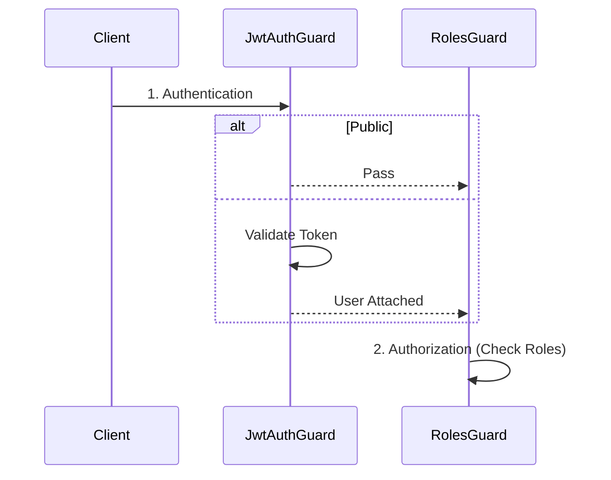

### 13-10. ガードパイプラインと型の一貫性（PR #35）

**学習元**: PR #35 - Task 3.3: RBAC実装設計（Geminiレビュー指摘）

#### ガード実行パイプラインの明確化

**問題**: シーケンス図などで、認可ガード（`RolesGuard`）が認証ガード（`JwtAuthGuard`）を直接呼び出すように描くと、NestJSの実行モデル（パイプライン処理）と矛盾し、誤解を招く。

**解決策**:
1. **グローバルガードの順序定義**: `AppModule` に両方のガードを登録し、実行順序を明確にする（認証 → 認可）。
2. **依存関係の分離**: `RolesGuard` は `JwtAuthGuard` を呼び出すのではなく、前のパイプラインで処理された結果（`request.user`）を利用する設計にする。
3. **公開エンドポイントの扱い**: `JwtAuthGuard` 側で `@Public` を検知し、認証エラーをスローせずに通過させる（Optional Auth）。



**理由**:
- フレームワークの仕組みに沿った正確な設計
- 各ガードの責務の明確化（認証と認可の分離）

#### クラス図における型表記

**問題**: クラス図などの設計書で `String` のような言語固有のクラス型とプリミティブ型 `string` が混在すると、実装時に混乱する。

**解決策**: TypeScript/JavaScriptのコンテキストでは、プリミティブ型には小文字の `string`, `number`, `boolean` を使用し、コードの実装と一致させる。

**理由**:
- 設計と実装の一貫性維持

### 13-11. 設定値のハードコーディング回避と命名規則（PR #36）

**学習元**: PR #36 - RBAC実装とRedisセッション管理（Geminiレビュー指摘）

#### 設定値の動的取得

**問題**: ユースケース層（`LoginUseCase`など）でトークンの有効期限などの設定値をハードコーディング（例: `const expiresIn = 1800;`）すると、環境変数や設定ファイルによる変更が反映されず、柔軟性が損なわれる。

**解決策**:
1. **サービス経由の取得**: 設定値を管理するサービス（`JwtService`など）にゲッターメソッドを追加し、そこから値を取得する。
2. **ConfigServiceの利用**: サービス自体も `ConfigService` を注入して環境変数から値を読み込むようにする。

```typescript
// Bad
const expiresIn = 1800;

// Good
const expiresIn = this.jwtService.getExpiresIn();
```

**理由**:
- 環境ごとの設定変更への対応
- 設定の一元管理

#### パラメータの命名規則

**問題**: メソッドの引数名に `pass` のような省略形を使用すると、可読性が低下し、意図が伝わりにくくなる。

**解決策**: `password` のように省略せずに記述する。

**理由**:
- コードの可読性と保守性の向上
- チーム開発における共通認識の維持
