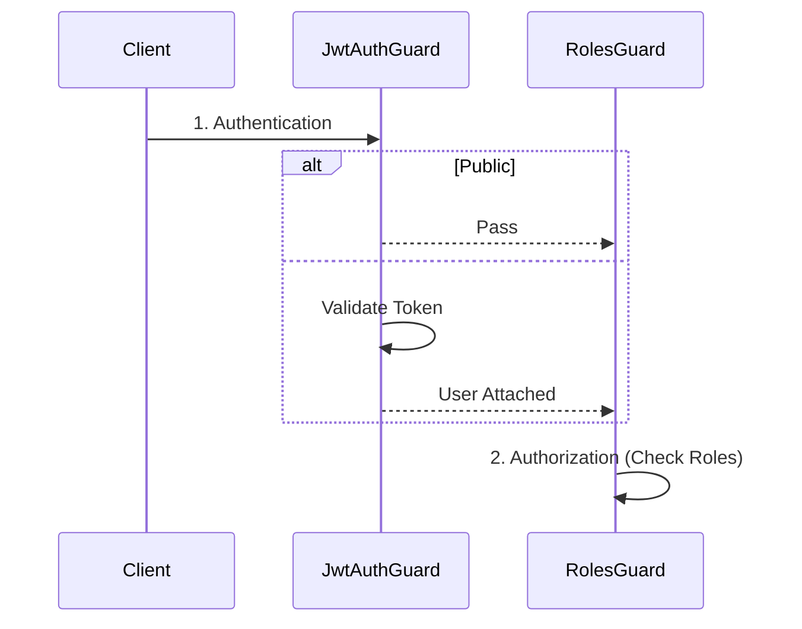

### 13-10. ガードパイプラインと型の一貫性（PR #35）

**学習元**: PR #35 - Task 3.3: RBAC実装設計（Geminiレビュー指摘）

#### ガード実行パイプラインの明確化

**問題**: シーケンス図などで、認可ガード（`RolesGuard`）が認証ガード（`JwtAuthGuard`）を直接呼び出すように描くと、NestJSの実行モデル（パイプライン処理）と矛盾し、誤解を招く。

**解決策**:
1. **グローバルガードの順序定義**: `AppModule` に両方のガードを登録し、実行順序を明確にする（認証 → 認可）。
2. **依存関係の分離**: `RolesGuard` は `JwtAuthGuard` を呼び出すのではなく、前のパイプラインで処理された結果（`request.user`）を利用する設計にする。
3. **公開エンドポイントの扱い**: `JwtAuthGuard` 側で `@Public` を検知し、認証エラーをスローせずに通過させる（Optional Auth）。



**理由**:
- フレームワークの仕組みに沿った正確な設計
- 各ガードの責務の明確化（認証と認可の分離）

#### クラス図における型表記

**問題**: クラス図などの設計書で `String` のような言語固有のクラス型とプリミティブ型 `string` が混在すると、実装時に混乱する。

**解決策**: TypeScript/JavaScriptのコンテキストでは、プリミティブ型には小文字の `string`, `number`, `boolean` を使用し、コードの実装と一致させる。

**理由**:
- 設計と実装の一貫性維持

### 13-11. 設定値のハードコーディング回避と命名規則（PR #36）

**学習元**: PR #36 - RBAC実装とRedisセッション管理（Geminiレビュー指摘）

#### 設定値の動的取得

**問題**: ユースケース層（`LoginUseCase`など）でトークンの有効期限などの設定値をハードコーディング（例: `const expiresIn = 1800;`）すると、環境変数や設定ファイルによる変更が反映されず、柔軟性が損なわれる。

**解決策**:
1. **サービス経由の取得**: 設定値を管理するサービス（`JwtService`など）にゲッターメソッドを追加し、そこから値を取得する。
2. **ConfigServiceの利用**: サービス自体も `ConfigService` を注入して環境変数から値を読み込むようにする。

```typescript
// Bad
const expiresIn = 1800;

// Good
const expiresIn = this.jwtService.getExpiresIn();
```

**理由**:
- 環境ごとの設定変更への対応
- 設定の一元管理

#### パラメータの命名規則

**問題**: メソッドの引数名に `pass` のような省略形を使用すると、可読性が低下し、意図が伝わりにくくなる。

**解決策**: `password` のように省略せずに記述する。

**理由**:
- コードの可読性と保守性の向上
- チーム開発における共通認識の維持

### 13-12. バックアップコードのライフサイクル管理と責務分離（PR #37）

**学習元**: PR #37 - MFA機能実装設計（Geminiレビュー指摘）

#### バックアップコードの提供タイミング

**問題**: MFAセットアップ時にバックアップコードを生成して返却すると、検証前にコードが漏洩するリスクがある。また、検証が完了しない場合に不要なコードが生成される。

**解決策**: バックアップコードは検証成功後にのみ生成・永続化し、その時点で一度だけ返却する。

```typescript
// Bad: セットアップ時にバックアップコードを生成
SetupMfaUseCase -> BackupCodeService.generateCodes()
SetupMfaUseCase -> return { qrCodeUrl, backupCodes, tempToken }

// Good: 検証成功後にバックアップコードを生成
VerifyMfaUseCase -> TotpService.verifyToken()
VerifyMfaUseCase -> BackupCodeService.generateCodes() // 検証成功後
VerifyMfaUseCase -> MfaRepository.saveBackupCodes()
VerifyMfaUseCase -> return { message, backupCodes }
```

**理由**:
- セキュリティ向上（検証前のコード漏洩防止）
- リソース効率（検証が完了しない場合の無駄な生成を防止）

#### バックアップコード管理APIの明確化

**問題**: バックアップコードの再生成機能が設計に含まれているが、API仕様が不明確。

**解決策**:
1. **バックアップコード一覧取得API**: 実際のコード値は返さず、使用済み/未使用の状態のみを返却する。
2. **バックアップコード再生成API**: パスワード確認を必須とし、既存コードを無効化してから新規コードを生成する。

**理由**:
- セキュリティ向上（コード値の再表示を防止）
- ユーザビリティ向上（状態確認と再生成の明確な分離）

#### ドメインモデルとインフラストラクチャ層の責務分離

**問題**: `BackupCodeService` がDomain層とInfrastructure層のどちらに属するか不明確。

**解決策**:
- **Domain層**: `BackupCode` Value Object（ビジネスロジック、バリデーション）
- **Infrastructure層**: `BackupCodeService`（技術的な詳細：生成アルゴリズム、ハッシュ化）

```typescript
// Domain Layer - Value Object (ビジネスロジックのみ)
class BackupCode {
  private constructor(private readonly code: string) {}
  static create(code: string): BackupCode { 
    // バリデーション: 形式チェック（例: /^[A-Z0-9]{4}-[A-Z0-9]{4}$/）
    if (!this.isValidFormat(code)) {
      throw new Error('Invalid backup code format');
    }
    return new BackupCode(code);
  }
  getValue(): string { return this.code; }
  equals(other: BackupCode): boolean { return this.code === other.code; }
  private static isValidFormat(code: string): boolean { /* validation logic */ }
}

// Infrastructure Layer - Service (技術的な詳細)
class BackupCodeService {
  // 技術的な実装: ランダム文字列生成アルゴリズム
  generateCodes(count: number): string[] { 
    // 外部ライブラリや技術的な詳細を含む
    return Array.from({ length: count }, () => this.generateRandomCode());
  }
  // 技術的な実装: bcryptハッシュ化
  hashCode(code: string): string { 
    return bcrypt.hashSync(code, 10);
  }
  // 技術的な実装: ハッシュ比較
  verifyCode(code: string, hash: string): boolean { 
    return bcrypt.compareSync(code, hash);
  }
}
```

**理由**:
- Onion Architectureの原則に従った明確な責務分離
- テスト容易性の向上（Domain層の独立性）
- 技術的な詳細の変更がDomain層に影響しない

#### ユースケースの役割の明確化

**問題**: 複数のユースケースが混在し、各ユースケースの責務が不明確になる。

**解決策**: 各ユースケースは単一の責務を持つように設計し、必要に応じて他のユースケースを呼び出す。

```typescript
// Bad: 1つのユースケースが複数の責務を持つ
class VerifyMfaUseCase {
  execute(userId, code, type) {
    // 検証処理
    // バックアップコード生成処理 ← 別の責務
    // 永続化処理
  }
}

// Good: 責務を分離
class VerifyMfaUseCase {
  constructor(
    private generateBackupCodesUseCase: GenerateBackupCodesUseCase
  ) {}
  
  execute(userId, code, type) {
    // 検証処理のみ
    if (this.verifyCode(code)) {
      // 必要に応じて他のユースケースを呼び出す
      if (type === 'SETUP') {
        return this.generateBackupCodesUseCase.execute(userId);
      }
    }
  }
}

class GenerateBackupCodesUseCase {
  execute(userId) {
    // バックアップコード生成・永続化のみ
  }
}
```

**理由**:
- 単一責任の原則（SRP）に従う
- テスト容易性の向上
- 再利用性の向上

### 13-13. TOTP仕様の明確化とデータベース設計の冗長性排除（PR #37）

**学習元**: PR #37 - MFA機能実装設計（Geminiレビュー指摘）

#### TOTPハッシュアルゴリズムの明確化

**問題**: TOTPのアルゴリズム仕様が簡潔すぎて、将来の拡張性や互換性について不明確。

**解決策**: RFC 6238の仕様を明確に記載し、デフォルトアルゴリズムと将来の拡張性について説明を追加する。

```markdown
### TOTP仕様

- **アルゴリズム**: HMAC-SHA1（RFC 6238準拠、デフォルト）
  - 注: RFC 6238ではHMAC-SHA256、HMAC-SHA512もサポートされているが、互換性のためHMAC-SHA1を使用
  - 将来的にアルゴリズムを変更する場合は、OTPAUTH URIの `algorithm` パラメータで指定可能
```

**理由**:
- 実装時の混乱を防止
- 将来の拡張性を考慮した設計の明確化

#### データベース設計の冗長性排除

**問題**: `backup_codes` テーブルに `used` (boolean) と `used_at` (timestamp) の両方があると、データの冗長性が発生し、整合性の問題が生じる可能性がある。

**解決策**: `used` フラグを削除し、`used_at` の有無で使用状態を判定する。

```sql
-- Bad: 冗長な設計
CREATE TABLE backup_codes (
  id UUID PRIMARY KEY,
  user_id UUID NOT NULL,
  code_hash VARCHAR(255) NOT NULL,
  used BOOLEAN NOT NULL DEFAULT false,  -- 冗長
  used_at TIMESTAMP NULL,               -- used_at があれば used = true
  created_at TIMESTAMP NOT NULL
);

-- Good: 冗長性を排除
CREATE TABLE backup_codes (
  id UUID PRIMARY KEY,
  user_id UUID NOT NULL,
  code_hash VARCHAR(255) NOT NULL,
  used_at TIMESTAMP NULL,  -- NULL = 未使用、値あり = 使用済み
  created_at TIMESTAMP NOT NULL
);
```

**理由**:
- データの整合性向上（単一の真実の源）
- ストレージの節約
- クエリの簡素化（`used_at IS NULL` で未使用を判定）

#### 設計書間の一貫性確保

**問題**: クラス図、シーケンス図、API仕様、データベーススキーマの間で不整合があると、実装時に混乱が生じる。

**解決策**: 
1. データベーススキーマ変更時は、関連する全ての設計書を同時に更新する
2. レビュー時に設計書間の整合性を確認する
3. 変更履歴を追跡しやすくするため、設計書を一括で更新する

**理由**:
- 実装時の混乱防止
- 設計の信頼性向上
