# クラス図 (Class Diagrams)

## WAFエンジン向け設定配信API関連クラス

```mermaid
classDiagram
    %% Presentation Layer
    class EngineConfigController {
        +getConfig(): Promise<EngineConfigResponseDto>
    }
    
    class EngineConfigResponseDto {
        +FqdnConfig[] fqdns
        +IpAllowListConfig[] ipAllowLists
        +CustomerConfig[] customers
        +string lastUpdated
    }
    
    class FqdnConfig {
        +string id
        +string fqdn
        +string status
    }
    
    class IpAllowListConfig {
        +string id
        +string userId
        +string ipAddress
    }
    
    class CustomerConfig {
        +string id
        +string name
        +string status
    }
    
    %% Application Layer
    class GetEngineConfigUseCase {
        -IFqdnRepository fqdnRepository
        -IIpAllowListRepository ipAllowListRepository
        -ICustomerRepository customerRepository
        +execute(): Promise<EngineConfig>
    }
    
    %% Domain Layer
    class EngineConfig {
        <<ValueObject>>
        +FqdnConfig[] fqdns
        +IpAllowListConfig[] ipAllowLists
        +CustomerConfig[] customers
        +Date lastUpdated
        <<static>> +create(fqdns: Fqdn[], ipAllowLists: IpAllowList[], customers: Customer[]): EngineConfig
    }
    
    class IFqdnRepository {
        <<interface>>
        +findAllActive(): Promise~Fqdn[]~
    }
    
    class IIpAllowListRepository {
        <<interface>>
        +findAll(): Promise~IpAllowList[]~
    }
    
    class ICustomerRepository {
        <<interface>>
        +findAllActive(): Promise~Customer[]~
    }
    
    class Fqdn {
        +string id
        +string fqdn
        +FqdnStatus status
        +isActive(): boolean
    }
    
    class IpAllowList {
        +string id
        +string userId
        +string ipAddress
    }
    
    class Customer {
        +string id
        +string name
        +CustomerStatus status
        +isActive(): boolean
    }
    
    %% Infrastructure Layer
    class FqdnRepository {
        +findAllActive(): Promise~Fqdn[]~
    }
    
    class IpAllowListRepository {
        +findAll(): Promise~IpAllowList[]~
    }
    
    class CustomerRepository {
        +findAllActive(): Promise~Customer[]~
    }
    
    %% Relationships
    EngineConfigController --> GetEngineConfigUseCase : uses
    EngineConfigController --> EngineConfigResponseDto : returns
    EngineConfigResponseDto --> FqdnConfig : contains
    EngineConfigResponseDto --> IpAllowListConfig : contains
    EngineConfigResponseDto --> CustomerConfig : contains
    
    GetEngineConfigUseCase --> IFqdnRepository : depends on
    GetEngineConfigUseCase --> IIpAllowListRepository : depends on
    GetEngineConfigUseCase --> ICustomerRepository : depends on
    GetEngineConfigUseCase --> EngineConfig : creates
    
    FqdnRepository ..|> IFqdnRepository : implements
    IpAllowListRepository ..|> IIpAllowListRepository : implements
    CustomerRepository ..|> ICustomerRepository : implements
    
    GetEngineConfigUseCase --> Fqdn : uses
    GetEngineConfigUseCase --> IpAllowList : uses
    GetEngineConfigUseCase --> Customer : uses
```

## クラス説明

### Presentation Layer

#### EngineConfigController
WAFエンジン向け設定配信APIのHTTPエンドポイントを提供するコントローラー。

- `getConfig`: 設定情報を取得し、Domain LayerのEngineConfigをDTOに変換して返却

#### DTOs
- **EngineConfigResponseDto**: 設定配信レスポンスのDTO
- **FqdnConfig**: FQDN設定情報のDTO
- **IpAllowListConfig**: IP AllowList設定情報のDTO
- **CustomerConfig**: 顧客設定情報のDTO

### Application Layer

#### Use Cases
- **GetEngineConfigUseCase**: 設定情報を集約して返却するユースケース
  - 各リポジトリから設定情報を取得
  - EngineConfig Value Objectに集約
  - Domain LayerのEngineConfigを返却（DTOへの変換はPresentation Layerで実施）

### Domain Layer

#### EngineConfig Value Object
WAFエンジンに配信する設定情報を表す値オブジェクト。

- `fqdns`: 有効なFQDN設定のリスト
- `ipAllowLists`: IP AllowList設定のリスト
- `customers`: 有効な顧客設定のリスト
- `lastUpdated`: 最終更新日時

#### Repository Interfaces
- **IFqdnRepository**: FQDNリポジトリのインターフェース（既存）
- **IIpAllowListRepository**: IP AllowListリポジトリのインターフェース（既存）
- **ICustomerRepository**: 顧客リポジトリのインターフェース（既存）

#### Domain Entities
- **Fqdn**: FQDNエンティティ（既存）
- **IpAllowList**: IP AllowListエンティティ（既存）
- **Customer**: 顧客エンティティ（既存）

### Infrastructure Layer

#### Repositories
- **FqdnRepository**: FQDNリポジトリの実装（既存）
- **IpAllowListRepository**: IP AllowListリポジトリの実装（既存）
- **CustomerRepository**: 顧客リポジトリの実装（既存）
