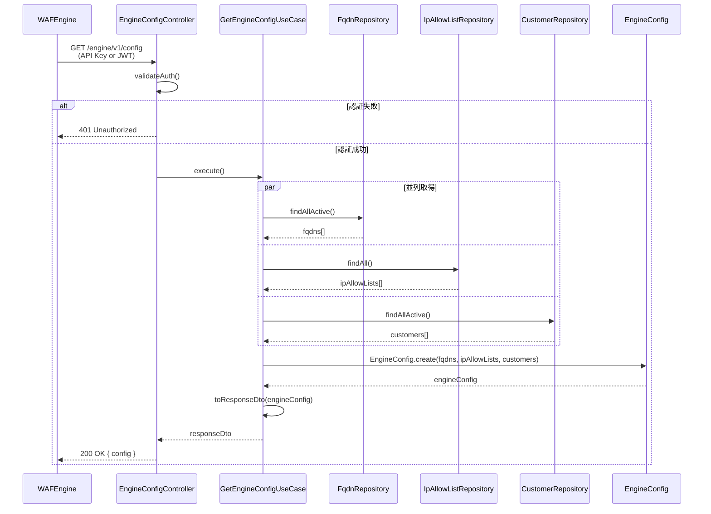
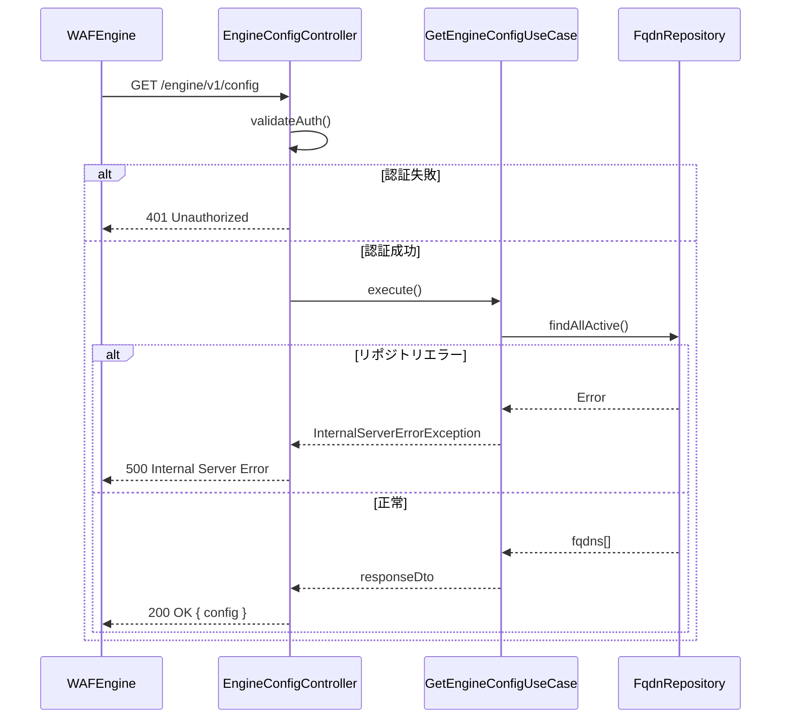
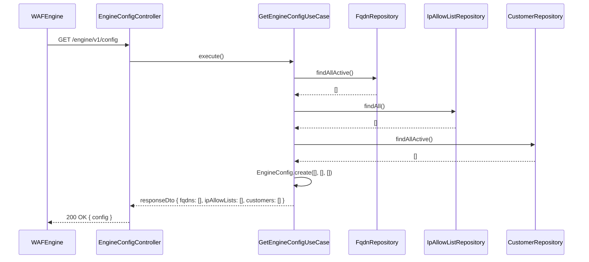

# シーケンス図 (Sequence Diagrams)

## 設定取得フロー

```mermaid
sequenceDiagram
    participant WAFEngine
    participant EngineConfigController
    participant GetEngineConfigUseCase
    participant FqdnRepository
    participant IpAllowListRepository
    participant CustomerRepository
    participant EngineConfig

    WAFEngine->>EngineConfigController: GET /engine/v1/config<br/>(API Key or JWT)
    EngineConfigController->>EngineConfigController: validateAuth()
    
    alt 認証失敗
        EngineConfigController-->>WAFEngine: 401 Unauthorized
    else 認証成功
        EngineConfigController->>GetEngineConfigUseCase: execute()
        
        par 並列取得
            GetEngineConfigUseCase->>FqdnRepository: findAllActive()
            FqdnRepository-->>GetEngineConfigUseCase: fqdns[]
        and
            GetEngineConfigUseCase->>IpAllowListRepository: findAll()
            IpAllowListRepository-->>GetEngineConfigUseCase: ipAllowLists[]
        and
            GetEngineConfigUseCase->>CustomerRepository: findAllActive()
            CustomerRepository-->>GetEngineConfigUseCase: customers[]
        end
        
        GetEngineConfigUseCase->>EngineConfig: EngineConfig.create(fqdns, ipAllowLists, customers)
        EngineConfig-->>GetEngineConfigUseCase: engineConfig
        
        GetEngineConfigUseCase->>GetEngineConfigUseCase: toResponseDto(engineConfig)
        GetEngineConfigUseCase-->>EngineConfigController: responseDto
        
        EngineConfigController-->>WAFEngine: 200 OK { config }
    end
```

## エラーハンドリングフロー

```mermaid
sequenceDiagram
    participant WAFEngine
    participant EngineConfigController
    participant GetEngineConfigUseCase
    participant FqdnRepository

    WAFEngine->>EngineConfigController: GET /engine/v1/config
    EngineConfigController->>EngineConfigController: validateAuth()
    
    alt 認証失敗
        EngineConfigController-->>WAFEngine: 401 Unauthorized
    else 認証成功
        EngineConfigController->>GetEngineConfigUseCase: execute()
        
        GetEngineConfigUseCase->>FqdnRepository: findAllActive()
        
        alt リポジトリエラー
            FqdnRepository-->>GetEngineConfigUseCase: Error
            GetEngineConfigUseCase-->>EngineConfigController: InternalServerErrorException
            EngineConfigController-->>WAFEngine: 500 Internal Server Error
        else 正常
            FqdnRepository-->>GetEngineConfigUseCase: fqdns[]
            GetEngineConfigUseCase-->>EngineConfigController: responseDto
            EngineConfigController-->>WAFEngine: 200 OK { config }
        end
    end
```

## 空の設定データフロー

```mermaid
sequenceDiagram
    participant WAFEngine
    participant EngineConfigController
    participant GetEngineConfigUseCase
    participant FqdnRepository
    participant IpAllowListRepository
    participant CustomerRepository

    WAFEngine->>EngineConfigController: GET /engine/v1/config
    EngineConfigController->>GetEngineConfigUseCase: execute()
    
    GetEngineConfigUseCase->>FqdnRepository: findAllActive()
    FqdnRepository-->>GetEngineConfigUseCase: []
    
    GetEngineConfigUseCase->>IpAllowListRepository: findAll()
    IpAllowListRepository-->>GetEngineConfigUseCase: []
    
    GetEngineConfigUseCase->>CustomerRepository: findAllActive()
    CustomerRepository-->>GetEngineConfigUseCase: []
    
    GetEngineConfigUseCase->>GetEngineConfigUseCase: EngineConfig.create([], [], [])
    GetEngineConfigUseCase-->>EngineConfigController: responseDto { fqdns: [], ipAllowLists: [], customers: [] }
    
    EngineConfigController-->>WAFEngine: 200 OK { config }
```
