# クラス図 (Class Diagrams)

## WAFエンジン向けAPIトークン管理関連クラス

```mermaid
classDiagram
    %% Presentation Layer
    class ApiTokenController {
        +create(dto: CreateApiTokenDto): Promise<ApiTokenResponseDto>
        +list(): Promise<ListApiTokensResponseDto>
        +delete(id: string): Promise<void>
        +revoke(id: string): Promise<void>
    }
    
    class CreateApiTokenDto {
        +string name
        +string? description
        +Date? expiresAt
    }
    
    class ApiTokenResponseDto {
        +string id
        +string name
        +string? description
        +string tokenPreview
        +Date? expiresAt
        +Date? revokedAt
        +Date createdAt
        +string createdBy
    }
    
    class ListApiTokensResponseDto {
        +ApiTokenResponseDto[] tokens
        +number total
    }
    
    %% Application Layer
    class CreateApiTokenUseCase {
        -IApiTokenRepository apiTokenRepository
        -ApiTokenService apiTokenService
        -string currentUserId
        +execute(dto: CreateApiTokenDto): Promise<ApiTokenResponseDto>
    }
    
    class ListApiTokensUseCase {
        -IApiTokenRepository apiTokenRepository
        +execute(): Promise<ApiToken[]>
    }
    
    class DeleteApiTokenUseCase {
        -IApiTokenRepository apiTokenRepository
        +execute(id: string): Promise<void>
    }
    
    class RevokeApiTokenUseCase {
        -IApiTokenRepository apiTokenRepository
        +execute(id: string): Promise<void>
    }
    
    %% Domain Layer
    class ApiToken {
        <<Entity>>
        +string id
        +string name
        +string? description
        +string tokenHash
        +string tokenPrefix
        +Date? expiresAt
        +Date? revokedAt
        +Date createdAt
        +string createdBy
        +isValid(): boolean
        +isExpired(): boolean
        +isRevoked(): boolean
        <<static>> +create(name: string, description: string, tokenHash: string, tokenPrefix: string, expiresAt: Date, createdBy: string): ApiToken
    }
    
    class IApiTokenRepository {
        <<interface>>
        +save(token: ApiToken): Promise<void>
        +findById(id: string): Promise<ApiToken | null>
        +findByTokenHash(tokenHash: string): Promise<ApiToken | null>
        +findAll(): Promise<ApiToken[]>
        +delete(id: string): Promise<void>
    }
    
    class ApiTokenService {
        <<DomainService>>
        +generateSecret(): string
        +hashToken(secret: string): Promise<string>
        +verifyToken(secret: string, tokenHash: string): Promise<boolean>
        +extractPrefix(fullToken: string): string
        +extractSecret(fullToken: string, prefix: string): string
        +buildFullToken(prefix: string, secret: string): string
    }
    
    %% Infrastructure Layer
    class ApiTokenRepository {
        +save(token: ApiToken): Promise<void>
        +findById(id: string): Promise<ApiToken | null>
        +findByTokenHash(tokenHash: string): Promise<ApiToken | null>
        +findAll(): Promise<ApiToken[]>
        +delete(id: string): Promise<void>
    }
    
    class ApiTokenAuthGuard {
        <<Guard>>
        -IApiTokenRepository apiTokenRepository
        -ApiTokenService apiTokenService
        +canActivate(context: ExecutionContext): Promise<boolean>
    }
    
    %% Relationships
    ApiTokenController --> CreateApiTokenUseCase : uses
    ApiTokenController --> ListApiTokensUseCase : uses
    ApiTokenController --> DeleteApiTokenUseCase : uses
    ApiTokenController --> RevokeApiTokenUseCase : uses
    ApiTokenController --> CreateApiTokenDto : receives
    ApiTokenController --> ApiTokenResponseDto : returns
    ApiTokenController --> ListApiTokensResponseDto : returns
    
    CreateApiTokenUseCase --> IApiTokenRepository : depends on
    CreateApiTokenUseCase --> ApiTokenService : depends on
    CreateApiTokenUseCase --> ApiToken : creates
    
    ListApiTokensUseCase --> IApiTokenRepository : depends on
    ListApiTokensUseCase --> ApiToken : returns
    
    DeleteApiTokenUseCase --> IApiTokenRepository : depends on
    RevokeApiTokenUseCase --> IApiTokenRepository : depends on
    
    ApiTokenRepository ..|> IApiTokenRepository : implements
    
    ApiTokenAuthGuard --> IApiTokenRepository : depends on
    ApiTokenAuthGuard --> ApiTokenService : depends on
    ApiTokenAuthGuard --> ApiToken : validates
```

## クラス説明

### Presentation Layer

#### ApiTokenController
APIトークン管理APIのHTTPエンドポイントを提供するコントローラー。

- `create`: APIトークンを生成・発行
- `list`: APIトークンの一覧を取得
- `delete`: APIトークンを削除
- `revoke`: APIトークンを無効化

#### DTOs
- **CreateApiTokenDto**: APIトークン作成リクエストのDTO
  - `name`: トークン名（必須）
  - `description`: 説明（オプション）
  - `expiresAt`: 有効期限（オプション、nullの場合は無期限）
- **ApiTokenResponseDto**: APIトークン情報のDTO
  - `id`: トークンID
  - `name`: トークン名
  - `description`: 説明
  - `tokenPreview`: トークンのプレビュー表示（例: `waf_abc123...`、実際のトークンは生成時のみ表示）
  - `expiresAt`: 有効期限
  - `revokedAt`: 無効化日時
  - `createdAt`: 作成日時
  - `createdBy`: 作成者ID
- **ListApiTokensResponseDto**: APIトークン一覧のDTO
  - `tokens`: トークンリスト
  - `total`: 総数

### Application Layer

#### Use Cases
- **CreateApiTokenUseCase**: APIトークンの生成・発行
  - ApiTokenServiceでトークンを生成
  - トークンをハッシュ化
  - ApiTokenエンティティを作成
  - ApiTokenRepositoryに保存
  - 生成されたトークン（プレフィックス付き）を返却（この時点でしか表示されない）
- **ListApiTokensUseCase**: APIトークンの一覧取得
  - ApiTokenRepositoryからすべてのトークンを取得
  - トークン情報を返却（実際のトークンは含まない）
- **DeleteApiTokenUseCase**: APIトークンの削除
  - ApiTokenRepositoryからトークンを削除
- **RevokeApiTokenUseCase**: APIトークンの無効化
  - ApiTokenエンティティの`revokedAt`を設定
  - ApiTokenRepositoryに保存

### Domain Layer

#### ApiToken Entity
APIトークンのドメインエンティティ。

- `id`: トークンID（UUID）
- `name`: トークン名（識別用）
- `description`: 説明（オプション）
- `tokenHash`: トークンのハッシュ値（保存用）
- `tokenPrefix`: トークンのプレフィックス（データベース保存用、例: `waf_`）
  - 注意: DTOでは`tokenPreview`（例: `waf_abc123...`）として表示される
- `expiresAt`: 有効期限（オプション、nullの場合は無期限）
- `revokedAt`: 無効化日時（nullの場合は有効）
- `createdAt`: 作成日時
- `createdBy`: 作成者ID（ユーザーID）

**メソッド**:
- `isValid()`: トークンが有効かどうか（有効期限切れでなく、無効化されていない）
- `isExpired()`: トークンが有効期限切れかどうか
- `isRevoked()`: トークンが無効化されているかどうか

#### IApiTokenRepository
APIトークンリポジトリのインターフェース。

- `save`: トークンを保存
- `findById`: IDでトークンを検索
- `findByTokenHash`: ハッシュ値でトークンを検索（認証時に使用）
- `findAll`: すべてのトークンを取得
- `delete`: トークンを削除

#### ApiTokenService
APIトークンの生成・検証ロジックを提供するドメインサービス。

- `generateSecret()`: ランダムなシークレットを生成（例: 64文字のランダム文字列）
- `hashToken(secret: string)`: シークレットをハッシュ化（bcrypt）
- `verifyToken(secret: string, tokenHash: string)`: シークレットを検証
- `extractPrefix(fullToken: string)`: フルトークンからプレフィックスを抽出（例: `waf_`）
- `extractSecret(fullToken: string, prefix: string)`: フルトークンからシークレット部分を抽出
- `buildFullToken(prefix: string, secret: string)`: プレフィックスとシークレットを結合してフルトークンを作成

### Infrastructure Layer

#### ApiTokenRepository
APIトークンリポジトリの実装。データベースの`api_tokens`テーブルにアクセス。

#### ApiTokenAuthGuard
APIトークン認証ガード。MWD-100の`GET /engine/v1/config`エンドポイントで使用。

- `Authorization: Bearer <API_TOKEN>`ヘッダーからトークンを取得
- トークンのプレフィックスから検索対象を絞り込み
- トークンをハッシュ化してApiTokenRepositoryで検索
- トークンが存在し、有効期限が切れておらず、無効化されていない場合、認証成功
