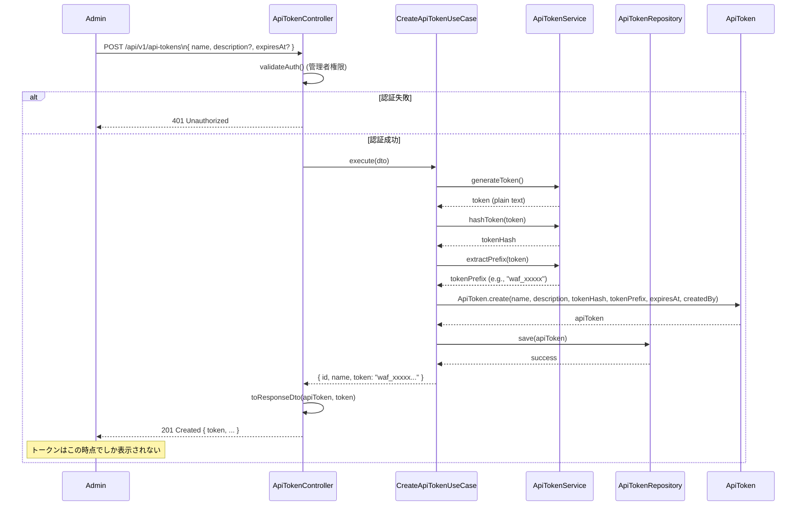
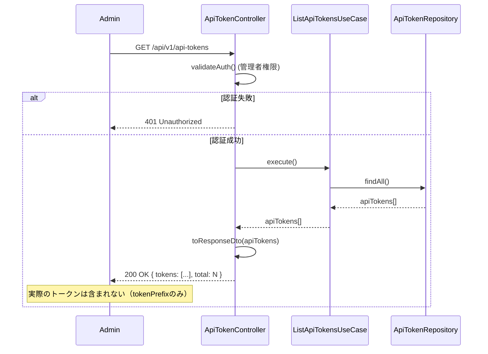
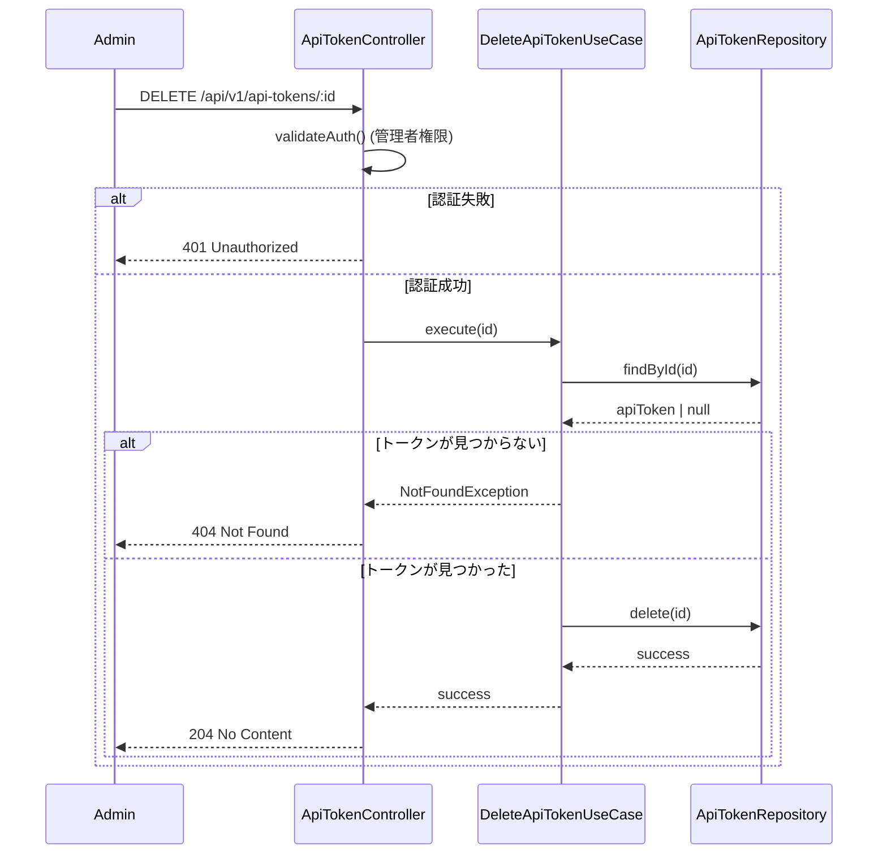
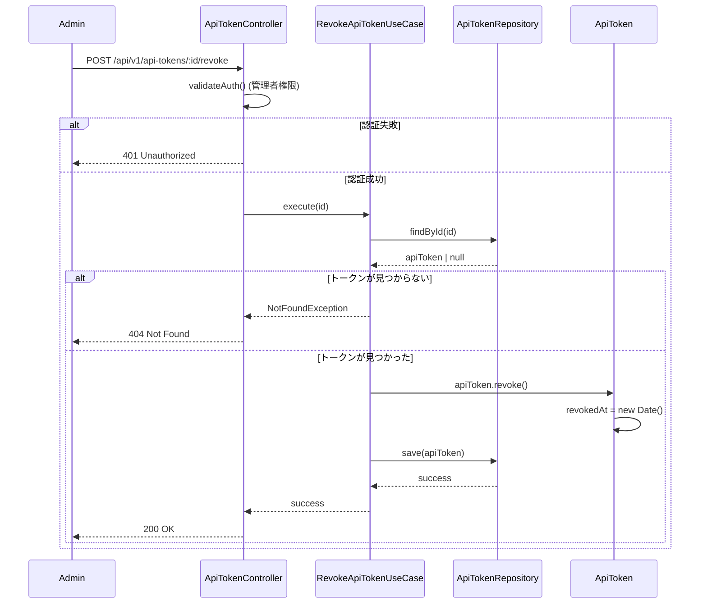
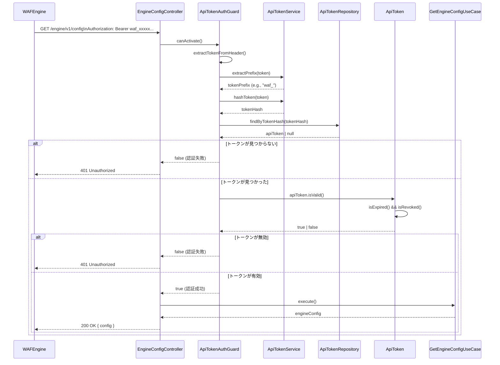
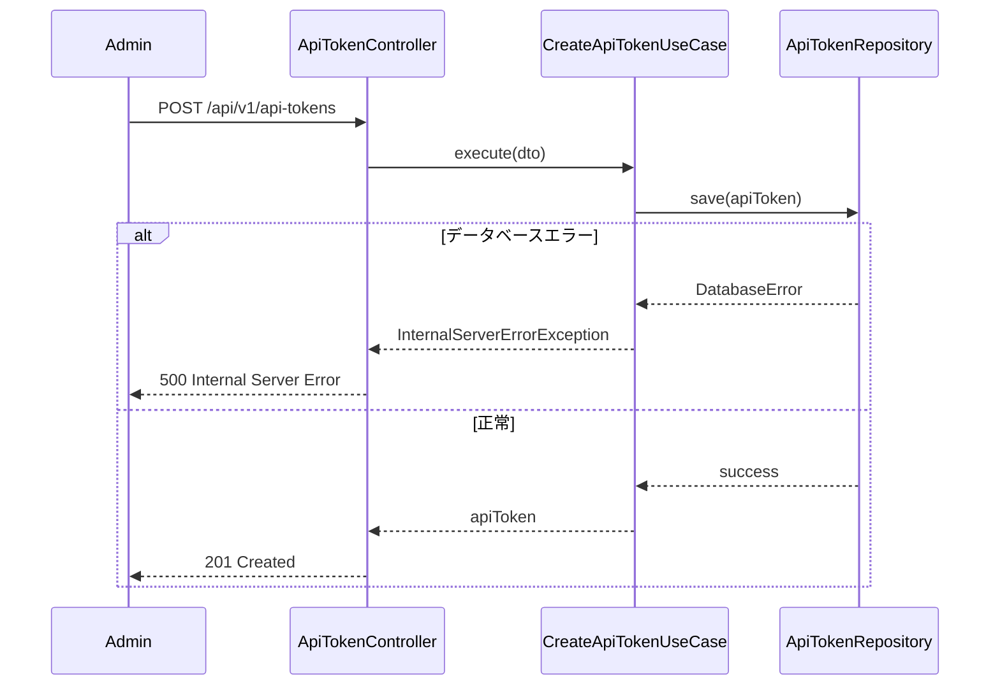

# シーケンス図 (Sequence Diagrams)

## APIトークン生成フロー

```mermaid
sequenceDiagram
    participant Admin
    participant ApiTokenController
    participant CreateApiTokenUseCase
    participant ApiTokenService
    participant ApiTokenRepository
    participant ApiToken

    Admin->>ApiTokenController: POST /api/v1/api-tokens\n{ name, description?, expiresAt? }
    ApiTokenController->>ApiTokenController: validateAuth() (管理者権限)
    
    alt 認証失敗
        ApiTokenController-->>Admin: 401 Unauthorized
    else 認証成功
        ApiTokenController->>CreateApiTokenUseCase: execute(dto)
        
        CreateApiTokenUseCase->>ApiTokenService: generateToken()
        ApiTokenService-->>CreateApiTokenUseCase: token (plain text)
        
        CreateApiTokenUseCase->>ApiTokenService: hashToken(token)
        ApiTokenService-->>CreateApiTokenUseCase: tokenHash
        
        CreateApiTokenUseCase->>ApiTokenService: extractPrefix(token)
        ApiTokenService-->>CreateApiTokenUseCase: tokenPrefix (e.g., "waf_xxxxx")
        
        CreateApiTokenUseCase->>ApiToken: ApiToken.create(name, description, tokenHash, tokenPrefix, expiresAt, createdBy)
        ApiToken-->>CreateApiTokenUseCase: apiToken
        
        CreateApiTokenUseCase->>ApiTokenRepository: save(apiToken)
        ApiTokenRepository-->>CreateApiTokenUseCase: success
        
        CreateApiTokenUseCase-->>ApiTokenController: { id, name, token: "waf_xxxxx..." }
        
        ApiTokenController->>ApiTokenController: toResponseDto(apiToken, token)
        ApiTokenController-->>Admin: 201 Created { token, ... }
        
        Note over Admin: トークンはこの時点でしか表示されない
    end
```

## APIトークン一覧取得フロー

```mermaid
sequenceDiagram
    participant Admin
    participant ApiTokenController
    participant ListApiTokensUseCase
    participant ApiTokenRepository

    Admin->>ApiTokenController: GET /api/v1/api-tokens
    ApiTokenController->>ApiTokenController: validateAuth() (管理者権限)
    
    alt 認証失敗
        ApiTokenController-->>Admin: 401 Unauthorized
    else 認証成功
        ApiTokenController->>ListApiTokensUseCase: execute()
        
        ListApiTokensUseCase->>ApiTokenRepository: findAll()
        ApiTokenRepository-->>ListApiTokensUseCase: apiTokens[]
        
        ListApiTokensUseCase-->>ApiTokenController: apiTokens[]
        
        ApiTokenController->>ApiTokenController: toResponseDto(apiTokens)
        ApiTokenController-->>Admin: 200 OK { tokens: [...], total: N }
        
        Note over Admin: 実際のトークンは含まれない（tokenPrefixのみ）
    end
```

## APIトークン削除フロー

```mermaid
sequenceDiagram
    participant Admin
    participant ApiTokenController
    participant DeleteApiTokenUseCase
    participant ApiTokenRepository

    Admin->>ApiTokenController: DELETE /api/v1/api-tokens/:id
    ApiTokenController->>ApiTokenController: validateAuth() (管理者権限)
    
    alt 認証失敗
        ApiTokenController-->>Admin: 401 Unauthorized
    else 認証成功
        ApiTokenController->>DeleteApiTokenUseCase: execute(id)
        
        DeleteApiTokenUseCase->>ApiTokenRepository: findById(id)
        ApiTokenRepository-->>DeleteApiTokenUseCase: apiToken | null
        
        alt トークンが見つからない
            DeleteApiTokenUseCase-->>ApiTokenController: NotFoundException
            ApiTokenController-->>Admin: 404 Not Found
        else トークンが見つかった
            DeleteApiTokenUseCase->>ApiTokenRepository: delete(id)
            ApiTokenRepository-->>DeleteApiTokenUseCase: success
            
            DeleteApiTokenUseCase-->>ApiTokenController: success
            ApiTokenController-->>Admin: 204 No Content
        end
    end
```

## APIトークン無効化フロー

```mermaid
sequenceDiagram
    participant Admin
    participant ApiTokenController
    participant RevokeApiTokenUseCase
    participant ApiTokenRepository
    participant ApiToken

    Admin->>ApiTokenController: POST /api/v1/api-tokens/:id/revoke
    ApiTokenController->>ApiTokenController: validateAuth() (管理者権限)
    
    alt 認証失敗
        ApiTokenController-->>Admin: 401 Unauthorized
    else 認証成功
        ApiTokenController->>RevokeApiTokenUseCase: execute(id)
        
        RevokeApiTokenUseCase->>ApiTokenRepository: findById(id)
        ApiTokenRepository-->>RevokeApiTokenUseCase: apiToken | null
        
        alt トークンが見つからない
            RevokeApiTokenUseCase-->>ApiTokenController: NotFoundException
            ApiTokenController-->>Admin: 404 Not Found
        else トークンが見つかった
            RevokeApiTokenUseCase->>ApiToken: apiToken.revoke()
            ApiToken->>ApiToken: revokedAt = new Date()
            
            RevokeApiTokenUseCase->>ApiTokenRepository: save(apiToken)
            ApiTokenRepository-->>RevokeApiTokenUseCase: success
            
            RevokeApiTokenUseCase-->>ApiTokenController: success
            ApiTokenController-->>Admin: 200 OK
        end
    end
```

## APIトークン認証フロー（MWD-100で使用）

```mermaid
sequenceDiagram
    participant WAFEngine
    participant EngineConfigController
    participant ApiTokenAuthGuard
    participant ApiTokenService
    participant ApiTokenRepository
    participant ApiToken
    participant GetEngineConfigUseCase

    WAFEngine->>EngineConfigController: GET /engine/v1/config\nAuthorization: Bearer waf_xxxxx...
    EngineConfigController->>ApiTokenAuthGuard: canActivate()
    
    ApiTokenAuthGuard->>ApiTokenAuthGuard: extractTokenFromHeader()
    ApiTokenAuthGuard->>ApiTokenService: extractPrefix(token)
    ApiTokenService-->>ApiTokenAuthGuard: tokenPrefix (e.g., "waf_")
    
    ApiTokenAuthGuard->>ApiTokenService: hashToken(token)
    ApiTokenService-->>ApiTokenAuthGuard: tokenHash
    
    ApiTokenAuthGuard->>ApiTokenRepository: findByTokenHash(tokenHash)
    ApiTokenRepository-->>ApiTokenAuthGuard: apiToken | null
    
    alt トークンが見つからない
        ApiTokenAuthGuard-->>EngineConfigController: false (認証失敗)
        EngineConfigController-->>WAFEngine: 401 Unauthorized
    else トークンが見つかった
        ApiTokenAuthGuard->>ApiToken: apiToken.isValid()
        ApiToken->>ApiToken: isExpired() && isRevoked()
        ApiToken-->>ApiTokenAuthGuard: true | false
        
        alt トークンが無効
            ApiTokenAuthGuard-->>EngineConfigController: false (認証失敗)
            EngineConfigController-->>WAFEngine: 401 Unauthorized
        else トークンが有効
            ApiTokenAuthGuard-->>EngineConfigController: true (認証成功)
            EngineConfigController->>GetEngineConfigUseCase: execute()
            GetEngineConfigUseCase-->>EngineConfigController: engineConfig
            EngineConfigController-->>WAFEngine: 200 OK { config }
        end
    end
```

## エラーハンドリングフロー

```mermaid
sequenceDiagram
    participant Admin
    participant ApiTokenController
    participant CreateApiTokenUseCase
    participant ApiTokenRepository

    Admin->>ApiTokenController: POST /api/v1/api-tokens
    ApiTokenController->>CreateApiTokenUseCase: execute(dto)
    
    CreateApiTokenUseCase->>ApiTokenRepository: save(apiToken)
    
    alt データベースエラー
        ApiTokenRepository-->>CreateApiTokenUseCase: DatabaseError
        CreateApiTokenUseCase-->>ApiTokenController: InternalServerErrorException
        ApiTokenController-->>Admin: 500 Internal Server Error
    else 正常
        ApiTokenRepository-->>CreateApiTokenUseCase: success
        CreateApiTokenUseCase-->>ApiTokenController: apiToken
        ApiTokenController-->>Admin: 201 Created
    end
```
