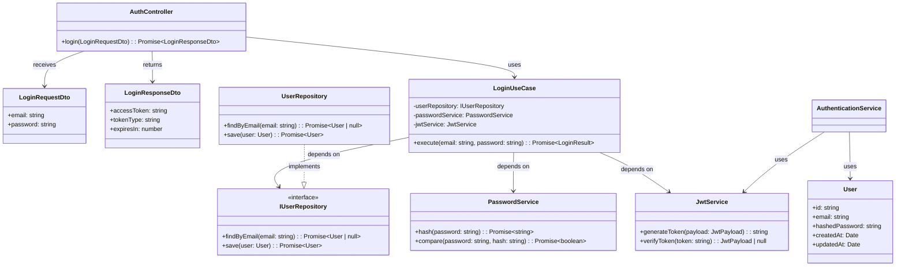

# クラス構造図

## 概要

ユーザー認証機能のクラス構造を定義します。

## クラス図

## クラス説明

### Presentation Layer

#### AuthController
- **責務**: HTTPリクエストの受信とレスポンスの返却
- **メソッド**:
  - `login(LoginRequestDto)`: ログイン処理を実行

#### LoginRequestDto
- **責務**: ログインリクエストのデータ転送オブジェクト
- **プロパティ**:
  - `email: string`: ユーザーのメールアドレス
  - `password: string`: ユーザーのパスワード

#### LoginResponseDto
- **責務**: ログインレスポンスのデータ転送オブジェクト
- **プロパティ**:
  - `accessToken: string`: JWTアクセストークン
  - `tokenType: string`: トークンタイプ（"Bearer"）
  - `expiresIn: number`: トークンの有効期限（秒）

### Application Layer

#### LoginUseCase
- **責務**: ログイン処理のユースケース実装
- **依存関係**:
  - `IUserRepository`: ユーザー情報の取得
  - `PasswordService`: パスワードの検証
  - `JwtService`: JWTトークンの生成

#### AuthenticationService
- **責務**: 認証関連のビジネスロジック
- **メソッド**:
  - `validateCredentials()`: 認証情報の検証
  - `generateToken()`: JWTトークンの生成

### Domain Layer

#### User
- **責務**: ユーザーエンティティ
- **プロパティ**:
  - `id: string`: ユーザーID
  - `email: string`: メールアドレス
  - `hashedPassword: string`: ハッシュ化されたパスワード
  - `createdAt: Date`: 作成日時
  - `updatedAt: Date`: 更新日時

#### IUserRepository
- **責務**: ユーザーリポジトリのインターフェース定義
- **メソッド**:
  - `findByEmail()`: メールアドレスでユーザーを検索
  - `save()`: ユーザーを保存

### Infrastructure Layer

#### UserRepository
- **責務**: ユーザーリポジトリの実装
- **実装**: `IUserRepository`インターフェース

#### JwtService
- **責務**: JWTトークンの生成と検証
- **メソッド**:
  - `generateToken()`: JWTトークンを生成
  - `verifyToken()`: JWTトークンを検証

#### PasswordService
- **責務**: パスワードのハッシュ化と検証
- **メソッド**:
  - `hash()`: パスワードをハッシュ化
  - `compare()`: パスワードを検証

