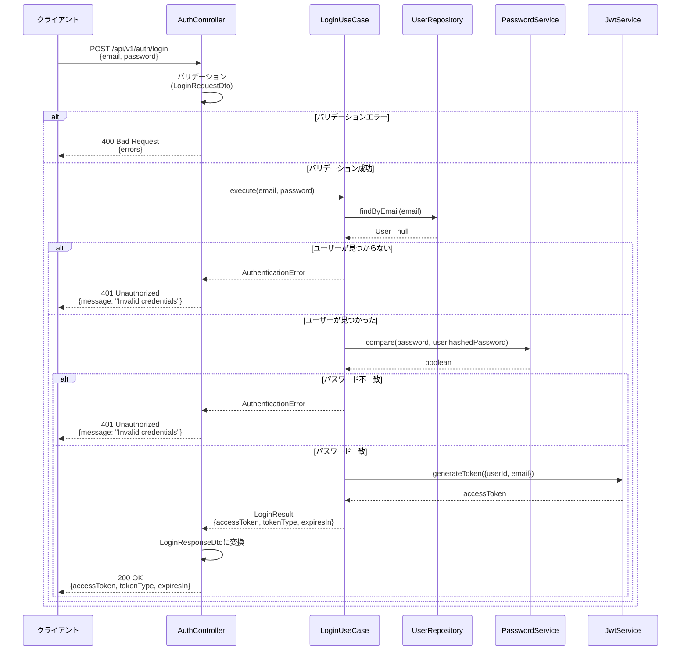

# シーケンス図

## 概要

ユーザー認証機能の処理フローを定義します。

## ログイン処理フロー

## 処理ステップ詳細

### 1. リクエスト受信
- クライアントが`POST /api/v1/auth/login`にリクエストを送信
- リクエストボディに`email`と`password`を含む

### 2. バリデーション
- `LoginRequestDto`でリクエストをバリデーション
- `email`: 必須、メールアドレス形式
- `password`: 必須、最小長8文字

### 3. ユーザー検索
- `UserRepository.findByEmail()`でユーザーを検索
- ユーザーが見つからない場合は認証エラー

### 4. パスワード検証
- `PasswordService.compare()`でパスワードを検証
- bcryptを使用してハッシュ化されたパスワードと比較
- 不一致の場合は認証エラー

### 5. JWTトークン生成
- `JwtService.generateToken()`でJWTトークンを生成
- ペイロードに`userId`と`email`を含む
- 有効期限を設定（例: 24時間）

### 6. レスポンス返却
- `LoginResponseDto`に変換して返却
- ステータスコード: 200 OK
- レスポンスボディに`accessToken`、`tokenType`、`expiresIn`を含む

## エラーハンドリング

### バリデーションエラー
- **ステータスコード**: 400 Bad Request
- **レスポンス**: バリデーションエラーの詳細

### 認証エラー
- **ステータスコード**: 401 Unauthorized
- **レスポンス**: `{message: "Invalid credentials"}`
- **セキュリティ**: ユーザーが存在するかどうかを明示しない

### サーバーエラー
- **ステータスコード**: 500 Internal Server Error
- **レスポンス**: エラーメッセージ（本番環境では詳細を隠す）

