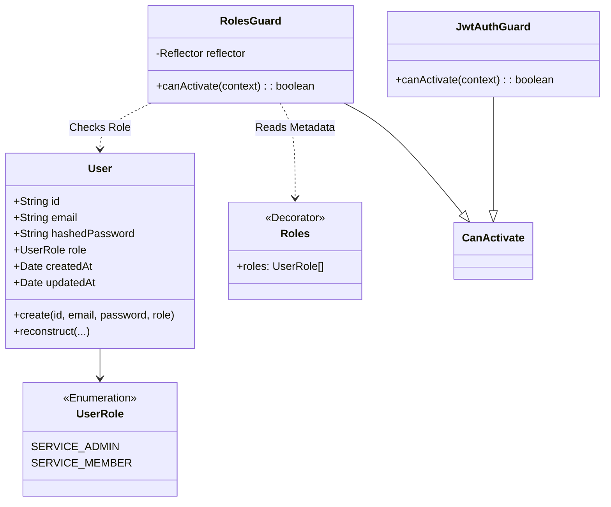
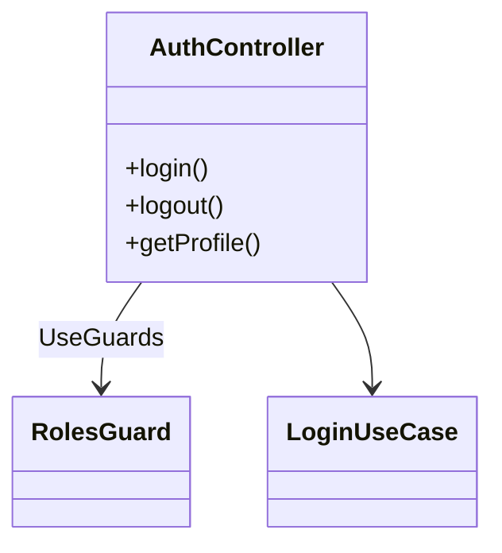

# クラス図 (Class Diagrams)

## RBAC関連クラス

```mermaid
classDiagram
    class UserRole {
        <<Enumeration>>
        SERVICE_ADMIN
        SERVICE_MEMBER
    }

    class User {
        +String id
        +String email
        +String hashedPassword
        +UserRole role
        +Date createdAt
        +Date updatedAt
        +create(id, email, password, role)
        +reconstruct(...)
    }

    class RolesGuard {
        -Reflector reflector
        +canActivate(context): boolean
    }

    class Roles {
        <<Decorator>>
        +roles: UserRole[]
    }

    class JwtAuthGuard {
        +canActivate(context): boolean
    }

    User --> UserRole
    RolesGuard ..> Roles : Reads Metadata
    RolesGuard ..> User : Checks Role
    RolesGuard --|> CanActivate
    JwtAuthGuard --|> CanActivate
```

## 依存関係

```mermaid
classDiagram
    class AuthController {
        +login()
        +logout()
        +getProfile()
    }

    class RolesGuard {
    }

    class LoginUseCase {
    }

    AuthController --> RolesGuard : UseGuards
    AuthController --> LoginUseCase
```

