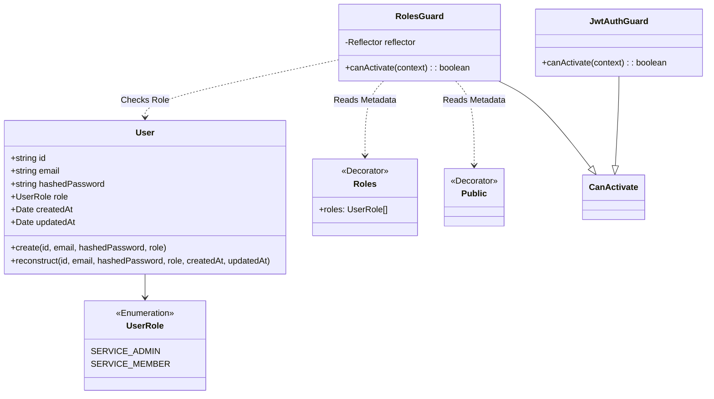
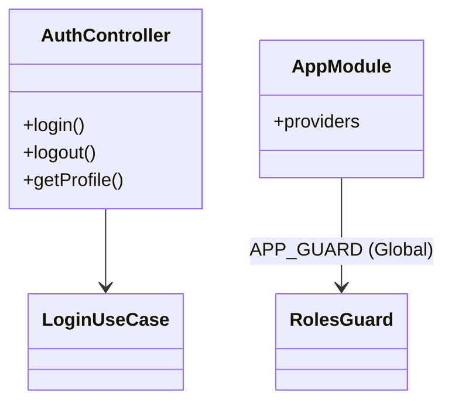

# クラス図 (Class Diagrams)

## RBAC関連クラス

```mermaid
classDiagram
    class UserRole {
        <<Enumeration>>
        SERVICE_ADMIN
        SERVICE_MEMBER
    }

    class User {
        +string id
        +string email
        +string hashedPassword
        +UserRole role
        +Date createdAt
        +Date updatedAt
        +create(id, email, hashedPassword, role)
        +reconstruct(id, email, hashedPassword, role, createdAt, updatedAt)
    }

    class RolesGuard {
        -Reflector reflector
        +canActivate(context): boolean
    }

    class Roles {
        <<Decorator>>
        +roles: UserRole[]
    }
    
    class Public {
        <<Decorator>>
    }

    class JwtAuthGuard {
        +canActivate(context): boolean
    }

    User --> UserRole
    RolesGuard ..> Roles : Reads Metadata
    RolesGuard ..> Public : Reads Metadata
    RolesGuard ..> User : Checks Role
    RolesGuard --|> CanActivate
    JwtAuthGuard --|> CanActivate
```

## 依存関係

```mermaid
classDiagram
    class AuthController {
        +login()
        +logout()
        +getProfile()
    }

    class RolesGuard {
    }
    
    class AppModule {
        +providers
    }

    class LoginUseCase {
    }

    AppModule --> RolesGuard : APP_GUARD (Global)
    AuthController --> LoginUseCase
```

## RBAC関連クラス

```mermaid
classDiagram
    class UserRole {
        <<Enumeration>>
        SERVICE_ADMIN
        SERVICE_MEMBER
    }

    class User {
        +string id
        +string email
        +string hashedPassword
        +UserRole role
        +Date createdAt
        +Date updatedAt
        +create(id, email, hashedPassword, role)
        +reconstruct(id, email, hashedPassword, role, createdAt, updatedAt)
    }

    class RolesGuard {
        -Reflector reflector
        +canActivate(context): boolean
    }

    class Roles {
        <<Decorator>>
        +roles: UserRole[]
    }
    
    class Public {
        <<Decorator>>
    }

    class JwtAuthGuard {
        +canActivate(context): boolean
    }

    User --> UserRole
    RolesGuard ..> Roles : Reads Metadata
    RolesGuard ..> Public : Reads Metadata
    RolesGuard ..> User : Checks Role
    RolesGuard --|> CanActivate
    JwtAuthGuard --|> CanActivate
```

## 依存関係

```mermaid
classDiagram
    class AuthController {
        +login()
        +logout()
        +getProfile()
    }

    class RolesGuard {
    }
    
    class AppModule {
        +providers
    }

    class LoginUseCase {
    }

    AppModule --> RolesGuard : APP_GUARD (Global)
    AuthController --> LoginUseCase
```

## RBAC関連クラス

```mermaid
classDiagram
    class UserRole {
        <<Enumeration>>
        SERVICE_ADMIN
        SERVICE_MEMBER
    }

    class User {
        +string id
        +string email
        +string hashedPassword
        +UserRole role
        +Date createdAt
        +Date updatedAt
        +create(id, email, hashedPassword, role)
        +reconstruct(id, email, hashedPassword, role, createdAt, updatedAt)
    }

    class RolesGuard {
        -Reflector reflector
        +canActivate(context): boolean
    }

    class Roles {
        <<Decorator>>
        +roles: UserRole[]
    }
    
    class Public {
        <<Decorator>>
    }

    class JwtAuthGuard {
        +canActivate(context): boolean
    }

    User --> UserRole
    RolesGuard ..> Roles : Reads Metadata
    RolesGuard ..> Public : Reads Metadata
    RolesGuard ..> User : Checks Role
    RolesGuard --|> CanActivate
    JwtAuthGuard --|> CanActivate
```

## 依存関係

```mermaid
classDiagram
    class AuthController {
        +login()
        +logout()
        +getProfile()
    }

    class RolesGuard {
    }
    
    class AppModule {
        +providers
    }

    class LoginUseCase {
    }

    AppModule --> RolesGuard : APP_GUARD (Global)
    AuthController --> LoginUseCase
```
