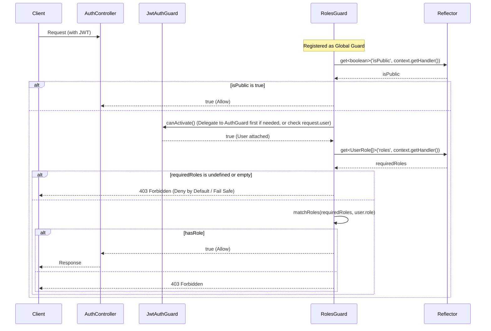

# シーケンス図 (Sequence Diagrams)

## 権限チェックフロー (Global Guard + Fail Safe)

```mermaid
sequenceDiagram
    participant Client
    participant AuthController
    participant JwtAuthGuard
    participant RolesGuard
    participant Reflector

    Client->>AuthController: Request (with JWT)
    
    Note over RolesGuard: Registered as Global Guard
    
    RolesGuard->>Reflector: get<boolean>('isPublic', context.getHandler())
    Reflector-->>RolesGuard: isPublic
    
    alt isPublic is true
        RolesGuard-->>AuthController: true (Allow)
    else
        RolesGuard->>JwtAuthGuard: canActivate() (Delegate to AuthGuard first if needed, or check request.user)
        JwtAuthGuard-->>RolesGuard: true (User attached)
        
        RolesGuard->>Reflector: get<UserRole[]>('roles', context.getHandler())
        Reflector-->>RolesGuard: requiredRoles
        
        alt requiredRoles is undefined or empty
            RolesGuard-->>Client: 403 Forbidden (Deny by Default / Fail Safe)
        else
            RolesGuard->>RolesGuard: matchRoles(requiredRoles, user.role)
            alt hasRole
                RolesGuard-->>AuthController: true (Allow)
                AuthController-->>Client: Response
            else
                RolesGuard-->>Client: 403 Forbidden
            end
        end
    end
```
