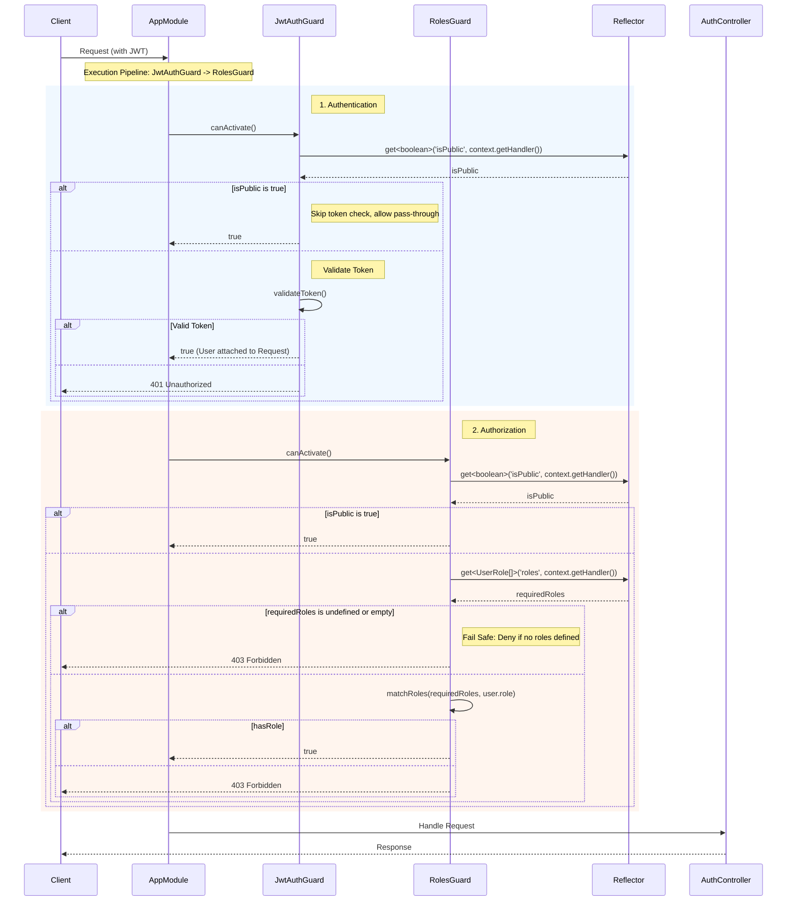

# シーケンス図 (Sequence Diagrams)

## 権限チェックフロー (Global Guard Pipeline)

```mermaid
sequenceDiagram
    participant Client
    participant AppModule
    participant JwtAuthGuard
    participant RolesGuard
    participant Reflector
    participant AuthController

    Client->>AppModule: Request (with JWT)
    
    Note over AppModule: Execution Pipeline: JwtAuthGuard -> RolesGuard
    
    rect rgb(240, 248, 255)
        Note right of JwtAuthGuard: 1. Authentication
        AppModule->>JwtAuthGuard: canActivate()
        JwtAuthGuard->>Reflector: get<boolean>('isPublic', context.getHandler())
        Reflector-->>JwtAuthGuard: isPublic
        
        alt isPublic is true
            Note right of JwtAuthGuard: Skip token check, allow pass-through
            JwtAuthGuard-->>AppModule: true
        else
            Note right of JwtAuthGuard: Validate Token
            JwtAuthGuard->>JwtAuthGuard: validateToken()
            alt Valid Token
                JwtAuthGuard-->>AppModule: true (User attached to Request)
            else
                JwtAuthGuard-->>Client: 401 Unauthorized
            end
        end
    end

    rect rgb(255, 245, 238)
        Note right of RolesGuard: 2. Authorization
        AppModule->>RolesGuard: canActivate()
        RolesGuard->>Reflector: get<boolean>('isPublic', context.getHandler())
        Reflector-->>RolesGuard: isPublic
        
        alt isPublic is true
            RolesGuard-->>AppModule: true
        else
            RolesGuard->>Reflector: get<UserRole[]>('roles', context.getHandler())
            Reflector-->>RolesGuard: requiredRoles
            
            alt requiredRoles is undefined or empty
                Note right of RolesGuard: Fail Safe: Deny if no roles defined
                RolesGuard-->>Client: 403 Forbidden
            else
                RolesGuard->>RolesGuard: matchRoles(requiredRoles, user.role)
                alt hasRole
                    RolesGuard-->>AppModule: true
                else
                    RolesGuard-->>Client: 403 Forbidden
                end
            end
        end
    end
    
    AppModule->>AuthController: Handle Request
    AuthController-->>Client: Response
```

## 権限チェックフロー (Global Guard Pipeline)

```mermaid
sequenceDiagram
    participant Client
    participant AppModule
    participant JwtAuthGuard
    participant RolesGuard
    participant Reflector
    participant AuthController

    Client->>AppModule: Request (with JWT)
    
    Note over AppModule: Execution Pipeline: JwtAuthGuard -> RolesGuard
    
    rect rgb(240, 248, 255)
        Note right of JwtAuthGuard: 1. Authentication
        AppModule->>JwtAuthGuard: canActivate()
        JwtAuthGuard->>Reflector: get<boolean>('isPublic', context.getHandler())
        Reflector-->>JwtAuthGuard: isPublic
        
        alt isPublic is true
            Note right of JwtAuthGuard: Skip token check, allow pass-through
            JwtAuthGuard-->>AppModule: true
        else
            Note right of JwtAuthGuard: Validate Token
            JwtAuthGuard->>JwtAuthGuard: validateToken()
            alt Valid Token
                JwtAuthGuard-->>AppModule: true (User attached to Request)
            else
                JwtAuthGuard-->>Client: 401 Unauthorized
            end
        end
    end

    rect rgb(255, 245, 238)
        Note right of RolesGuard: 2. Authorization
        AppModule->>RolesGuard: canActivate()
        RolesGuard->>Reflector: get<boolean>('isPublic', context.getHandler())
        Reflector-->>RolesGuard: isPublic
        
        alt isPublic is true
            RolesGuard-->>AppModule: true
        else
            RolesGuard->>Reflector: get<UserRole[]>('roles', context.getHandler())
            Reflector-->>RolesGuard: requiredRoles
            
            alt requiredRoles is undefined or empty
                Note right of RolesGuard: Fail Safe: Deny if no roles defined
                RolesGuard-->>Client: 403 Forbidden
            else
                RolesGuard->>RolesGuard: matchRoles(requiredRoles, user.role)
                alt hasRole
                    RolesGuard-->>AppModule: true
                else
                    RolesGuard-->>Client: 403 Forbidden
                end
            end
        end
    end
    
    AppModule->>AuthController: Handle Request
    AuthController-->>Client: Response
```

## 権限チェックフロー (Global Guard Pipeline)

```mermaid
sequenceDiagram
    participant Client
    participant AppModule
    participant JwtAuthGuard
    participant RolesGuard
    participant Reflector
    participant AuthController

    Client->>AppModule: Request (with JWT)
    
    Note over AppModule: Execution Pipeline: JwtAuthGuard -> RolesGuard
    
    rect rgb(240, 248, 255)
        Note right of JwtAuthGuard: 1. Authentication
        AppModule->>JwtAuthGuard: canActivate()
        JwtAuthGuard->>Reflector: get<boolean>('isPublic', context.getHandler())
        Reflector-->>JwtAuthGuard: isPublic
        
        alt isPublic is true
            Note right of JwtAuthGuard: Skip token check, allow pass-through
            JwtAuthGuard-->>AppModule: true
        else
            Note right of JwtAuthGuard: Validate Token
            JwtAuthGuard->>JwtAuthGuard: validateToken()
            alt Valid Token
                JwtAuthGuard-->>AppModule: true (User attached to Request)
            else
                JwtAuthGuard-->>Client: 401 Unauthorized
            end
        end
    end

    rect rgb(255, 245, 238)
        Note right of RolesGuard: 2. Authorization
        AppModule->>RolesGuard: canActivate()
        RolesGuard->>Reflector: get<boolean>('isPublic', context.getHandler())
        Reflector-->>RolesGuard: isPublic
        
        alt isPublic is true
            RolesGuard-->>AppModule: true
        else
            RolesGuard->>Reflector: get<UserRole[]>('roles', context.getHandler())
            Reflector-->>RolesGuard: requiredRoles
            
            alt requiredRoles is undefined or empty
                Note right of RolesGuard: Fail Safe: Deny if no roles defined
                RolesGuard-->>Client: 403 Forbidden
            else
                RolesGuard->>RolesGuard: matchRoles(requiredRoles, user.role)
                alt hasRole
                    RolesGuard-->>AppModule: true
                else
                    RolesGuard-->>Client: 403 Forbidden
                end
            end
        end
    end
    
    AppModule->>AuthController: Handle Request
    AuthController-->>Client: Response
```
