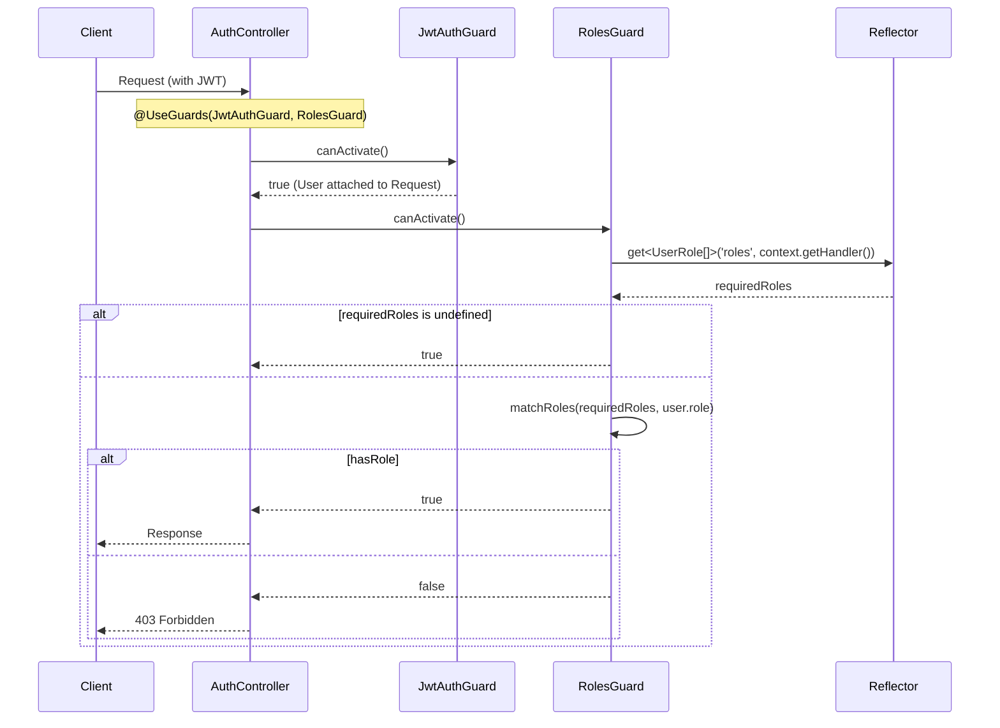

# シーケンス図 (Sequence Diagrams)

## 権限チェックフロー

```mermaid
sequenceDiagram
    participant Client
    participant AuthController
    participant JwtAuthGuard
    participant RolesGuard
    participant Reflector

    Client->>AuthController: Request (with JWT)
    
    Note over AuthController: @UseGuards(JwtAuthGuard, RolesGuard)
    
    AuthController->>JwtAuthGuard: canActivate()
    JwtAuthGuard-->>AuthController: true (User attached to Request)
    
    AuthController->>RolesGuard: canActivate()
    RolesGuard->>Reflector: get<UserRole[]>('roles', context.getHandler())
    Reflector-->>RolesGuard: requiredRoles
    
    alt requiredRoles is undefined
        RolesGuard-->>AuthController: true
    else
        RolesGuard->>RolesGuard: matchRoles(requiredRoles, user.role)
        alt hasRole
            RolesGuard-->>AuthController: true
            AuthController-->>Client: Response
        else
            RolesGuard-->>AuthController: false
            AuthController-->>Client: 403 Forbidden
        end
    end
```

