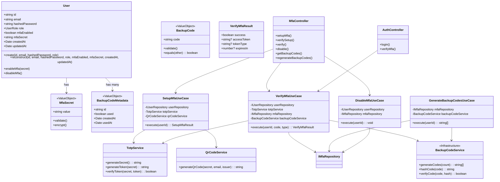
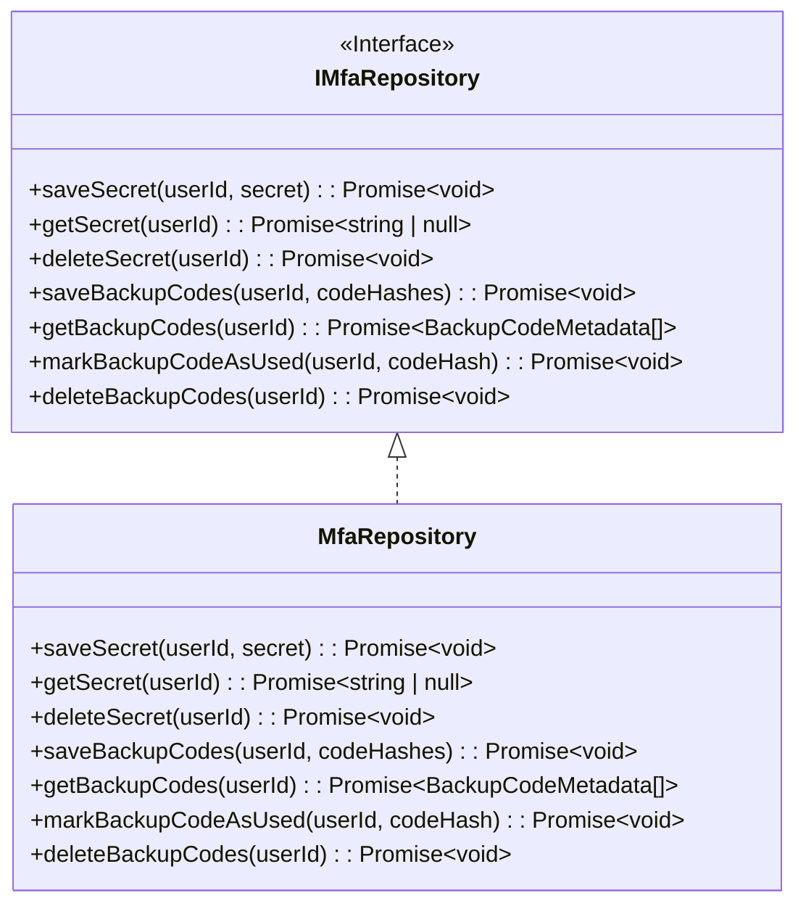
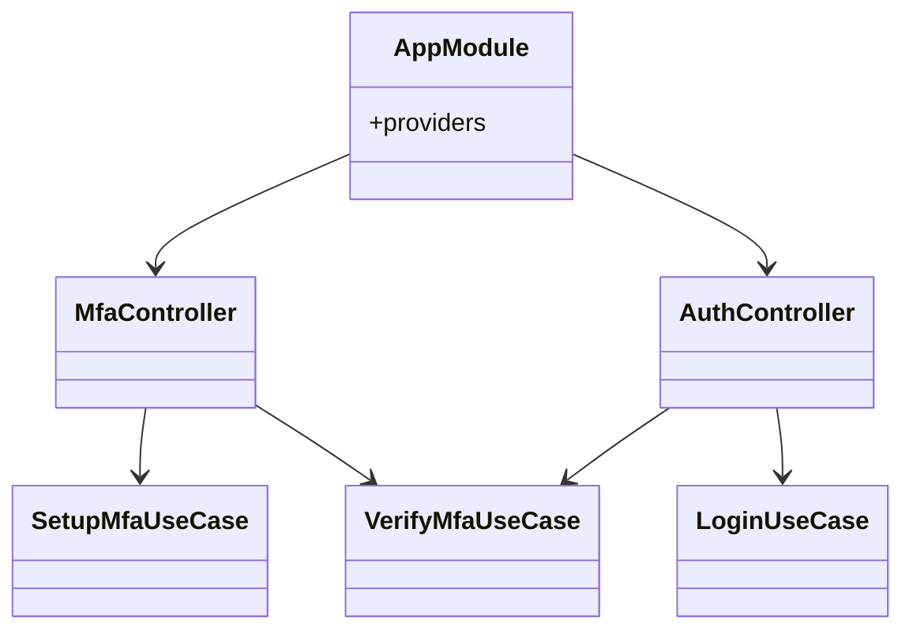

# クラス図 (Class Diagrams)

## MFA関連クラス

```mermaid
classDiagram
    class User {
        +string id
        +string email
        +string hashedPassword
        +UserRole role
        +boolean mfaEnabled
        +string mfaSecret
        +Date createdAt
        +Date updatedAt
        +create(id, email, hashedPassword, role)
        +reconstruct(id, email, hashedPassword, role, mfaEnabled, mfaSecret, createdAt, updatedAt)
        +enableMfa(secret)
        +disableMfa()
    }

    class MfaSecret {
        <<ValueObject>>
        +string value
        +validate()
        +encrypt()
    }

    class BackupCode {
        <<ValueObject>>
        +string code
        +validate()
        +equals(other): boolean
    }
    
    class BackupCodeMetadata {
        <<ValueObject>>
        +string id
        +boolean used
        +Date createdAt
        +Date usedAt
    }

    class SetupMfaUseCase {
        -IUserRepository userRepository
        -TotpService totpService
        -QrCodeService qrCodeService
        +execute(userId): SetupMfaResult
    }

    class VerifyMfaUseCase {
        -IUserRepository userRepository
        -TotpService totpService
        -IMfaRepository mfaRepository
        -BackupCodeService backupCodeService
        +execute(userId, code, type): VerifyMfaResult
    }
    
    class VerifyMfaResult {
        +boolean success
        +string? accessToken
        +string? tokenType
        +number? expiresIn
    }

    class GenerateBackupCodesUseCase {
        -IMfaRepository mfaRepository
        -BackupCodeService backupCodeService
        +execute(userId): string[]
    }

    class DisableMfaUseCase {
        -IUserRepository userRepository
        -IMfaRepository mfaRepository
        +execute(userId): void
    }

    class TotpService {
        +generateSecret(): string
        +generateToken(secret): string
        +verifyToken(secret, token): boolean
    }

    class QrCodeService {
        +generateQrCode(secret, email, issuer): string
    }

    class BackupCodeService {
        <<Infrastructure>>
        +generateCodes(count): string[]
        +hashCode(code): string
        +verifyCode(code, hash): boolean
    }

    class MfaController {
        +setupMfa()
        +verifySetup()
        +verify()
        +disable()
        +getBackupCodes()
        +regenerateBackupCodes()
    }

    class AuthController {
        +login()
        +verifyMfa()
    }

    User --> MfaSecret : has
    User --> BackupCodeMetadata : has many
    SetupMfaUseCase --> TotpService
    SetupMfaUseCase --> QrCodeService
    VerifyMfaUseCase --> TotpService
    VerifyMfaUseCase --> IMfaRepository
    VerifyMfaUseCase --> BackupCodeService
    GenerateBackupCodesUseCase --> IMfaRepository
    GenerateBackupCodesUseCase --> BackupCodeService
    DisableMfaUseCase --> IMfaRepository
    MfaController --> SetupMfaUseCase
    MfaController --> VerifyMfaUseCase
    MfaController --> DisableMfaUseCase
    AuthController --> VerifyMfaUseCase
```

## リポジトリインターフェース

```mermaid
classDiagram
    class IMfaRepository {
        <<Interface>>
        +saveSecret(userId, secret): Promise~void~
        +getSecret(userId): Promise~string | null~
        +deleteSecret(userId): Promise~void~
        +saveBackupCodes(userId, codeHashes): Promise~void~
        +getBackupCodes(userId): Promise~BackupCodeMetadata[]~
        +markBackupCodeAsUsed(userId, codeHash): Promise~void~
        +deleteBackupCodes(userId): Promise~void~
    }

    class MfaRepository {
        +saveSecret(userId, secret): Promise~void~
        +getSecret(userId): Promise~string | null~
        +deleteSecret(userId): Promise~void~
        +saveBackupCodes(userId, codeHashes): Promise~void~
        +getBackupCodes(userId): Promise~BackupCodeMetadata[]~
        +markBackupCodeAsUsed(userId, codeHash): Promise~void~
        +deleteBackupCodes(userId): Promise~void~
    }

    IMfaRepository <|.. MfaRepository
```

## 依存関係

```mermaid
classDiagram
    class MfaController {
    }
    
    class AuthController {
    }

    class AppModule {
        +providers
    }

    class SetupMfaUseCase {
    }

    class VerifyMfaUseCase {
    }

    class LoginUseCase {
    }

    AppModule --> MfaController
    AppModule --> AuthController
    MfaController --> SetupMfaUseCase
    MfaController --> VerifyMfaUseCase
    AuthController --> LoginUseCase
    AuthController --> VerifyMfaUseCase
```

