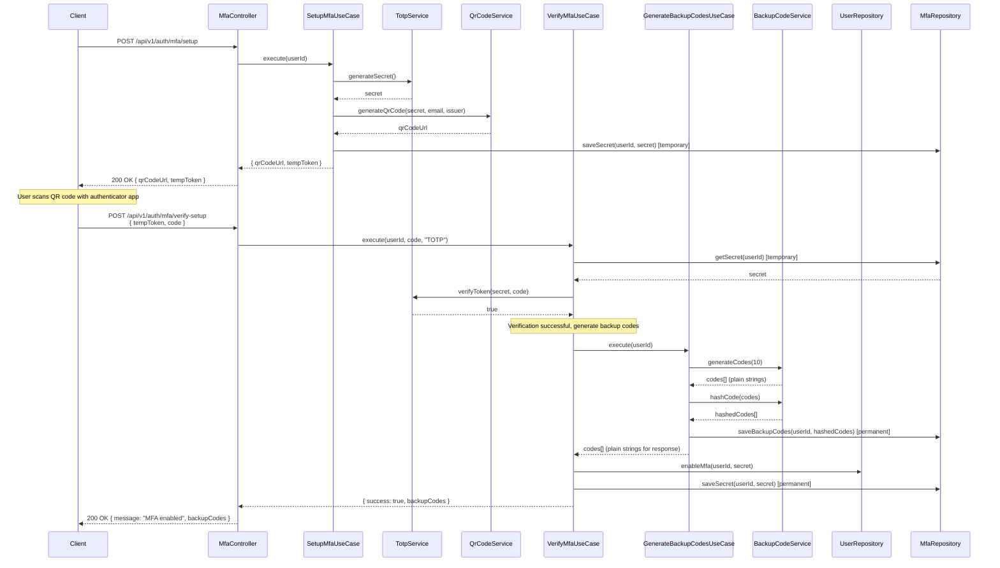
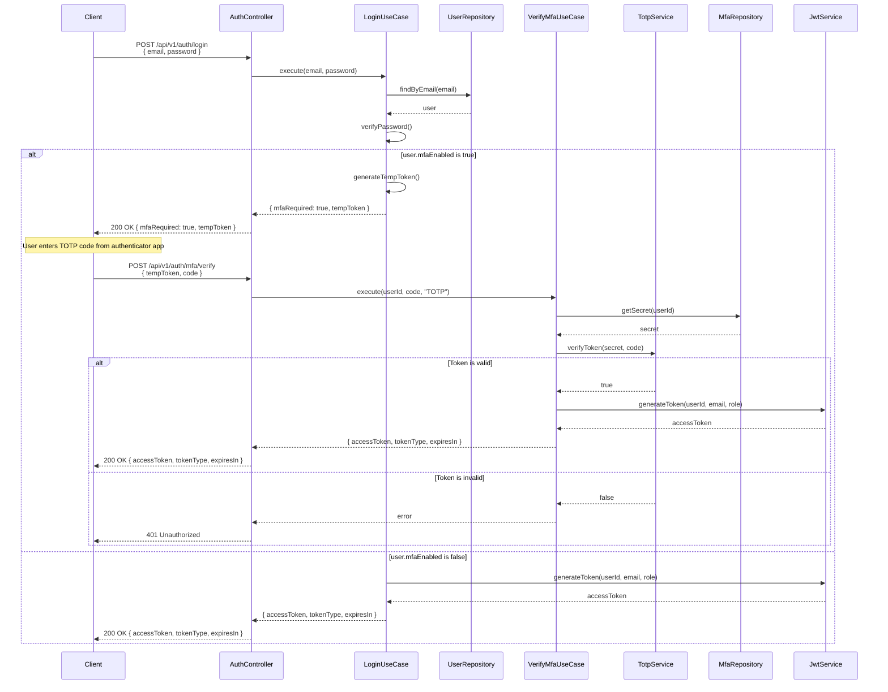
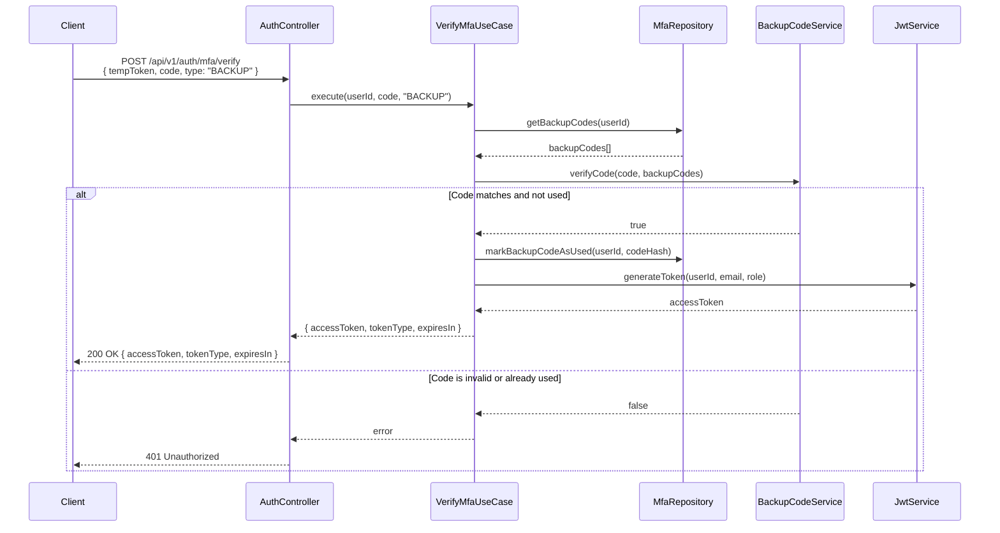
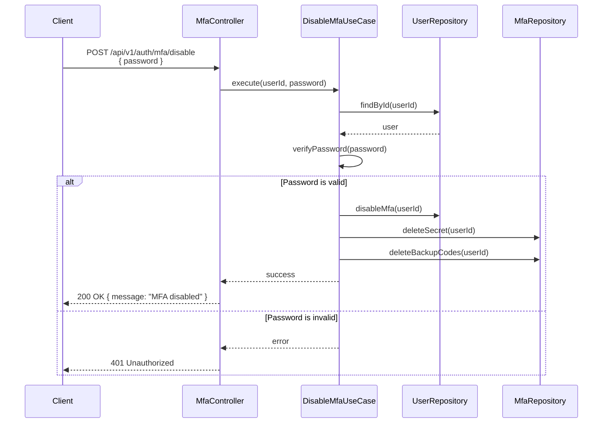

# シーケンス図 (Sequence Diagrams)

## MFAセットアップフロー

```mermaid
sequenceDiagram
    participant Client
    participant MfaController
    participant SetupMfaUseCase
    participant TotpService
    participant QrCodeService
    participant VerifyMfaUseCase
    participant GenerateBackupCodesUseCase
    participant BackupCodeService
    participant UserRepository
    participant MfaRepository

    Client->>MfaController: POST /api/v1/auth/mfa/setup
    MfaController->>SetupMfaUseCase: execute(userId)
    
    SetupMfaUseCase->>TotpService: generateSecret()
    TotpService-->>SetupMfaUseCase: secret
    
    SetupMfaUseCase->>QrCodeService: generateQrCode(secret, email, issuer)
    QrCodeService-->>SetupMfaUseCase: qrCodeUrl
    
    SetupMfaUseCase->>MfaRepository: saveSecret(userId, secret) [temporary]
    
    SetupMfaUseCase-->>MfaController: { qrCodeUrl, tempToken }
    MfaController-->>Client: 200 OK { qrCodeUrl, tempToken }
    
    Note over Client: User scans QR code with authenticator app
    
    Client->>MfaController: POST /api/v1/auth/mfa/verify-setup<br/>{ tempToken, code }
    MfaController->>VerifyMfaUseCase: execute(userId, code, "TOTP")
    
    VerifyMfaUseCase->>MfaRepository: getSecret(userId) [temporary]
    MfaRepository-->>VerifyMfaUseCase: secret
    
    VerifyMfaUseCase->>TotpService: verifyToken(secret, code)
    TotpService-->>VerifyMfaUseCase: true
    
    Note over VerifyMfaUseCase: Verification successful, generate backup codes
    
    VerifyMfaUseCase->>GenerateBackupCodesUseCase: execute(userId)
    
    GenerateBackupCodesUseCase->>BackupCodeService: generateCodes(10)
    BackupCodeService-->>GenerateBackupCodesUseCase: codes[] (plain strings)
    
    GenerateBackupCodesUseCase->>BackupCodeService: hashCode(codes)
    BackupCodeService-->>GenerateBackupCodesUseCase: hashedCodes[]
    
    GenerateBackupCodesUseCase->>MfaRepository: saveBackupCodes(userId, hashedCodes) [permanent]
    GenerateBackupCodesUseCase-->>VerifyMfaUseCase: codes[] (plain strings for response)
    
    VerifyMfaUseCase->>UserRepository: enableMfa(userId, secret)
    VerifyMfaUseCase->>MfaRepository: saveSecret(userId, secret) [permanent]
    
    VerifyMfaUseCase-->>MfaController: { success: true, backupCodes }
    MfaController-->>Client: 200 OK { message: "MFA enabled", backupCodes }
```

## ログイン時のMFA認証フロー

```mermaid
sequenceDiagram
    participant Client
    participant AuthController
    participant LoginUseCase
    participant UserRepository
    participant VerifyMfaUseCase
    participant TotpService
    participant MfaRepository
    participant JwtService

    Client->>AuthController: POST /api/v1/auth/login<br/>{ email, password }
    AuthController->>LoginUseCase: execute(email, password)
    
    LoginUseCase->>UserRepository: findByEmail(email)
    UserRepository-->>LoginUseCase: user
    
    LoginUseCase->>LoginUseCase: verifyPassword()
    
    alt user.mfaEnabled is true
        LoginUseCase->>LoginUseCase: generateTempToken()
        LoginUseCase-->>AuthController: { mfaRequired: true, tempToken }
        AuthController-->>Client: 200 OK { mfaRequired: true, tempToken }
        
        Note over Client: User enters TOTP code from authenticator app
        
        Client->>AuthController: POST /api/v1/auth/mfa/verify<br/>{ tempToken, code }
        AuthController->>VerifyMfaUseCase: execute(userId, code, "TOTP")
        
        VerifyMfaUseCase->>MfaRepository: getSecret(userId)
        MfaRepository-->>VerifyMfaUseCase: secret
        
        VerifyMfaUseCase->>TotpService: verifyToken(secret, code)
        
        alt Token is valid
            TotpService-->>VerifyMfaUseCase: true
            VerifyMfaUseCase->>JwtService: generateToken(userId, email, role)
            JwtService-->>VerifyMfaUseCase: accessToken
            VerifyMfaUseCase-->>AuthController: { accessToken, tokenType, expiresIn }
            AuthController-->>Client: 200 OK { accessToken, tokenType, expiresIn }
        else Token is invalid
            TotpService-->>VerifyMfaUseCase: false
            VerifyMfaUseCase-->>AuthController: error
            AuthController-->>Client: 401 Unauthorized
        end
    else user.mfaEnabled is false
        LoginUseCase->>JwtService: generateToken(userId, email, role)
        JwtService-->>LoginUseCase: accessToken
        LoginUseCase-->>AuthController: { accessToken, tokenType, expiresIn }
        AuthController-->>Client: 200 OK { accessToken, tokenType, expiresIn }
    end
```

## バックアップコード使用フロー

```mermaid
sequenceDiagram
    participant Client
    participant AuthController
    participant VerifyMfaUseCase
    participant MfaRepository
    participant BackupCodeService
    participant JwtService

    Client->>AuthController: POST /api/v1/auth/mfa/verify<br/>{ tempToken, code, type: "BACKUP" }
    AuthController->>VerifyMfaUseCase: execute(userId, code, "BACKUP")
    
    VerifyMfaUseCase->>MfaRepository: getBackupCodes(userId)
    MfaRepository-->>VerifyMfaUseCase: backupCodes[]
    
    VerifyMfaUseCase->>BackupCodeService: verifyCode(code, backupCodes)
    
    alt Code matches and not used
        BackupCodeService-->>VerifyMfaUseCase: true
        VerifyMfaUseCase->>MfaRepository: markBackupCodeAsUsed(userId, codeHash)
        VerifyMfaUseCase->>JwtService: generateToken(userId, email, role)
        JwtService-->>VerifyMfaUseCase: accessToken
        VerifyMfaUseCase-->>AuthController: { accessToken, tokenType, expiresIn }
        AuthController-->>Client: 200 OK { accessToken, tokenType, expiresIn }
    else Code is invalid or already used
        BackupCodeService-->>VerifyMfaUseCase: false
        VerifyMfaUseCase-->>AuthController: error
        AuthController-->>Client: 401 Unauthorized
    end
```

## MFA無効化フロー

```mermaid
sequenceDiagram
    participant Client
    participant MfaController
    participant DisableMfaUseCase
    participant UserRepository
    participant MfaRepository

    Client->>MfaController: POST /api/v1/auth/mfa/disable<br/>{ password }
    MfaController->>DisableMfaUseCase: execute(userId, password)
    
    DisableMfaUseCase->>UserRepository: findById(userId)
    UserRepository-->>DisableMfaUseCase: user
    
    DisableMfaUseCase->>DisableMfaUseCase: verifyPassword(password)
    
    alt Password is valid
        DisableMfaUseCase->>UserRepository: disableMfa(userId)
        DisableMfaUseCase->>MfaRepository: deleteSecret(userId)
        DisableMfaUseCase->>MfaRepository: deleteBackupCodes(userId)
        DisableMfaUseCase-->>MfaController: success
        MfaController-->>Client: 200 OK { message: "MFA disabled" }
    else Password is invalid
        DisableMfaUseCase-->>MfaController: error
        MfaController-->>Client: 401 Unauthorized
    end
```

