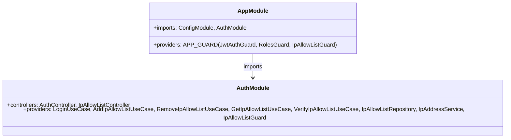
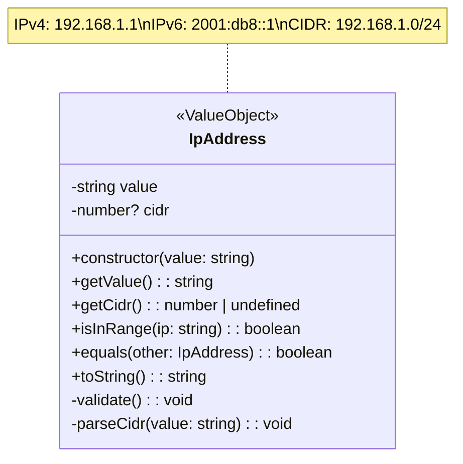

# クラス図 (Class Diagrams)

## IP AllowList関連クラス

```mermaid
classDiagram
    class User {
        +string id
        +string email
        +string hashedPassword
        +UserRole role
        +Date createdAt
        +Date updatedAt
        +create(id, email, hashedPassword, role)
        +reconstruct(id, email, hashedPassword, role, createdAt, updatedAt)
    }

    class IpAddress {
        <<ValueObject>>
        +string value
        +number? cidr
        +validate()
        +isInRange(ip: string): boolean
        +equals(other: IpAddress): boolean
    }

    class IpAllowList {
        <<Entity>>
        +string id
        +string userId
        +IpAddress ipAddress
        +string? description
        +Date createdAt
        +Date updatedAt
        +create(userId, ipAddress, description)
        +reconstruct(id, userId, ipAddress, description, createdAt, updatedAt)
    }

    class AddIpAllowListUseCase {
        -IIpAllowListRepository ipAllowListRepository
        -IpAddressService ipAddressService
        +execute(userId, ipAddress, description): IpAllowList
    }

    class RemoveIpAllowListUseCase {
        -IIpAllowListRepository ipAllowListRepository
        +execute(userId, ipAllowListId): void
    }

    class GetIpAllowListUseCase {
        -IIpAllowListRepository ipAllowListRepository
        +execute(userId): IpAllowList[]
    }

    class VerifyIpAllowListUseCase {
        -IIpAllowListRepository ipAllowListRepository
        -IpAddressService ipAddressService
        +execute(userId, clientIp): boolean
    }

    class IpAllowListController {
        -AddIpAllowListUseCase addIpAllowListUseCase
        -RemoveIpAllowListUseCase removeIpAllowListUseCase
        -GetIpAllowListUseCase getIpAllowListUseCase
        +addIpAllowList(dto): IpAllowListResponseDto
        +removeIpAllowList(id): void
        +getIpAllowList(): IpAllowListResponseDto[]
    }

    class IpAllowListGuard {
        -VerifyIpAllowListUseCase verifyIpAllowListUseCase
        +canActivate(context): boolean
        -extractClientIp(request): string
    }

    class IpAddressService {
        +validate(ipAddress: string): boolean
        +parse(ipAddress: string): IpAddress
        +isInRange(ip: string, cidr: string): boolean
        +isValidIpv4(ip: string): boolean
        +isValidIpv6(ip: string): boolean
    }

    class IpAllowListRepository {
        -Map~string, IpAllowList[]~ storage
        +save(ipAllowList: IpAllowList): Promise~void~
        +findByUserId(userId: string): Promise~IpAllowList[]~
        +findById(id: string): Promise~IpAllowList | null~
        +delete(id: string): Promise~void~
        +exists(userId: string, ipAddress: string): Promise~boolean~
    }

    class IIpAllowListRepository {
        <<interface>>
        +save(ipAllowList: IpAllowList): Promise~void~
        +findByUserId(userId: string): Promise~IpAllowList[]~
        +findById(id: string): Promise~IpAllowList | null~
        +delete(id: string): Promise~void~
        +exists(userId: string, ipAddress: string): Promise~boolean~
    }

    class LoginUseCase {
        -IUserRepository userRepository
        -PasswordService passwordService
        -JwtService jwtService
        -VerifyIpAllowListUseCase verifyIpAllowListUseCase
        +execute(email, password, clientIp): LoginResult
    }

    class AuthController {
        -LoginUseCase loginUseCase
        +login(dto): LoginResponseDto
    }

    %% Relationships
    IpAllowList --> User : belongs to
    IpAllowList --> IpAddress : contains
    AddIpAllowListUseCase --> IIpAllowListRepository : uses
    AddIpAllowListUseCase --> IpAddressService : uses
    RemoveIpAllowListUseCase --> IIpAllowListRepository : uses
    GetIpAllowListUseCase --> IIpAllowListRepository : uses
    VerifyIpAllowListUseCase --> IIpAllowListRepository : uses
    VerifyIpAllowListUseCase --> IpAddressService : uses
    IpAllowListController --> AddIpAllowListUseCase : uses
    IpAllowListController --> RemoveIpAllowListUseCase : uses
    IpAllowListController --> GetIpAllowListUseCase : uses
    IpAllowListGuard --> VerifyIpAllowListUseCase : uses
    IpAllowListRepository ..|> IIpAllowListRepository : implements
    LoginUseCase --> VerifyIpAllowListUseCase : uses
    AuthController --> LoginUseCase : uses
```

## モジュール構成

```mermaid
classDiagram
    class AuthModule {
        +controllers: AuthController, IpAllowListController
        +providers: LoginUseCase, AddIpAllowListUseCase, RemoveIpAllowListUseCase, GetIpAllowListUseCase, VerifyIpAllowListUseCase, IpAllowListRepository, IpAddressService, IpAllowListGuard
    }

    class AppModule {
        +imports: ConfigModule, AuthModule
        +providers: APP_GUARD (JwtAuthGuard, RolesGuard, IpAllowListGuard)
    }

    AppModule --> AuthModule : imports
```

## Value Object詳細

```mermaid
classDiagram
    class IpAddress {
        <<ValueObject>>
        -string value
        -number? cidr
        +constructor(value: string)
        +getValue(): string
        +getCidr(): number | undefined
        +isInRange(ip: string): boolean
        +equals(other: IpAddress): boolean
        +toString(): string
        -validate(): void
        -parseCidr(value: string): void
    }

    note for IpAddress "IPv4: 192.168.1.1\nIPv6: 2001:db8::1\nCIDR: 192.168.1.0/24"
```

