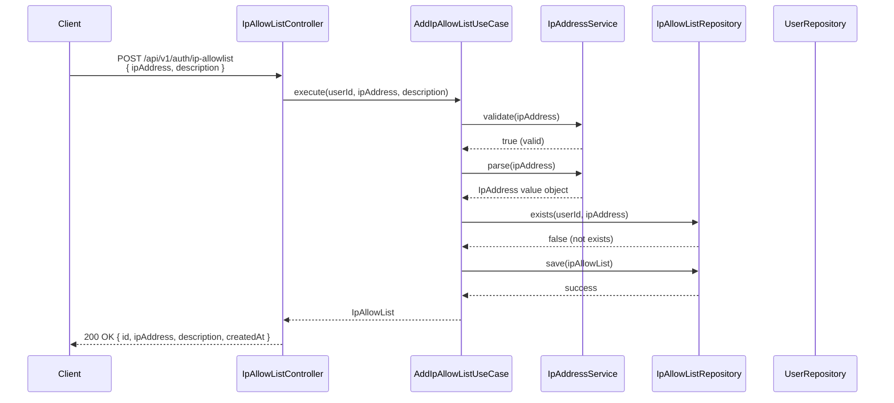
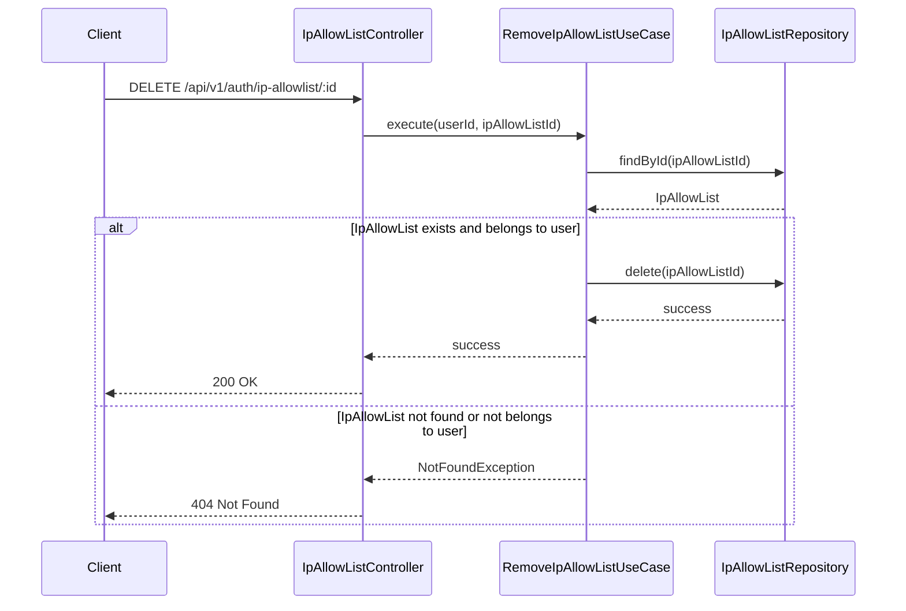
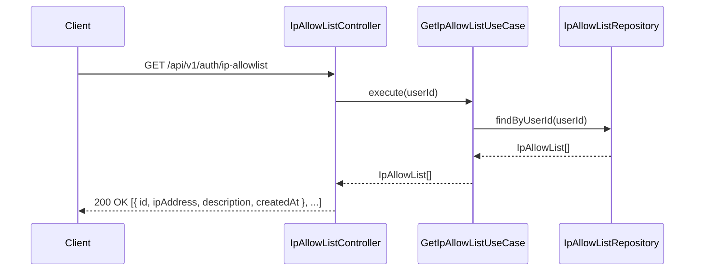
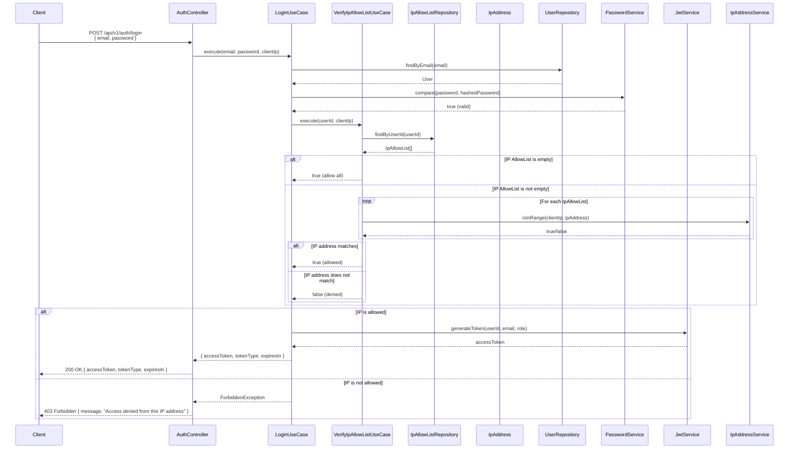

# シーケンス図 (Sequence Diagrams)

## IP AllowList追加フロー

```mermaid
sequenceDiagram
    participant Client
    participant IpAllowListController
    participant AddIpAllowListUseCase
    participant IpAddressService
    participant IpAllowListRepository
    participant UserRepository

    Client->>IpAllowListController: POST /api/v1/auth/ip-allowlist<br/>{ ipAddress, description }
    IpAllowListController->>AddIpAllowListUseCase: execute(userId, ipAddress, description)
    
    AddIpAllowListUseCase->>IpAddressService: validate(ipAddress)
    IpAddressService-->>AddIpAllowListUseCase: true (valid)
    
    AddIpAllowListUseCase->>IpAddressService: parse(ipAddress)
    IpAddressService-->>AddIpAllowListUseCase: IpAddress value object
    
    AddIpAllowListUseCase->>IpAllowListRepository: exists(userId, ipAddress)
    IpAllowListRepository-->>AddIpAllowListUseCase: false (not exists)
    
    AddIpAllowListUseCase->>IpAllowListRepository: save(ipAllowList)
    IpAllowListRepository-->>AddIpAllowListUseCase: success
    
    AddIpAllowListUseCase-->>IpAllowListController: IpAllowList
    IpAllowListController-->>Client: 200 OK { id, ipAddress, description, createdAt }
```

## IP AllowList削除フロー

```mermaid
sequenceDiagram
    participant Client
    participant IpAllowListController
    participant RemoveIpAllowListUseCase
    participant IpAllowListRepository

    Client->>IpAllowListController: DELETE /api/v1/auth/ip-allowlist/:id
    IpAllowListController->>RemoveIpAllowListUseCase: execute(userId, ipAllowListId)
    
    RemoveIpAllowListUseCase->>IpAllowListRepository: findById(ipAllowListId)
    IpAllowListRepository-->>RemoveIpAllowListUseCase: IpAllowList
    
    alt IpAllowList exists and belongs to user
        RemoveIpAllowListUseCase->>IpAllowListRepository: delete(ipAllowListId)
        IpAllowListRepository-->>RemoveIpAllowListUseCase: success
        RemoveIpAllowListUseCase-->>IpAllowListController: success
        IpAllowListController-->>Client: 200 OK
    else IpAllowList not found or not belongs to user
        RemoveIpAllowListUseCase-->>IpAllowListController: NotFoundException
        IpAllowListController-->>Client: 404 Not Found
    end
```

## IP AllowList一覧取得フロー

```mermaid
sequenceDiagram
    participant Client
    participant IpAllowListController
    participant GetIpAllowListUseCase
    participant IpAllowListRepository

    Client->>IpAllowListController: GET /api/v1/auth/ip-allowlist
    IpAllowListController->>GetIpAllowListUseCase: execute(userId)
    
    GetIpAllowListUseCase->>IpAllowListRepository: findByUserId(userId)
    IpAllowListRepository-->>GetIpAllowListUseCase: IpAllowList[]
    
    GetIpAllowListUseCase-->>IpAllowListController: IpAllowList[]
    IpAllowListController-->>Client: 200 OK [{ id, ipAddress, description, createdAt }, ...]
```

## ログイン時のIP検証フロー

```mermaid
sequenceDiagram
    participant Client
    participant AuthController
    participant LoginUseCase
    participant VerifyIpAllowListUseCase
    participant IpAllowListRepository
    participant IpAddress
    participant UserRepository
    participant PasswordService
    participant JwtService

    Client->>AuthController: POST /api/v1/auth/login<br/>{ email, password }
    AuthController->>LoginUseCase: execute(email, password, clientIp)
    
    LoginUseCase->>UserRepository: findByEmail(email)
    UserRepository-->>LoginUseCase: User
    
    LoginUseCase->>PasswordService: compare(password, hashedPassword)
    PasswordService-->>LoginUseCase: true (valid)
    
    LoginUseCase->>VerifyIpAllowListUseCase: execute(userId, clientIp)
    
    VerifyIpAllowListUseCase->>IpAllowListRepository: findByUserId(userId)
    IpAllowListRepository-->>VerifyIpAllowListUseCase: IpAllowList[]
    
    alt IP AllowList is empty
        VerifyIpAllowListUseCase-->>LoginUseCase: true (allow all)
    else IP AllowList is not empty
        loop For each IpAllowList
            VerifyIpAllowListUseCase->>IpAddressService: isInRange(clientIp, ipAddress)
            IpAddressService-->>VerifyIpAllowListUseCase: true/false
        end
        
        alt IP address matches
            VerifyIpAllowListUseCase-->>LoginUseCase: true (allowed)
        else IP address does not match
            VerifyIpAllowListUseCase-->>LoginUseCase: false (denied)
        end
    end
    
    alt IP is allowed
        LoginUseCase->>JwtService: generateToken(userId, email, role)
        JwtService-->>LoginUseCase: accessToken
        LoginUseCase-->>AuthController: { accessToken, tokenType, expiresIn }
        AuthController-->>Client: 200 OK { accessToken, tokenType, expiresIn }
    else IP is not allowed
        LoginUseCase-->>AuthController: ForbiddenException
        AuthController-->>Client: 403 Forbidden { message: "Access denied from this IP address" }
    end
```

