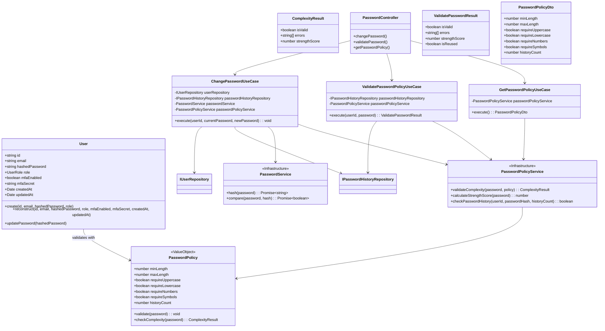
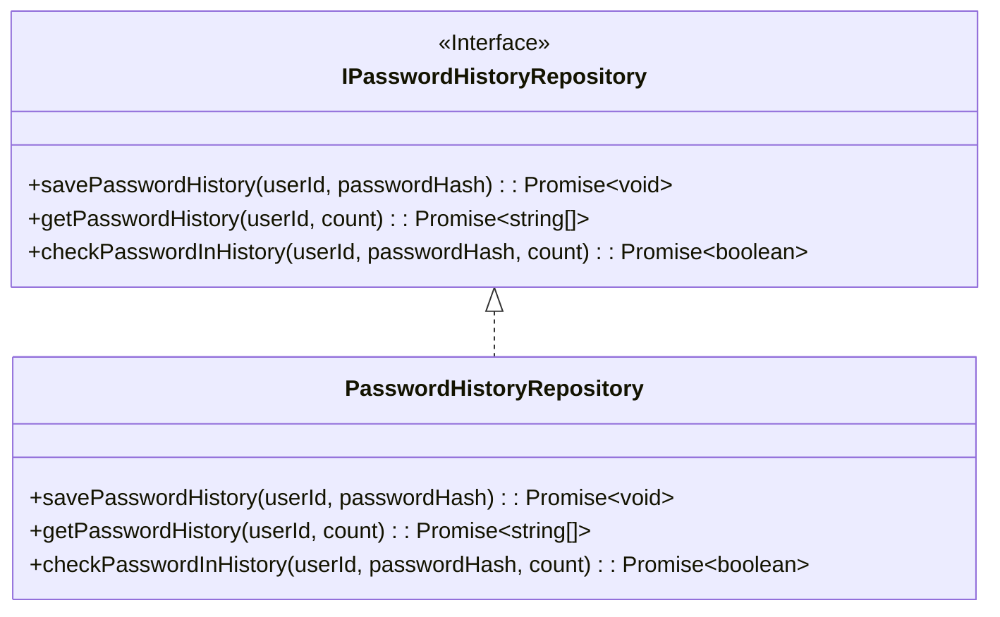
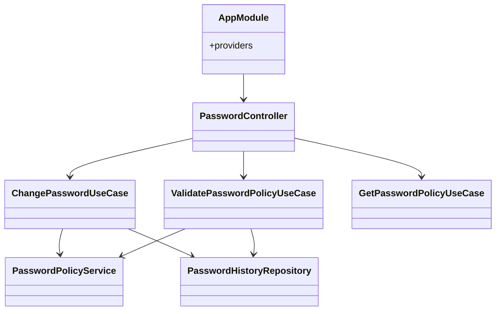

# クラス図 (Class Diagrams)

## パスワードポリシー関連クラス

```mermaid
classDiagram
    class User {
        +string id
        +string email
        +string hashedPassword
        +UserRole role
        +boolean mfaEnabled
        +string mfaSecret
        +Date createdAt
        +Date updatedAt
        +create(id, email, hashedPassword, role)
        +reconstruct(id, email, hashedPassword, role, mfaEnabled, mfaSecret, createdAt, updatedAt)
        +updatePassword(hashedPassword)
    }

    class PasswordPolicy {
        <<ValueObject>>
        +number minLength
        +number maxLength
        +boolean requireUppercase
        +boolean requireLowercase
        +boolean requireNumbers
        +boolean requireSymbols
        +number historyCount
        +validate(password): void
        +checkComplexity(password): ComplexityResult
    }

    class ComplexityResult {
        +boolean isValid
        +string[] errors
        +number strengthScore
    }

    class ChangePasswordUseCase {
        -IUserRepository userRepository
        -IPasswordHistoryRepository passwordHistoryRepository
        -PasswordService passwordService
        -PasswordPolicyService passwordPolicyService
        +execute(userId, currentPassword, newPassword): void
    }

    class ValidatePasswordPolicyUseCase {
        -IPasswordHistoryRepository passwordHistoryRepository
        -PasswordPolicyService passwordPolicyService
        +execute(userId, password): ValidatePasswordResult
    }

    class GetPasswordPolicyUseCase {
        -PasswordPolicyService passwordPolicyService
        +execute(): PasswordPolicyDto
    }

    class PasswordPolicyService {
        <<Infrastructure>>
        +validateComplexity(password, policy): ComplexityResult
        +calculateStrengthScore(password): number
        +checkPasswordHistory(userId, passwordHash, historyCount): boolean
    }

    class PasswordService {
        <<Infrastructure>>
        +hash(password): Promise~string~
        +compare(password, hash): Promise~boolean~
    }

    class PasswordController {
        +changePassword()
        +validatePassword()
        +getPasswordPolicy()
    }

    class ValidatePasswordResult {
        +boolean isValid
        +string[] errors
        +number strengthScore
        +boolean isReused
    }

    class PasswordPolicyDto {
        +number minLength
        +number maxLength
        +boolean requireUppercase
        +boolean requireLowercase
        +boolean requireNumbers
        +boolean requireSymbols
        +number historyCount
    }

    User --> PasswordPolicy : validates with
    ChangePasswordUseCase --> IUserRepository
    ChangePasswordUseCase --> IPasswordHistoryRepository
    ChangePasswordUseCase --> PasswordService
    ChangePasswordUseCase --> PasswordPolicyService
    ValidatePasswordPolicyUseCase --> IPasswordHistoryRepository
    ValidatePasswordPolicyUseCase --> PasswordPolicyService
    GetPasswordPolicyUseCase --> PasswordPolicyService
    PasswordController --> ChangePasswordUseCase
    PasswordController --> ValidatePasswordPolicyUseCase
    PasswordController --> GetPasswordPolicyUseCase
    PasswordPolicyService --> PasswordPolicy
```

## リポジトリインターフェース

```mermaid
classDiagram
    class IPasswordHistoryRepository {
        <<Interface>>
        +savePasswordHistory(userId, passwordHash): Promise~void~
        +getPasswordHistory(userId, count): Promise~string[]~
        +checkPasswordInHistory(userId, passwordHash, count): Promise~boolean~
    }

    class PasswordHistoryRepository {
        +savePasswordHistory(userId, passwordHash): Promise~void~
        +getPasswordHistory(userId, count): Promise~string[]~
        +checkPasswordInHistory(userId, passwordHash, count): Promise~boolean~
    }

    IPasswordHistoryRepository <|.. PasswordHistoryRepository
```

## 依存関係

```mermaid
classDiagram
    class PasswordController {
    }

    class AppModule {
        +providers
    }

    class ChangePasswordUseCase {
    }

    class ValidatePasswordPolicyUseCase {
    }

    class GetPasswordPolicyUseCase {
    }

    class PasswordPolicyService {
    }

    class PasswordHistoryRepository {
    }

    AppModule --> PasswordController
    PasswordController --> ChangePasswordUseCase
    PasswordController --> ValidatePasswordPolicyUseCase
    PasswordController --> GetPasswordPolicyUseCase
    ChangePasswordUseCase --> PasswordPolicyService
    ChangePasswordUseCase --> PasswordHistoryRepository
    ValidatePasswordPolicyUseCase --> PasswordPolicyService
    ValidatePasswordPolicyUseCase --> PasswordHistoryRepository
```

