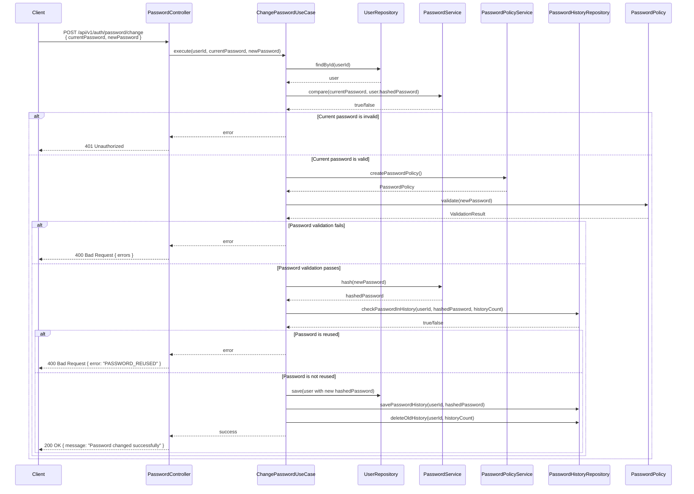
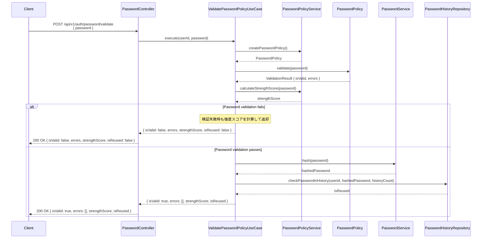
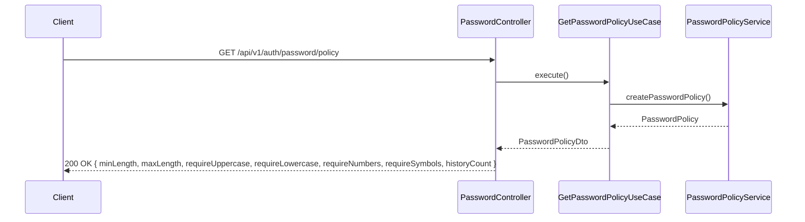

# シーケンス図 (Sequence Diagrams)

## パスワード変更フロー

```mermaid
sequenceDiagram
    participant Client
    participant PasswordController
    participant ChangePasswordUseCase
    participant UserRepository
    participant PasswordService
    participant PasswordPolicyService
    participant PasswordHistoryRepository

    Client->>PasswordController: POST /api/v1/auth/password/change<br/>{ currentPassword, newPassword }
    PasswordController->>ChangePasswordUseCase: execute(userId, currentPassword, newPassword)
    
    ChangePasswordUseCase->>UserRepository: findById(userId)
    UserRepository-->>ChangePasswordUseCase: user
    
    ChangePasswordUseCase->>PasswordService: compare(currentPassword, user.hashedPassword)
    PasswordService-->>ChangePasswordUseCase: true/false
    
    alt Current password is invalid
        ChangePasswordUseCase-->>PasswordController: error
        PasswordController-->>Client: 401 Unauthorized
    else Current password is valid
        ChangePasswordUseCase->>PasswordPolicyService: createPasswordPolicy()
        PasswordPolicyService-->>ChangePasswordUseCase: PasswordPolicy
        
        ChangePasswordUseCase->>PasswordPolicy: validate(newPassword)
        PasswordPolicy-->>ChangePasswordUseCase: ValidationResult
        
        alt Password validation fails
            ChangePasswordUseCase-->>PasswordController: error
            PasswordController-->>Client: 400 Bad Request { errors }
        else Password validation passes
            ChangePasswordUseCase->>PasswordService: hash(newPassword)
            PasswordService-->>ChangePasswordUseCase: hashedPassword
            
            ChangePasswordUseCase->>PasswordHistoryRepository: checkPasswordInHistory(userId, hashedPassword, historyCount)
            PasswordHistoryRepository-->>ChangePasswordUseCase: true/false
            
            alt Password is reused
                ChangePasswordUseCase-->>PasswordController: error
                PasswordController-->>Client: 400 Bad Request { error: "PASSWORD_REUSED" }
            else Password is not reused
                ChangePasswordUseCase->>UserRepository: save(user with new hashedPassword)
                ChangePasswordUseCase->>PasswordHistoryRepository: savePasswordHistory(userId, hashedPassword)
                ChangePasswordUseCase->>PasswordHistoryRepository: deleteOldHistory(userId, historyCount)
                
                ChangePasswordUseCase-->>PasswordController: success
                PasswordController-->>Client: 200 OK { message: "Password changed successfully" }
            end
        end
    end
```

## パスワード強度チェックフロー

```mermaid
sequenceDiagram
    participant Client
    participant PasswordController
    participant ValidatePasswordPolicyUseCase
    participant PasswordPolicyService
    participant PasswordPolicy
    participant PasswordService
    participant PasswordHistoryRepository

    Client->>PasswordController: POST /api/v1/auth/password/validate<br/>{ password }
    PasswordController->>ValidatePasswordPolicyUseCase: execute(userId, password)
    
    ValidatePasswordPolicyUseCase->>PasswordPolicyService: createPasswordPolicy()
    PasswordPolicyService-->>ValidatePasswordPolicyUseCase: PasswordPolicy
    
    ValidatePasswordPolicyUseCase->>PasswordPolicy: validate(password)
    PasswordPolicy-->>ValidatePasswordPolicyUseCase: ValidationResult { isValid, errors }
    
    ValidatePasswordPolicyUseCase->>PasswordPolicyService: calculateStrengthScore(password)
    PasswordPolicyService-->>ValidatePasswordPolicyUseCase: strengthScore
    
    alt Password validation fails
        Note over ValidatePasswordPolicyUseCase: 検証失敗時も強度スコアを計算して返却
        ValidatePasswordPolicyUseCase-->>PasswordController: { isValid: false, errors, strengthScore, isReused: false }
        PasswordController-->>Client: 200 OK { isValid: false, errors, strengthScore, isReused: false }
    else Password validation passes
        ValidatePasswordPolicyUseCase->>PasswordService: hash(password)
        PasswordService-->>ValidatePasswordPolicyUseCase: hashedPassword
        
        ValidatePasswordPolicyUseCase->>PasswordHistoryRepository: checkPasswordInHistory(userId, hashedPassword, historyCount)
        PasswordHistoryRepository-->>ValidatePasswordPolicyUseCase: isReused
        
        ValidatePasswordPolicyUseCase-->>PasswordController: { isValid: true, errors: [], strengthScore, isReused }
        PasswordController-->>Client: 200 OK { isValid: true, errors: [], strengthScore, isReused }
    end
```

## パスワードポリシー設定取得フロー

```mermaid
sequenceDiagram
    participant Client
    participant PasswordController
    participant GetPasswordPolicyUseCase
    participant PasswordPolicyService

    Client->>PasswordController: GET /api/v1/auth/password/policy
    PasswordController->>GetPasswordPolicyUseCase: execute()
    
    GetPasswordPolicyUseCase->>PasswordPolicyService: createPasswordPolicy()
    PasswordPolicyService-->>GetPasswordPolicyUseCase: PasswordPolicy
    
    GetPasswordPolicyUseCase-->>PasswordController: PasswordPolicyDto
    PasswordController-->>Client: 200 OK { minLength, maxLength, requireUppercase, requireLowercase, requireNumbers, requireSymbols, historyCount }
```

