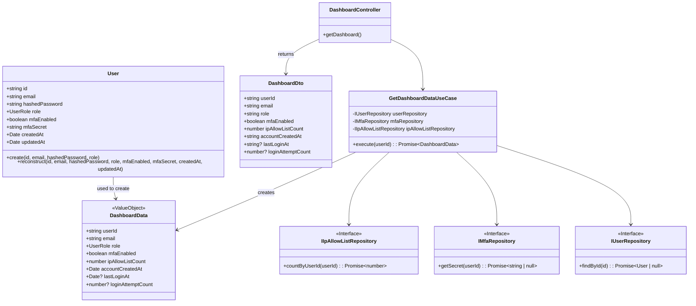
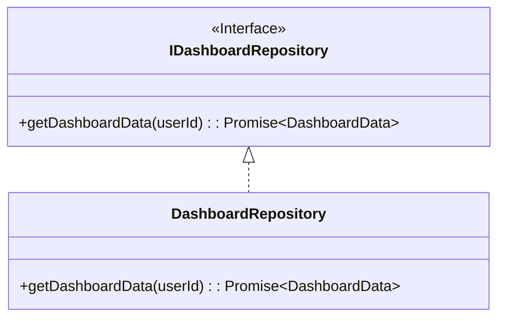
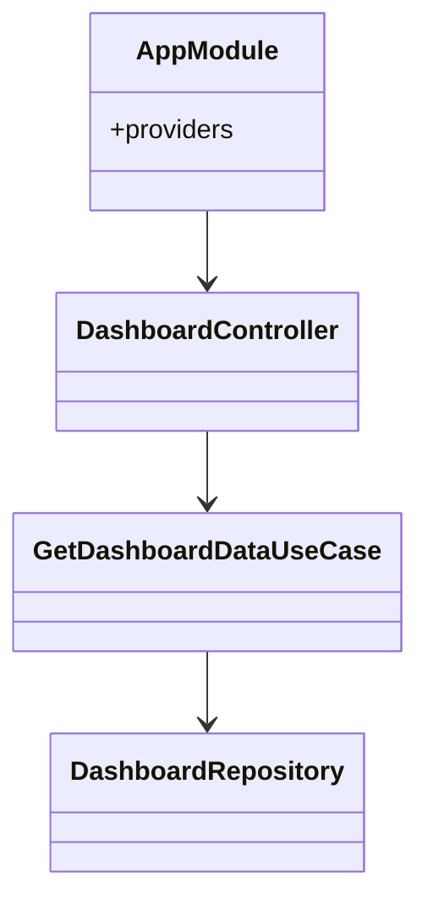

# クラス図 (Class Diagrams)

## ダッシュボード関連クラス

```mermaid
classDiagram
    class User {
        +string id
        +string email
        +string hashedPassword
        +UserRole role
        +boolean mfaEnabled
        +string mfaSecret
        +Date createdAt
        +Date updatedAt
        +create(id, email, hashedPassword, role)
        +reconstruct(id, email, hashedPassword, role, mfaEnabled, mfaSecret, createdAt, updatedAt)
    }

    class DashboardData {
        <<ValueObject>>
        +string userId
        +string email
        +UserRole role
        +boolean mfaEnabled
        +number ipAllowListCount
        +Date accountCreatedAt
        +Date? lastLoginAt
        +number? loginAttemptCount
    }

    class GetDashboardDataUseCase {
        -IUserRepository userRepository
        -IMfaRepository mfaRepository
        -IIpAllowListRepository ipAllowListRepository
        +execute(userId): Promise~DashboardData~
    }

    class DashboardController {
        +getDashboard()
    }

    class DashboardDto {
        +string userId
        +string email
        +string role
        +boolean mfaEnabled
        +number ipAllowListCount
        +string accountCreatedAt
        +string? lastLoginAt
        +number? loginAttemptCount
    }

    class IUserRepository {
        <<Interface>>
        +findById(id): Promise~User | null~
    }

    class IMfaRepository {
        <<Interface>>
        +getSecret(userId): Promise~string | null~
    }

    class IIpAllowListRepository {
        <<Interface>>
        +countByUserId(userId): Promise~number~
    }

    User --> DashboardData : used to create
    GetDashboardDataUseCase --> IUserRepository
    GetDashboardDataUseCase --> IMfaRepository
    GetDashboardDataUseCase --> IIpAllowListRepository
    GetDashboardDataUseCase --> DashboardData : creates
    DashboardController --> GetDashboardDataUseCase
    DashboardController --> DashboardDto : returns
```

## リポジトリインターフェース

```mermaid
classDiagram
    class IDashboardRepository {
        <<Interface>>
        +getDashboardData(userId): Promise~DashboardData~
    }

    class DashboardRepository {
        +getDashboardData(userId): Promise~DashboardData~
    }

    IDashboardRepository <|.. DashboardRepository
```

## 依存関係

```mermaid
classDiagram
    class DashboardController {
    }

    class AppModule {
        +providers
    }

    class GetDashboardDataUseCase {
    }

    class DashboardRepository {
    }

    AppModule --> DashboardController
    DashboardController --> GetDashboardDataUseCase
    GetDashboardDataUseCase --> DashboardRepository
```

