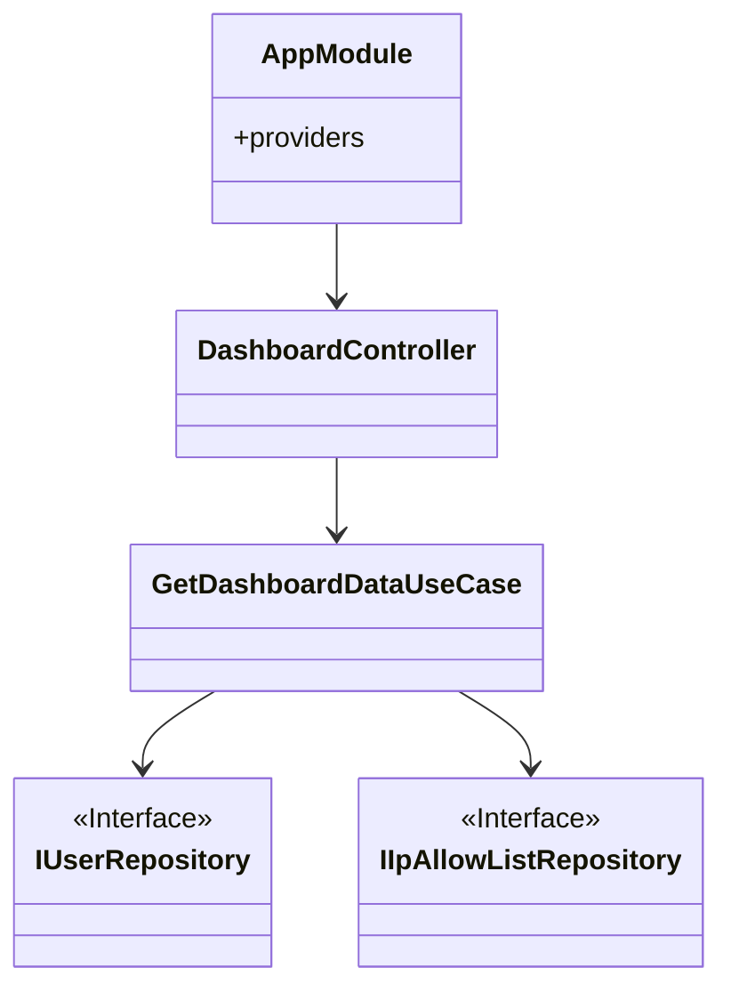
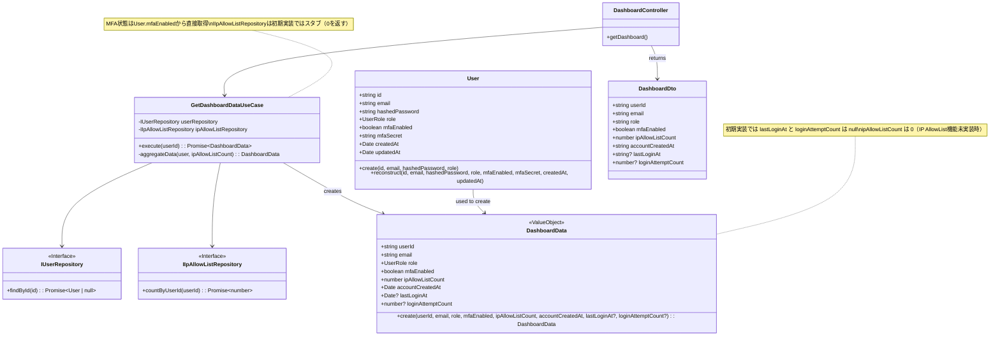

# クラス図 (Class Diagrams)

## ダッシュボード関連クラス

## 依存関係

**注意**: `GetDashboardDataUseCase`は既存のRepositoryインターフェースに依存します。依存性逆転の原則に従い、具象クラスではなくインターフェースに依存します。

## ダッシュボード関連クラス

## 依存関係

**注意**: `GetDashboardDataUseCase`は既存のRepositoryインターフェースに依存します。依存性逆転の原則に従い、具象クラスではなくインターフェースに依存します。

## ダッシュボード関連クラス

## 依存関係

**注意**: `GetDashboardDataUseCase`は既存のRepositoryインターフェースに依存します。依存性逆転の原則に従い、具象クラスではなくインターフェースに依存します。

