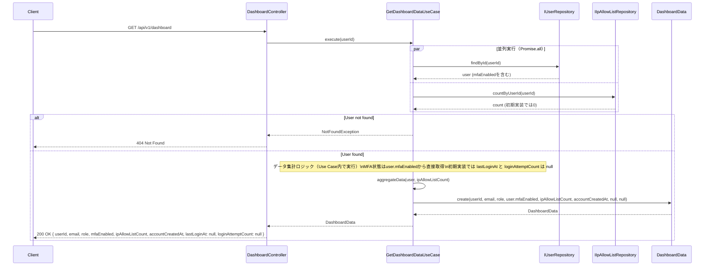

# シーケンス図 (Sequence Diagrams)

## ダッシュボードデータ取得フロー

```mermaid
sequenceDiagram
    participant Client
    participant DashboardController
    participant GetDashboardDataUseCase
    participant IUserRepository
    participant IIpAllowListRepository
    participant DashboardData

    Client->>DashboardController: GET /api/v1/dashboard
    DashboardController->>GetDashboardDataUseCase: execute(userId)
    
    par 並列実行（Promise.all）
        GetDashboardDataUseCase->>IUserRepository: findById(userId)
        IUserRepository-->>GetDashboardDataUseCase: user (mfaEnabledを含む)
    and
        GetDashboardDataUseCase->>IIpAllowListRepository: countByUserId(userId)
        IIpAllowListRepository-->>GetDashboardDataUseCase: count (初期実装では0)
    end
    
    alt User not found
        GetDashboardDataUseCase-->>DashboardController: NotFoundException
        DashboardController-->>Client: 404 Not Found
    else User found
        Note over GetDashboardDataUseCase: データ集計ロジック（Use Case内で実行）\nMFA状態はuser.mfaEnabledから直接取得\n初期実装では lastLoginAt と loginAttemptCount は null
        GetDashboardDataUseCase->>GetDashboardDataUseCase: aggregateData(user, ipAllowListCount)
        GetDashboardDataUseCase->>DashboardData: create(userId, email, role, user.mfaEnabled, ipAllowListCount, accountCreatedAt, null, null)
        DashboardData-->>GetDashboardDataUseCase: DashboardData
        
        GetDashboardDataUseCase-->>DashboardController: DashboardData
        DashboardController-->>Client: 200 OK { userId, email, role, mfaEnabled, ipAllowListCount, accountCreatedAt, lastLoginAt: null, loginAttemptCount: null }
    end
```

## ダッシュボードデータ取得フロー

```mermaid
sequenceDiagram
    participant Client
    participant DashboardController
    participant GetDashboardDataUseCase
    participant IUserRepository
    participant IIpAllowListRepository
    participant DashboardData

    Client->>DashboardController: GET /api/v1/dashboard
    DashboardController->>GetDashboardDataUseCase: execute(userId)
    
    par 並列実行（Promise.all）
        GetDashboardDataUseCase->>IUserRepository: findById(userId)
        IUserRepository-->>GetDashboardDataUseCase: user (mfaEnabledを含む)
    and
        GetDashboardDataUseCase->>IIpAllowListRepository: countByUserId(userId)
        IIpAllowListRepository-->>GetDashboardDataUseCase: count (初期実装では0)
    end
    
    alt User not found
        GetDashboardDataUseCase-->>DashboardController: NotFoundException
        DashboardController-->>Client: 404 Not Found
    else User found
        Note over GetDashboardDataUseCase: データ集計ロジック（Use Case内で実行）\nMFA状態はuser.mfaEnabledから直接取得\n初期実装では lastLoginAt と loginAttemptCount は null
        GetDashboardDataUseCase->>GetDashboardDataUseCase: aggregateData(user, ipAllowListCount)
        GetDashboardDataUseCase->>DashboardData: create(userId, email, role, user.mfaEnabled, ipAllowListCount, accountCreatedAt, null, null)
        DashboardData-->>GetDashboardDataUseCase: DashboardData
        
        GetDashboardDataUseCase-->>DashboardController: DashboardData
        DashboardController-->>Client: 200 OK { userId, email, role, mfaEnabled, ipAllowListCount, accountCreatedAt, lastLoginAt: null, loginAttemptCount: null }
    end
```

## ダッシュボードデータ取得フロー

```mermaid
sequenceDiagram
    participant Client
    participant DashboardController
    participant GetDashboardDataUseCase
    participant IUserRepository
    participant IIpAllowListRepository
    participant DashboardData

    Client->>DashboardController: GET /api/v1/dashboard
    DashboardController->>GetDashboardDataUseCase: execute(userId)
    
    par 並列実行（Promise.all）
        GetDashboardDataUseCase->>IUserRepository: findById(userId)
        IUserRepository-->>GetDashboardDataUseCase: user (mfaEnabledを含む)
    and
        GetDashboardDataUseCase->>IIpAllowListRepository: countByUserId(userId)
        IIpAllowListRepository-->>GetDashboardDataUseCase: count (初期実装では0)
    end
    
    alt User not found
        GetDashboardDataUseCase-->>DashboardController: NotFoundException
        DashboardController-->>Client: 404 Not Found
    else User found
        Note over GetDashboardDataUseCase: データ集計ロジック（Use Case内で実行）\nMFA状態はuser.mfaEnabledから直接取得\n初期実装では lastLoginAt と loginAttemptCount は null
        GetDashboardDataUseCase->>GetDashboardDataUseCase: aggregateData(user, ipAllowListCount)
        GetDashboardDataUseCase->>DashboardData: create(userId, email, role, user.mfaEnabled, ipAllowListCount, accountCreatedAt, null, null)
        DashboardData-->>GetDashboardDataUseCase: DashboardData
        
        GetDashboardDataUseCase-->>DashboardController: DashboardData
        DashboardController-->>Client: 200 OK { userId, email, role, mfaEnabled, ipAllowListCount, accountCreatedAt, lastLoginAt: null, loginAttemptCount: null }
    end
```

