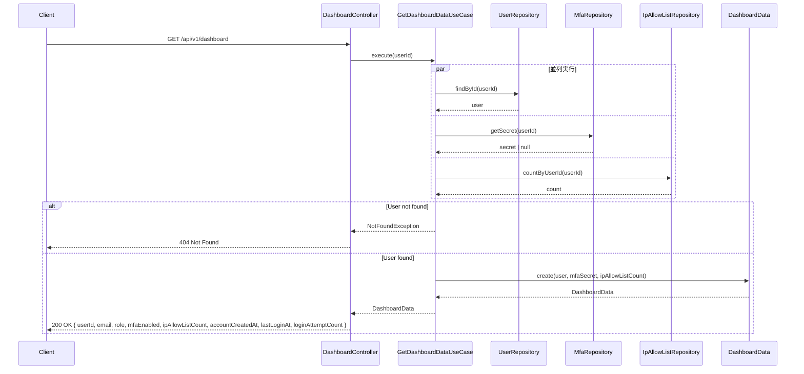

# シーケンス図 (Sequence Diagrams)

## ダッシュボードデータ取得フロー

```mermaid
sequenceDiagram
    participant Client
    participant DashboardController
    participant GetDashboardDataUseCase
    participant UserRepository
    participant MfaRepository
    participant IpAllowListRepository
    participant DashboardData

    Client->>DashboardController: GET /api/v1/dashboard
    DashboardController->>GetDashboardDataUseCase: execute(userId)
    
    par 並列実行
        GetDashboardDataUseCase->>UserRepository: findById(userId)
        UserRepository-->>GetDashboardDataUseCase: user
    and
        GetDashboardDataUseCase->>MfaRepository: getSecret(userId)
        MfaRepository-->>GetDashboardDataUseCase: secret | null
    and
        GetDashboardDataUseCase->>IpAllowListRepository: countByUserId(userId)
        IpAllowListRepository-->>GetDashboardDataUseCase: count
    end
    
    alt User not found
        GetDashboardDataUseCase-->>DashboardController: NotFoundException
        DashboardController-->>Client: 404 Not Found
    else User found
        GetDashboardDataUseCase->>DashboardData: create(user, mfaSecret, ipAllowListCount)
        DashboardData-->>GetDashboardDataUseCase: DashboardData
        
        GetDashboardDataUseCase-->>DashboardController: DashboardData
        DashboardController-->>Client: 200 OK { userId, email, role, mfaEnabled, ipAllowListCount, accountCreatedAt, lastLoginAt, loginAttemptCount }
    end
```

