# クラス図 (Class Diagrams)

## 顧客管理関連クラス

```mermaid
classDiagram
    %% Presentation Layer
    class CustomerController {
        +create(createCustomerDto: CreateCustomerDto): Promise~CustomerResponseDto~
        +update(id: string, updateCustomerDto: UpdateCustomerDto): Promise~CustomerResponseDto~
        +delete(id: string): Promise~void~
        +findAll(query: CustomerListQueryDto): Promise~CustomerListResponseDto~
        +findOne(id: string): Promise~CustomerResponseDto~
        +search(query: SearchCustomersDto): Promise~CustomerListResponseDto~
        +toggleStatus(id: string, statusDto: ToggleStatusDto): Promise~CustomerResponseDto~
    }
    
    class CreateCustomerDto {
        +string name
        +string email
        +string? phone
        +string? company
        +string? address
    }
    
    class UpdateCustomerDto {
        +string? name
        +string? email
        +string? phone
        +string? company
        +string? address
    }
    
    class CustomerResponseDto {
        +string id
        +string name
        +string email
        +string? phone
        +string? company
        +string? address
        +CustomerStatus status
        +Date createdAt
        +Date updatedAt
    }
    
    class CustomerListResponseDto {
        +CustomerResponseDto[] customers
        +number total
        +number page
        +number limit
    }
    
    class CustomerListQueryDto {
        +string? name
        +string? email
        +string? company
        +CustomerStatus? status
        +number? page
        +number? limit
    }
    
    class ToggleStatusDto {
        +CustomerStatus status
    }
    
    %% Application Layer
    class CreateCustomerUseCase {
        -ICustomerRepository customerRepository
        +execute(dto: CreateCustomerDto): Promise~Customer~
    }
    
    class UpdateCustomerUseCase {
        -ICustomerRepository customerRepository
        +execute(id: string, dto: UpdateCustomerDto): Promise~Customer~
    }
    
    class DeleteCustomerUseCase {
        -ICustomerRepository customerRepository
        +execute(id: string): Promise~void~
    }
    
    class GetCustomerListUseCase {
        -ICustomerRepository customerRepository
        +execute(query: CustomerListQuery): Promise~CustomerListResult~
    }
    
    class GetCustomerByIdUseCase {
        -ICustomerRepository customerRepository
        +execute(id: string): Promise~Customer | null~
    }
    
    class ToggleCustomerStatusUseCase {
        -ICustomerRepository customerRepository
        +execute(id: string, status: CustomerStatus): Promise~Customer~
    }
    
    %% Domain Layer
    class Customer {
        +string id
        +string name
        +string email
        +string? phone
        +string? company
        +string? address
        +CustomerStatus status
        +Date createdAt
        +Date updatedAt
        +create(name, email, phone?, company?, address?)
        +reconstruct(id, name, email, phone?, company?, address?, status, createdAt, updatedAt)
        +update(name?, email?, phone?, company?, address?)
        +activate()
        +deactivate()
    }
    
    class CustomerStatus {
        <<ValueObject>>
        +string value
        +validate()
        +isActive(): boolean
        +isInactive(): boolean
    }
    
    class ICustomerRepository {
        <<interface>>
        +create(customer: Customer): Promise~Customer~
        +update(customer: Customer): Promise~Customer~
        +delete(id: string): Promise~void~
        +findById(id: string): Promise~Customer | null~
        +findAll(query: CustomerListQuery): Promise~CustomerListResult~
        +search(query: SearchQuery): Promise~CustomerListResult~
    }
    
    %% Infrastructure Layer
    class CustomerRepository {
        +create(customer: Customer): Promise~Customer~
        +update(customer: Customer): Promise~Customer~
        +delete(id: string): Promise~void~
        +findById(id: string): Promise~Customer | null~
        +findAll(query: CustomerListQuery): Promise~CustomerListResult~
        +search(query: SearchQuery): Promise~CustomerListResult~
    }
    
    %% Relationships
    CustomerController --> CreateCustomerUseCase : uses
    CustomerController --> UpdateCustomerUseCase : uses
    CustomerController --> DeleteCustomerUseCase : uses
    CustomerController --> GetCustomerListUseCase : uses
    CustomerController --> GetCustomerByIdUseCase : uses
    CustomerController --> ToggleCustomerStatusUseCase : uses
    CustomerController --> CreateCustomerDto : receives
    CustomerController --> UpdateCustomerDto : receives
    CustomerController --> CustomerListQueryDto : receives
    CustomerController --> CustomerResponseDto : returns
    CustomerController --> CustomerListResponseDto : returns
    
    CreateCustomerUseCase --> ICustomerRepository : depends on
    UpdateCustomerUseCase --> ICustomerRepository : depends on
    DeleteCustomerUseCase --> ICustomerRepository : depends on
    GetCustomerListUseCase --> ICustomerRepository : depends on
    GetCustomerByIdUseCase --> ICustomerRepository : depends on
    ToggleCustomerStatusUseCase --> ICustomerRepository : depends on
    
    Customer --> CustomerStatus : uses
    CustomerRepository ..|> ICustomerRepository : implements
    
    CreateCustomerUseCase --> Customer : creates
    UpdateCustomerUseCase --> Customer : updates
    GetCustomerListUseCase --> Customer : returns
    GetCustomerByIdUseCase --> Customer : returns
    ToggleCustomerStatusUseCase --> Customer : updates
```

## クラス説明

### Presentation Layer

#### CustomerController
顧客管理に関するHTTPエンドポイントを提供するコントローラー。

- `create`: 新規顧客を作成
- `update`: 既存顧客を更新
- `delete`: 顧客を削除
- `findAll`: 顧客一覧を取得（ページネーション対応）
- `findOne`: 顧客詳細を取得
- `search`: 顧客を検索
- `toggleStatus`: 顧客の有効/無効状態を切り替え

#### DTOs
- **CreateCustomerDto**: 顧客作成時のリクエストDTO
- **UpdateCustomerDto**: 顧客更新時のリクエストDTO
- **CustomerResponseDto**: 顧客情報のレスポンスDTO
- **CustomerListResponseDto**: 顧客一覧のレスポンスDTO（ページネーション情報含む）
- **CustomerListQueryDto**: 顧客一覧取得・検索時のクエリDTO（検索パラメータ含む）
- **ToggleStatusDto**: ステータス変更時のリクエストDTO

### Application Layer

#### Use Cases
各ユースケースは単一責任の原則に従い、特定の操作を担当します。

- **CreateCustomerUseCase**: 顧客作成処理
- **UpdateCustomerUseCase**: 顧客更新処理
- **DeleteCustomerUseCase**: 顧客削除処理
- **GetCustomerListUseCase**: 顧客一覧取得・検索処理（検索クエリパラメータ対応）
- **GetCustomerByIdUseCase**: 顧客詳細取得処理
- **ToggleCustomerStatusUseCase**: 顧客有効/無効化処理

### Domain Layer

#### Customer Entity
顧客エンティティ。顧客の基本情報とステータスを保持します。

- `id`: 顧客ID（UUID）
- `name`: 顧客名
- `email`: メールアドレス
- `phone`: 電話番号（オプション）
- `company`: 会社名（オプション）
- `address`: 住所（オプション）
- `status`: ステータス（有効/無効）
- `createdAt`: 作成日時
- `updatedAt`: 更新日時

#### CustomerStatus Value Object
顧客ステータスを表す値オブジェクト。有効（ACTIVE）と無効（INACTIVE）の2つの状態を持ちます。

#### ICustomerRepository
顧客リポジトリのインターフェース。ドメイン層とインフラストラクチャ層を分離します。

### Infrastructure Layer

#### CustomerRepository
顧客リポジトリの実装。現段階ではインメモリ実装ですが、将来的にはデータベースに接続します。

