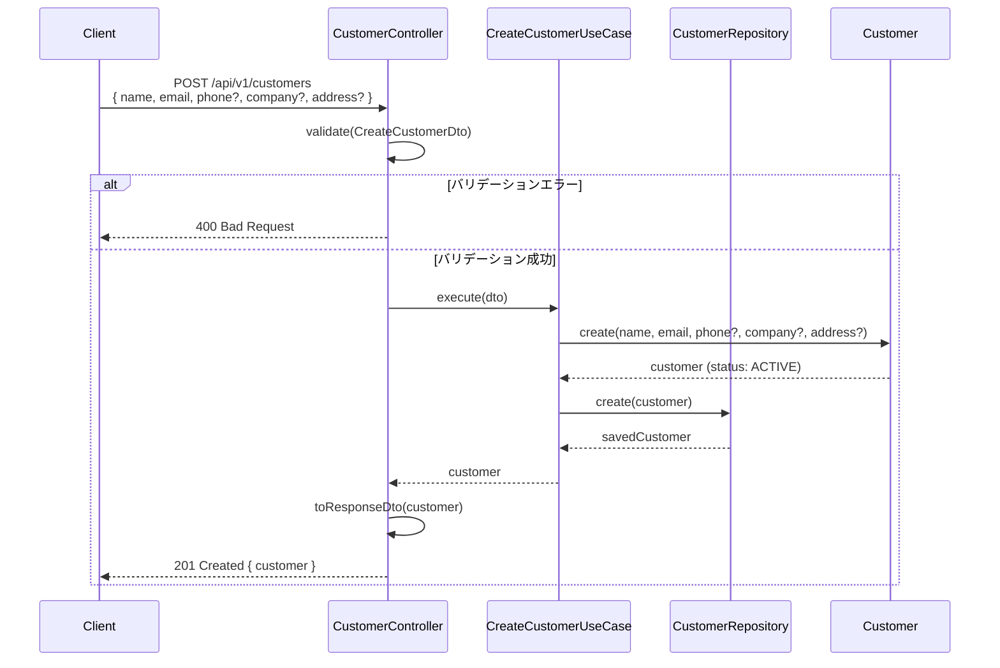
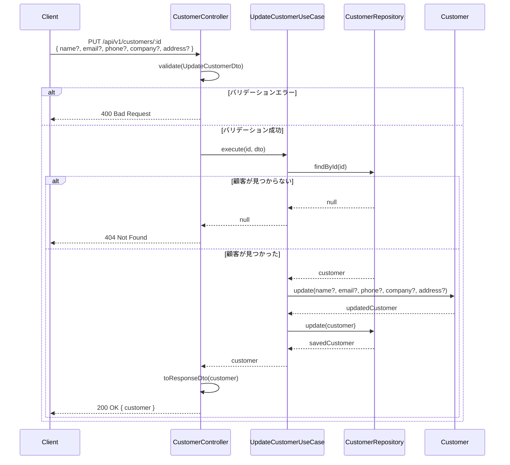
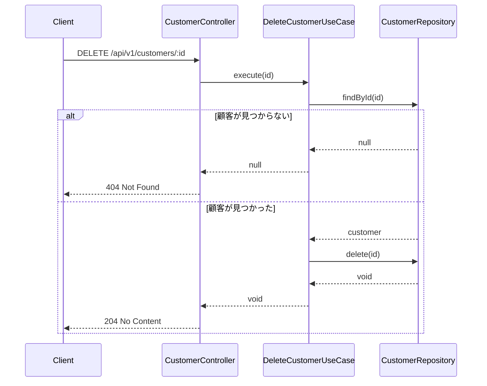
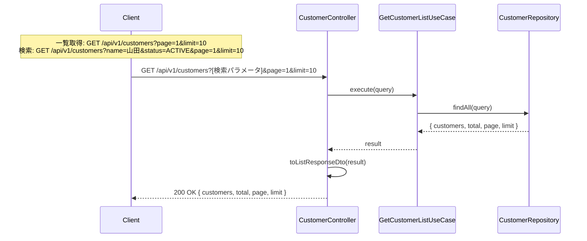
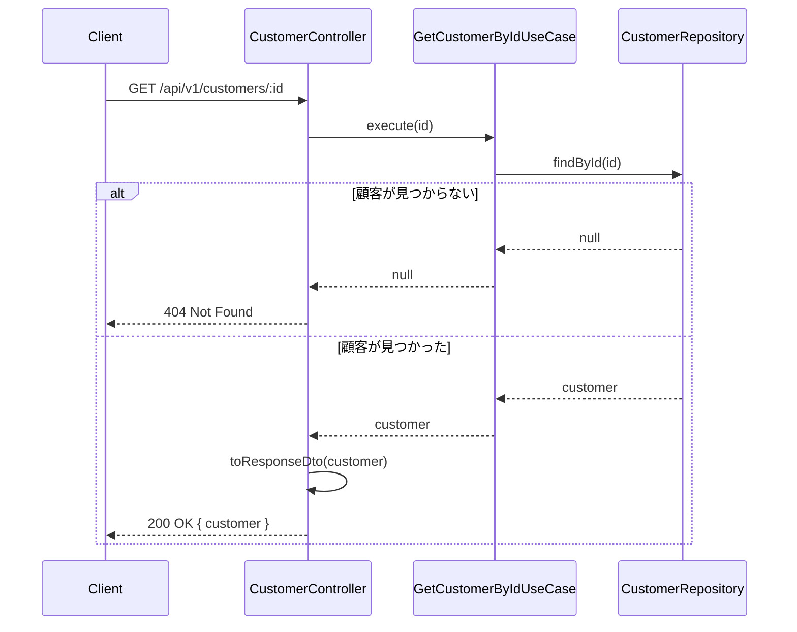
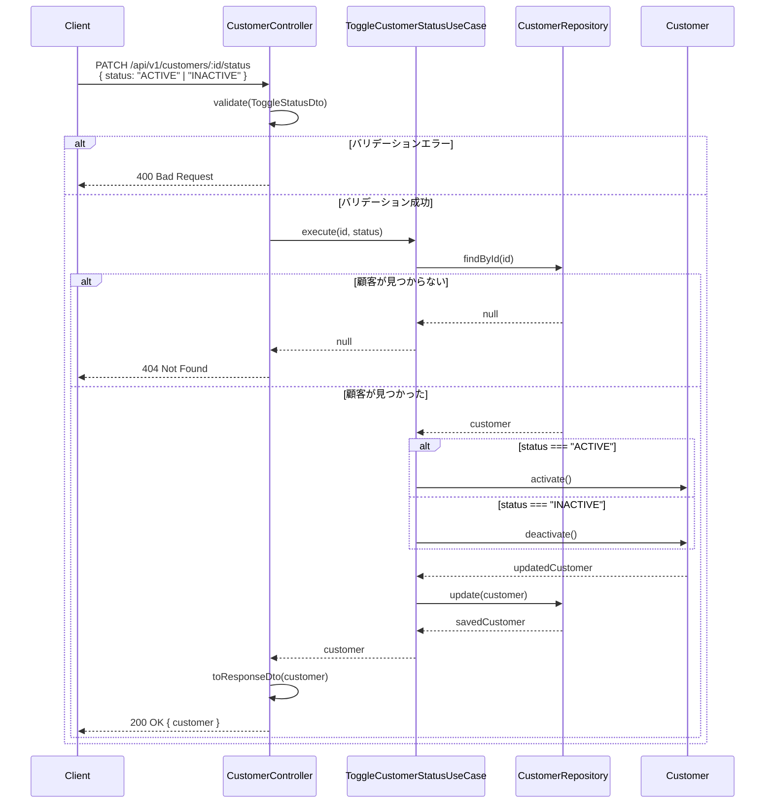

# シーケンス図 (Sequence Diagrams)

## 顧客作成フロー

```mermaid
sequenceDiagram
    participant Client
    participant CustomerController
    participant CreateCustomerUseCase
    participant CustomerRepository
    participant Customer

    Client->>CustomerController: POST /api/v1/customers<br/>{ name, email, phone?, company?, address? }
    CustomerController->>CustomerController: validate(CreateCustomerDto)
    
    alt バリデーションエラー
        CustomerController-->>Client: 400 Bad Request
    else バリデーション成功
        CustomerController->>CreateCustomerUseCase: execute(dto)
        
        CreateCustomerUseCase->>Customer: create(name, email, phone?, company?, address?)
        Customer-->>CreateCustomerUseCase: customer (status: ACTIVE)
        
        CreateCustomerUseCase->>CustomerRepository: create(customer)
        CustomerRepository-->>CreateCustomerUseCase: savedCustomer
        
        CreateCustomerUseCase-->>CustomerController: customer
        CustomerController->>CustomerController: toResponseDto(customer)
        CustomerController-->>Client: 201 Created { customer }
    end
```

## 顧客更新フロー

```mermaid
sequenceDiagram
    participant Client
    participant CustomerController
    participant UpdateCustomerUseCase
    participant CustomerRepository
    participant Customer

    Client->>CustomerController: PUT /api/v1/customers/:id<br/>{ name?, email?, phone?, company?, address? }
    CustomerController->>CustomerController: validate(UpdateCustomerDto)
    
    alt バリデーションエラー
        CustomerController-->>Client: 400 Bad Request
    else バリデーション成功
        CustomerController->>UpdateCustomerUseCase: execute(id, dto)
        
        UpdateCustomerUseCase->>CustomerRepository: findById(id)
        
        alt 顧客が見つからない
            CustomerRepository-->>UpdateCustomerUseCase: null
            UpdateCustomerUseCase-->>CustomerController: null
            CustomerController-->>Client: 404 Not Found
        else 顧客が見つかった
            CustomerRepository-->>UpdateCustomerUseCase: customer
            
            UpdateCustomerUseCase->>Customer: update(name?, email?, phone?, company?, address?)
            Customer-->>UpdateCustomerUseCase: updatedCustomer
            
            UpdateCustomerUseCase->>CustomerRepository: update(customer)
            CustomerRepository-->>UpdateCustomerUseCase: savedCustomer
            
            UpdateCustomerUseCase-->>CustomerController: customer
            CustomerController->>CustomerController: toResponseDto(customer)
            CustomerController-->>Client: 200 OK { customer }
        end
    end
```

## 顧客削除フロー

```mermaid
sequenceDiagram
    participant Client
    participant CustomerController
    participant DeleteCustomerUseCase
    participant CustomerRepository

    Client->>CustomerController: DELETE /api/v1/customers/:id
    CustomerController->>DeleteCustomerUseCase: execute(id)
    
    DeleteCustomerUseCase->>CustomerRepository: findById(id)
    
    alt 顧客が見つからない
        CustomerRepository-->>DeleteCustomerUseCase: null
        DeleteCustomerUseCase-->>CustomerController: null
        CustomerController-->>Client: 404 Not Found
    else 顧客が見つかった
        CustomerRepository-->>DeleteCustomerUseCase: customer
        
        DeleteCustomerUseCase->>CustomerRepository: delete(id)
        CustomerRepository-->>DeleteCustomerUseCase: void
        
        DeleteCustomerUseCase-->>CustomerController: void
        CustomerController-->>Client: 204 No Content
    end
```

## 顧客一覧取得・検索フロー

```mermaid
sequenceDiagram
    participant Client
    participant CustomerController
    participant GetCustomerListUseCase
    participant CustomerRepository

    Note over Client: 一覧取得: GET /api/v1/customers?page=1&limit=10<br/>検索: GET /api/v1/customers?name=山田&status=ACTIVE&page=1&limit=10
    
    Client->>CustomerController: GET /api/v1/customers?[検索パラメータ]&page=1&limit=10
    CustomerController->>GetCustomerListUseCase: execute(query)
    
    GetCustomerListUseCase->>CustomerRepository: findAll(query)
    CustomerRepository-->>GetCustomerListUseCase: { customers, total, page, limit }
    
    GetCustomerListUseCase-->>CustomerController: result
    CustomerController->>CustomerController: toListResponseDto(result)
    CustomerController-->>Client: 200 OK { customers, total, page, limit }
```

## 顧客詳細取得フロー

```mermaid
sequenceDiagram
    participant Client
    participant CustomerController
    participant GetCustomerByIdUseCase
    participant CustomerRepository

    Client->>CustomerController: GET /api/v1/customers/:id
    CustomerController->>GetCustomerByIdUseCase: execute(id)
    
    GetCustomerByIdUseCase->>CustomerRepository: findById(id)
    
    alt 顧客が見つからない
        CustomerRepository-->>GetCustomerByIdUseCase: null
        GetCustomerByIdUseCase-->>CustomerController: null
        CustomerController-->>Client: 404 Not Found
    else 顧客が見つかった
        CustomerRepository-->>GetCustomerByIdUseCase: customer
        GetCustomerByIdUseCase-->>CustomerController: customer
        CustomerController->>CustomerController: toResponseDto(customer)
        CustomerController-->>Client: 200 OK { customer }
    end
```

## 顧客ステータス切り替えフロー

```mermaid
sequenceDiagram
    participant Client
    participant CustomerController
    participant ToggleCustomerStatusUseCase
    participant CustomerRepository
    participant Customer

    Client->>CustomerController: PATCH /api/v1/customers/:id/status<br/>{ status: "ACTIVE" | "INACTIVE" }
    CustomerController->>CustomerController: validate(ToggleStatusDto)
    
    alt バリデーションエラー
        CustomerController-->>Client: 400 Bad Request
    else バリデーション成功
        CustomerController->>ToggleCustomerStatusUseCase: execute(id, status)
        
        ToggleCustomerStatusUseCase->>CustomerRepository: findById(id)
        
        alt 顧客が見つからない
            CustomerRepository-->>ToggleCustomerStatusUseCase: null
            ToggleCustomerStatusUseCase-->>CustomerController: null
            CustomerController-->>Client: 404 Not Found
        else 顧客が見つかった
            CustomerRepository-->>ToggleCustomerStatusUseCase: customer
            
            alt status === "ACTIVE"
                ToggleCustomerStatusUseCase->>Customer: activate()
            else status === "INACTIVE"
                ToggleCustomerStatusUseCase->>Customer: deactivate()
            end
            
            Customer-->>ToggleCustomerStatusUseCase: updatedCustomer
            
            ToggleCustomerStatusUseCase->>CustomerRepository: update(customer)
            CustomerRepository-->>ToggleCustomerStatusUseCase: savedCustomer
            
            ToggleCustomerStatusUseCase-->>CustomerController: customer
            CustomerController->>CustomerController: toResponseDto(customer)
            CustomerController-->>Client: 200 OK { customer }
        end
    end
```

