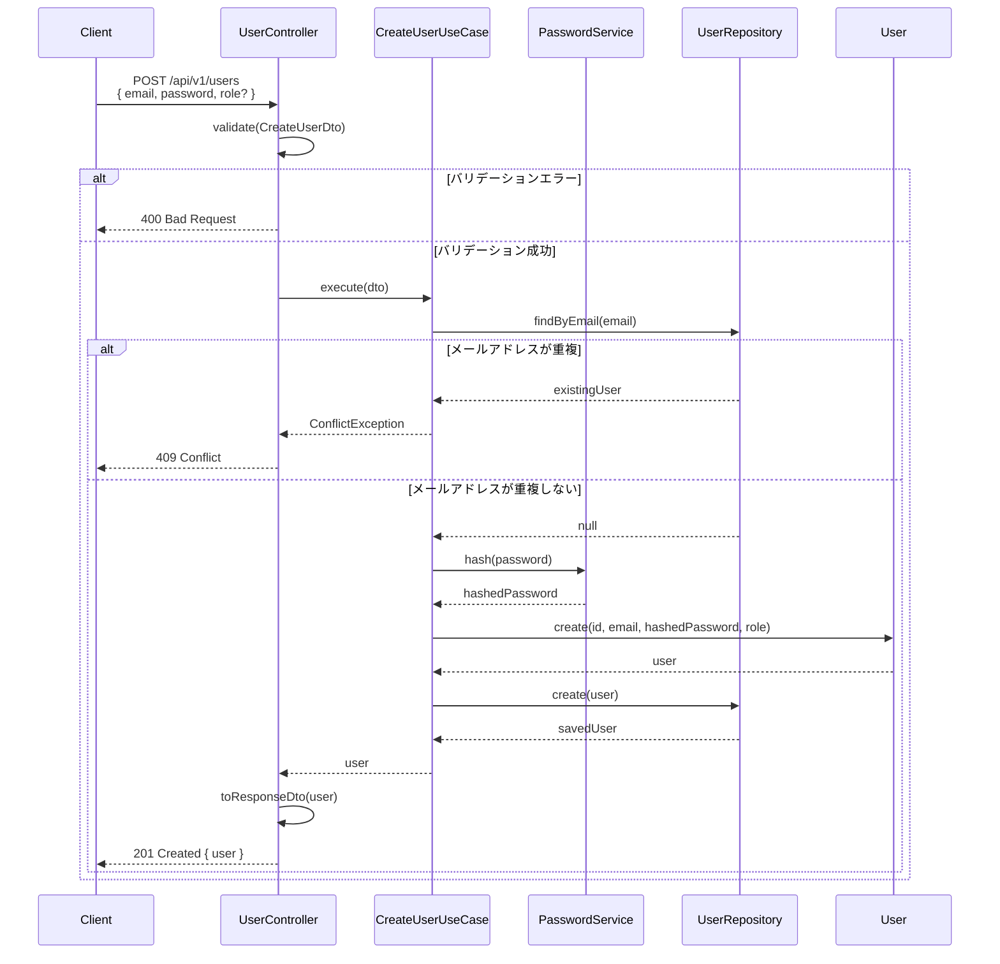
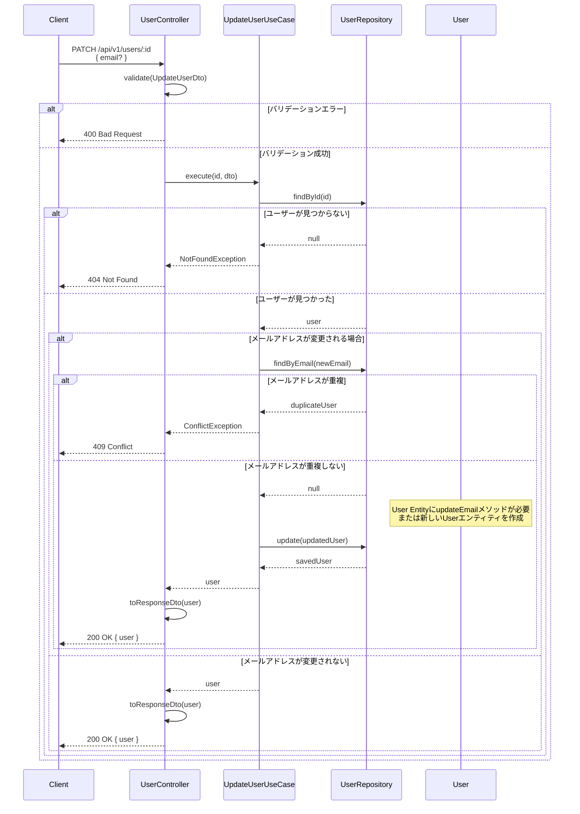
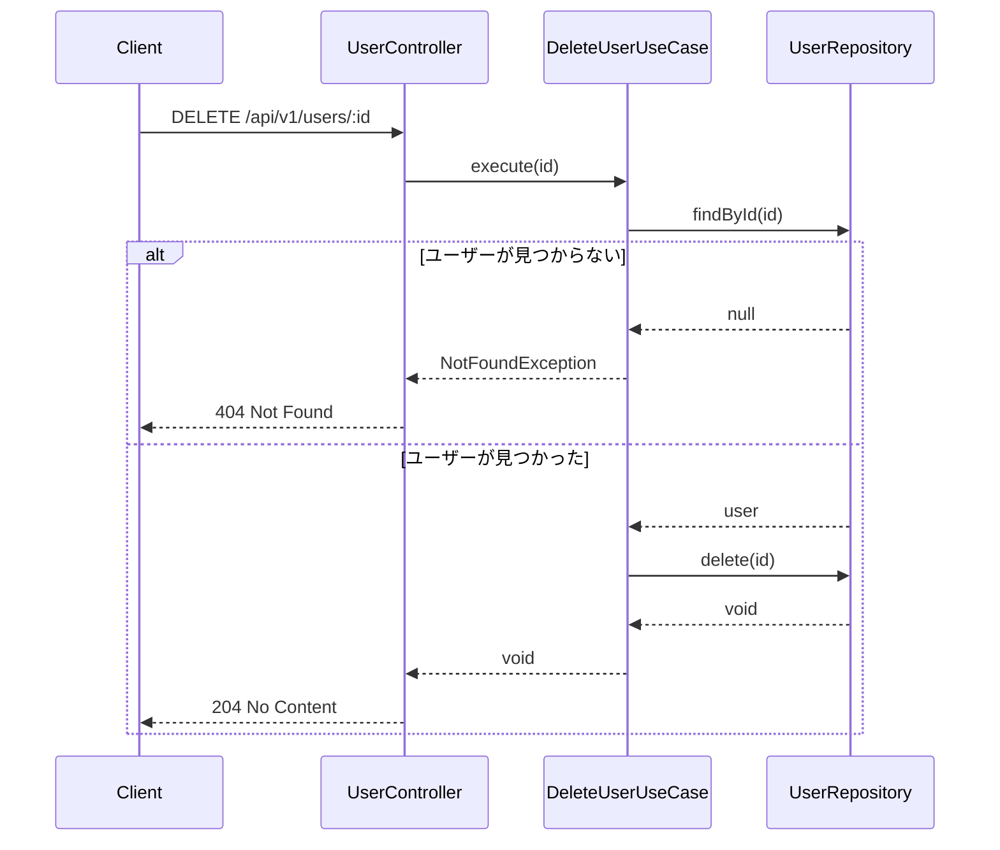
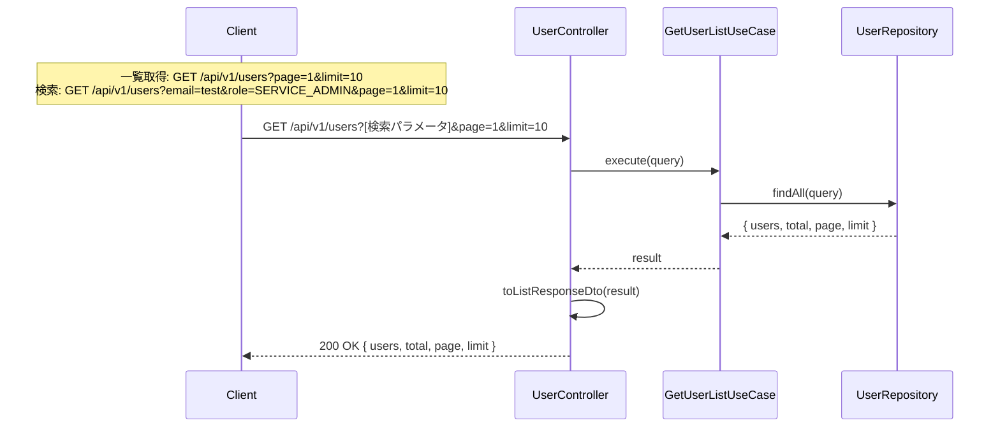
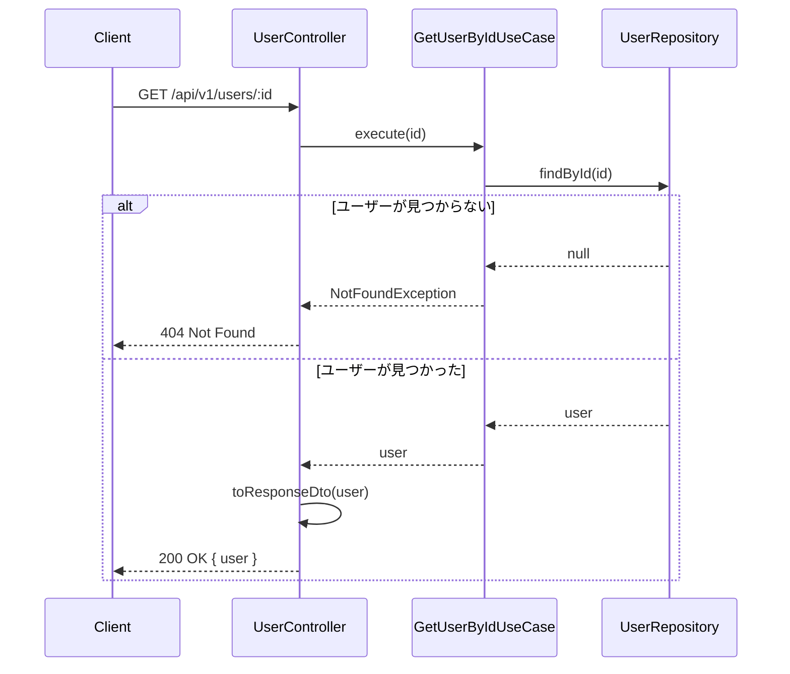
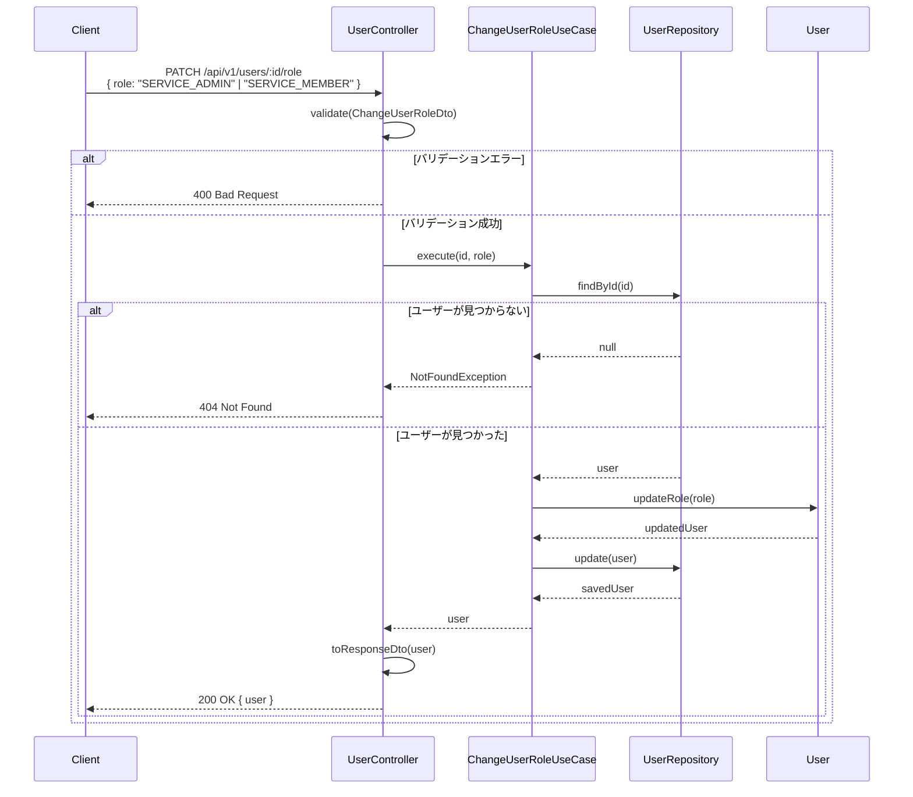

# シーケンス図 (Sequence Diagrams)

## ユーザー作成フロー

```mermaid
sequenceDiagram
    participant Client
    participant UserController
    participant CreateUserUseCase
    participant PasswordService
    participant UserRepository
    participant User

    Client->>UserController: POST /api/v1/users<br/>{ email, password, role? }
    UserController->>UserController: validate(CreateUserDto)
    
    alt バリデーションエラー
        UserController-->>Client: 400 Bad Request
    else バリデーション成功
        UserController->>CreateUserUseCase: execute(dto)
        
        CreateUserUseCase->>UserRepository: findByEmail(email)
        
        alt メールアドレスが重複
            UserRepository-->>CreateUserUseCase: existingUser
            CreateUserUseCase-->>UserController: ConflictException
            UserController-->>Client: 409 Conflict
        else メールアドレスが重複しない
            UserRepository-->>CreateUserUseCase: null
            
            CreateUserUseCase->>PasswordService: hash(password)
            PasswordService-->>CreateUserUseCase: hashedPassword
            
            CreateUserUseCase->>User: create(id, email, hashedPassword, role)
            User-->>CreateUserUseCase: user
            
            CreateUserUseCase->>UserRepository: create(user)
            UserRepository-->>CreateUserUseCase: savedUser
            
            CreateUserUseCase-->>UserController: user
            UserController->>UserController: toResponseDto(user)
            UserController-->>Client: 201 Created { user }
        end
    end
```

## ユーザー更新フロー

```mermaid
sequenceDiagram
    participant Client
    participant UserController
    participant UpdateUserUseCase
    participant UserRepository
    participant User

    Client->>UserController: PATCH /api/v1/users/:id<br/>{ email? }
    UserController->>UserController: validate(UpdateUserDto)
    
    alt バリデーションエラー
        UserController-->>Client: 400 Bad Request
    else バリデーション成功
        UserController->>UpdateUserUseCase: execute(id, dto)
        
        UpdateUserUseCase->>UserRepository: findById(id)
        
        alt ユーザーが見つからない
            UserRepository-->>UpdateUserUseCase: null
            UpdateUserUseCase-->>UserController: NotFoundException
            UserController-->>Client: 404 Not Found
        else ユーザーが見つかった
            UserRepository-->>UpdateUserUseCase: user
            
            alt メールアドレスが変更される場合
                UpdateUserUseCase->>UserRepository: findByEmail(newEmail)
                
                alt メールアドレスが重複
                    UserRepository-->>UpdateUserUseCase: duplicateUser
                    UpdateUserUseCase-->>UserController: ConflictException
                    UserController-->>Client: 409 Conflict
                else メールアドレスが重複しない
                    UserRepository-->>UpdateUserUseCase: null
                    
                    Note over User: User EntityにupdateEmailメソッドが必要<br/>または新しいUserエンティティを作成
                    UpdateUserUseCase->>UserRepository: update(updatedUser)
                    UserRepository-->>UpdateUserUseCase: savedUser
                    
                    UpdateUserUseCase-->>UserController: user
                    UserController->>UserController: toResponseDto(user)
                    UserController-->>Client: 200 OK { user }
                end
            else メールアドレスが変更されない
                UpdateUserUseCase-->>UserController: user
                UserController->>UserController: toResponseDto(user)
                UserController-->>Client: 200 OK { user }
            end
        end
    end
```

## ユーザー削除フロー

```mermaid
sequenceDiagram
    participant Client
    participant UserController
    participant DeleteUserUseCase
    participant UserRepository

    Client->>UserController: DELETE /api/v1/users/:id
    UserController->>DeleteUserUseCase: execute(id)
    
    DeleteUserUseCase->>UserRepository: findById(id)
    
    alt ユーザーが見つからない
        UserRepository-->>DeleteUserUseCase: null
        DeleteUserUseCase-->>UserController: NotFoundException
        UserController-->>Client: 404 Not Found
    else ユーザーが見つかった
        UserRepository-->>DeleteUserUseCase: user
        
        DeleteUserUseCase->>UserRepository: delete(id)
        UserRepository-->>DeleteUserUseCase: void
        
        DeleteUserUseCase-->>UserController: void
        UserController-->>Client: 204 No Content
    end
```

## ユーザー一覧取得・検索フロー

```mermaid
sequenceDiagram
    participant Client
    participant UserController
    participant GetUserListUseCase
    participant UserRepository

    Note over Client: 一覧取得: GET /api/v1/users?page=1&limit=10<br/>検索: GET /api/v1/users?email=test&role=SERVICE_ADMIN&page=1&limit=10
    
    Client->>UserController: GET /api/v1/users?[検索パラメータ]&page=1&limit=10
    UserController->>GetUserListUseCase: execute(query)
    
    GetUserListUseCase->>UserRepository: findAll(query)
    UserRepository-->>GetUserListUseCase: { users, total, page, limit }
    
    GetUserListUseCase-->>UserController: result
    UserController->>UserController: toListResponseDto(result)
    UserController-->>Client: 200 OK { users, total, page, limit }
```

## ユーザー詳細取得フロー

```mermaid
sequenceDiagram
    participant Client
    participant UserController
    participant GetUserByIdUseCase
    participant UserRepository

    Client->>UserController: GET /api/v1/users/:id
    UserController->>GetUserByIdUseCase: execute(id)
    
    GetUserByIdUseCase->>UserRepository: findById(id)
    
    alt ユーザーが見つからない
        UserRepository-->>GetUserByIdUseCase: null
        GetUserByIdUseCase-->>UserController: NotFoundException
        UserController-->>Client: 404 Not Found
    else ユーザーが見つかった
        UserRepository-->>GetUserByIdUseCase: user
        GetUserByIdUseCase-->>UserController: user
        UserController->>UserController: toResponseDto(user)
        UserController-->>Client: 200 OK { user }
    end
```

## ユーザーロール変更フロー

```mermaid
sequenceDiagram
    participant Client
    participant UserController
    participant ChangeUserRoleUseCase
    participant UserRepository
    participant User

    Client->>UserController: PATCH /api/v1/users/:id/role<br/>{ role: "SERVICE_ADMIN" | "SERVICE_MEMBER" }
    UserController->>UserController: validate(ChangeUserRoleDto)
    
    alt バリデーションエラー
        UserController-->>Client: 400 Bad Request
    else バリデーション成功
        UserController->>ChangeUserRoleUseCase: execute(id, role)
        
        ChangeUserRoleUseCase->>UserRepository: findById(id)
        
        alt ユーザーが見つからない
            UserRepository-->>ChangeUserRoleUseCase: null
            ChangeUserRoleUseCase-->>UserController: NotFoundException
            UserController-->>Client: 404 Not Found
        else ユーザーが見つかった
            UserRepository-->>ChangeUserRoleUseCase: user
            
            ChangeUserRoleUseCase->>User: updateRole(role)
            User-->>ChangeUserRoleUseCase: updatedUser
            
            ChangeUserRoleUseCase->>UserRepository: update(user)
            UserRepository-->>ChangeUserRoleUseCase: savedUser
            
            ChangeUserRoleUseCase-->>UserController: user
            UserController->>UserController: toResponseDto(user)
            UserController-->>Client: 200 OK { user }
        end
    end
```

