# クラス図 (Class Diagrams)

## FQDN管理関連クラス

```mermaid
classDiagram
    %% Presentation Layer
    class FqdnController {
        +create(createFqdnDto: CreateFqdnDto): Promise~FqdnResponseDto~
        +update(id: string, updateFqdnDto: UpdateFqdnDto): Promise~FqdnResponseDto~
        +delete(id: string): Promise~void~
        +findAll(query: FqdnListQueryDto): Promise~FqdnListResponseDto~
        +findOne(id: string): Promise~FqdnResponseDto~
        +updateStatus(id: string, statusDto: UpdateFqdnStatusDto): Promise~FqdnResponseDto~
    }
    
    class CreateFqdnDto {
        +string fqdn
        +string? description
    }
    
    class UpdateFqdnDto {
        +string? fqdn
        +string? description
    }
    
    class FqdnResponseDto {
        +string id
        +string fqdn
        +string? description
        +FqdnStatus status
        +Date createdAt
        +Date updatedAt
    }
    
    class FqdnListResponseDto {
        +FqdnResponseDto[] fqdns
        +number total
        +number page
        +number limit
    }
    
    class FqdnListQueryDto {
        +string? fqdn
        +FqdnStatus? status
        +number? page
        +number? limit
    }
    
    class UpdateFqdnStatusDto {
        +FqdnStatus status
    }
    
    %% Application Layer
    class CreateFqdnUseCase {
        -IFqdnRepository fqdnRepository
        +execute(fqdn: string, description?: string): Promise~Fqdn~
    }
    
    class UpdateFqdnUseCase {
        -IFqdnRepository fqdnRepository
        +execute(id: string, fqdn?: string, description?: string): Promise~Fqdn~
    }
    
    class DeleteFqdnUseCase {
        -IFqdnRepository fqdnRepository
        +execute(id: string): Promise~void~
    }
    
    class GetFqdnListUseCase {
        -IFqdnRepository fqdnRepository
        +execute(query: FqdnListQuery): Promise~FqdnListResult~
    }
    
    class FqdnListQuery {
        <<ValueObject>>
        +string? fqdn
        +FqdnStatus? status
        +number? page
        +number? limit
    }
    
    class FqdnListResult {
        <<ValueObject>>
        +Fqdn[] fqdns
        +number total
        +number page
        +number limit
    }
    
    class GetFqdnByIdUseCase {
        -IFqdnRepository fqdnRepository
        +execute(id: string): Promise~Fqdn~
    }
    
    class UpdateFqdnStatusUseCase {
        -IFqdnRepository fqdnRepository
        +execute(id: string, status: FqdnStatus): Promise~Fqdn~
    }
    
    %% Domain Layer
    class Fqdn {
        +string id
        +string fqdn
        +string? description
        +FqdnStatus status
        +Date createdAt
        +Date updatedAt
        +create(fqdn: string, description?: string)
        +reconstruct(id: string, fqdn: string, description?: string, status: FqdnStatus, createdAt: Date, updatedAt: Date)
        +update(fqdn?: string, description?: string)
        +activate()
        +deactivate()
    }
    
    class FqdnStatus {
        <<ValueObject>>
        +string value
        +validate()
        +isActive(): boolean
        +isInactive(): boolean
    }
    
    class IFqdnRepository {
        <<interface>>
        +create(fqdn: Fqdn): Promise~Fqdn~
        +update(fqdn: Fqdn): Promise~Fqdn~
        +delete(id: string): Promise~void~
        +findById(id: string): Promise~Fqdn | null~
        +findByFqdn(fqdn: string): Promise~Fqdn | null~
        +findAll(query: FqdnListQuery): Promise~FqdnListResult~
    }
    
    %% Infrastructure Layer
    class FqdnRepository {
        +create(fqdn: Fqdn): Promise~Fqdn~
        +update(fqdn: Fqdn): Promise~Fqdn~
        +delete(id: string): Promise~void~
        +findById(id: string): Promise~Fqdn | null~
        +findByFqdn(fqdn: string): Promise~Fqdn | null~
        +findAll(query: FqdnListQuery): Promise~FqdnListResult~
    }
    
    %% Relationships
    FqdnController --> CreateFqdnUseCase : uses
    FqdnController --> UpdateFqdnUseCase : uses
    FqdnController --> DeleteFqdnUseCase : uses
    FqdnController --> GetFqdnListUseCase : uses
    FqdnController --> GetFqdnByIdUseCase : uses
    FqdnController --> UpdateFqdnStatusUseCase : uses
    FqdnController --> CreateFqdnDto : receives
    FqdnController --> UpdateFqdnDto : receives
    FqdnController --> FqdnListQueryDto : receives
    FqdnController --> FqdnResponseDto : returns
    FqdnController --> FqdnListResponseDto : returns
    
    CreateFqdnUseCase --> IFqdnRepository : depends on
    UpdateFqdnUseCase --> IFqdnRepository : depends on
    DeleteFqdnUseCase --> IFqdnRepository : depends on
    GetFqdnListUseCase --> IFqdnRepository : depends on
    GetFqdnListUseCase --> FqdnListQuery : uses
    GetFqdnListUseCase --> FqdnListResult : returns
    GetFqdnByIdUseCase --> IFqdnRepository : depends on
    UpdateFqdnStatusUseCase --> IFqdnRepository : depends on
    
    Fqdn --> FqdnStatus : uses
    FqdnRepository ..|> IFqdnRepository : implements
    
    CreateFqdnUseCase --> Fqdn : creates
    UpdateFqdnUseCase --> Fqdn : updates
    GetFqdnListUseCase --> Fqdn : returns
    GetFqdnByIdUseCase --> Fqdn : returns
    UpdateFqdnStatusUseCase --> Fqdn : updates
```

## クラス説明

### Presentation Layer

#### FqdnController
FQDN管理に関するHTTPエンドポイントを提供するコントローラー。

- `create`: 新規FQDNを作成
- `update`: 既存FQDNを更新
- `delete`: FQDNを削除
- `findAll`: FQDN一覧を取得・検索（検索クエリパラメータ対応、ページネーション対応）
- `findOne`: FQDN詳細を取得
- `updateStatus`: FQDNのステータスを更新

#### DTOs
- **CreateFqdnDto**: FQDN作成時のリクエストDTO
- **UpdateFqdnDto**: FQDN更新時のリクエストDTO
- **FqdnResponseDto**: FQDN情報のレスポンスDTO
- **FqdnListResponseDto**: FQDN一覧のレスポンスDTO（ページネーション情報含む）
- **FqdnListQueryDto**: FQDN一覧取得・検索時のクエリDTO（検索パラメータ含む）
- **UpdateFqdnStatusDto**: ステータス更新時のリクエストDTO

### Application Layer

#### Use Cases
各ユースケースは単一責任の原則に従い、特定の操作を担当します。

- **CreateFqdnUseCase**: FQDN作成処理
- **UpdateFqdnUseCase**: FQDN更新処理
- **DeleteFqdnUseCase**: FQDN削除処理
- **GetFqdnListUseCase**: FQDN一覧取得・検索処理（検索クエリパラメータ対応）
- **GetFqdnByIdUseCase**: FQDN詳細取得処理
- **UpdateFqdnStatusUseCase**: FQDNステータス更新処理

### Domain Layer

#### Fqdn Entity
FQDNエンティティ。FQDNの基本情報とステータスを保持します。

- `id`: FQDN ID（UUID）
- `fqdn`: FQDN文字列（例: example.com）
- `description`: 説明（オプション）
- `status`: ステータス（有効/無効）
- `createdAt`: 作成日時
- `updatedAt`: 更新日時

#### FqdnStatus Value Object
FQDNステータスを表す値オブジェクト。有効（ACTIVE）と無効（INACTIVE）の2つの状態を持ちます。

#### IFqdnRepository
FQDNリポジトリのインターフェース。ドメイン層とインフラストラクチャ層を分離します。

- `findByFqdn`: FQDN文字列による検索（重複チェック用）

#### FqdnListQuery Value Object
FQDN一覧取得・検索のクエリパラメータを表す値オブジェクト。

- `fqdn`: FQDN文字列（部分一致検索、オプション）
- `status`: ステータス（オプション）
- `page`: ページ番号（オプション）
- `limit`: 1ページあたりの件数（オプション）

#### FqdnListResult Value Object
FQDN一覧取得・検索の結果を表す値オブジェクト。

- `fqdns`: FQDNエンティティの配列
- `total`: 総件数
- `page`: 現在のページ番号
- `limit`: 1ページあたりの件数

### Infrastructure Layer

#### FqdnRepository
FQDNリポジトリの実装。現段階ではインメモリ実装ですが、将来的にはデータベースに接続します。

