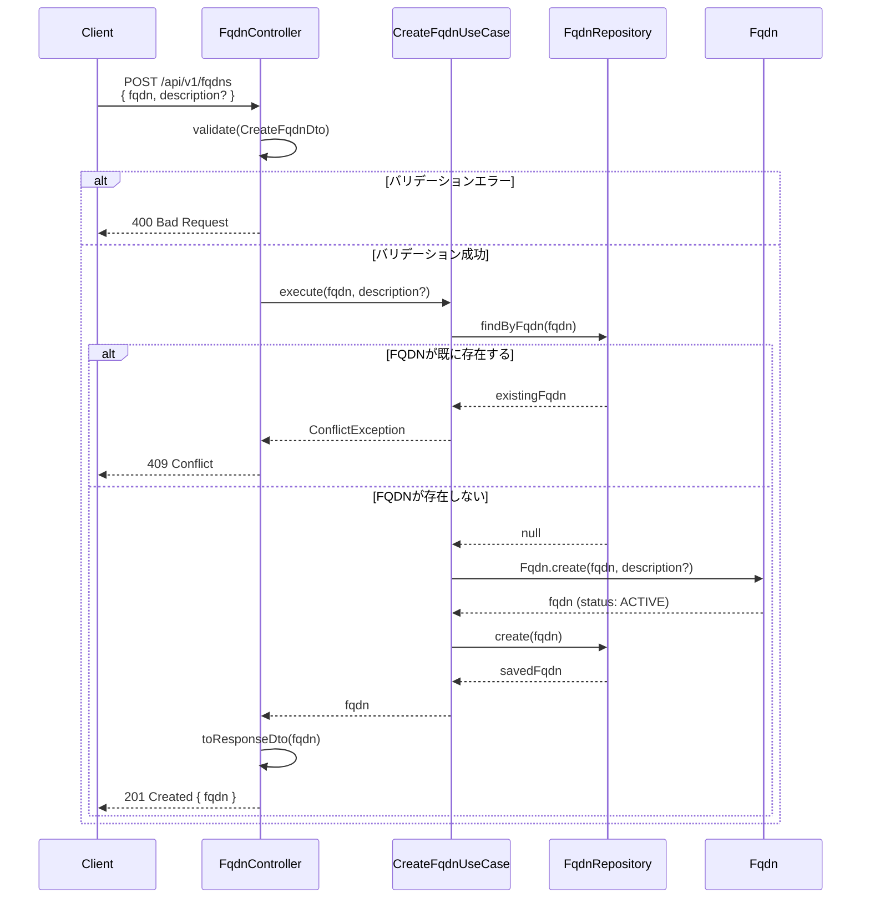
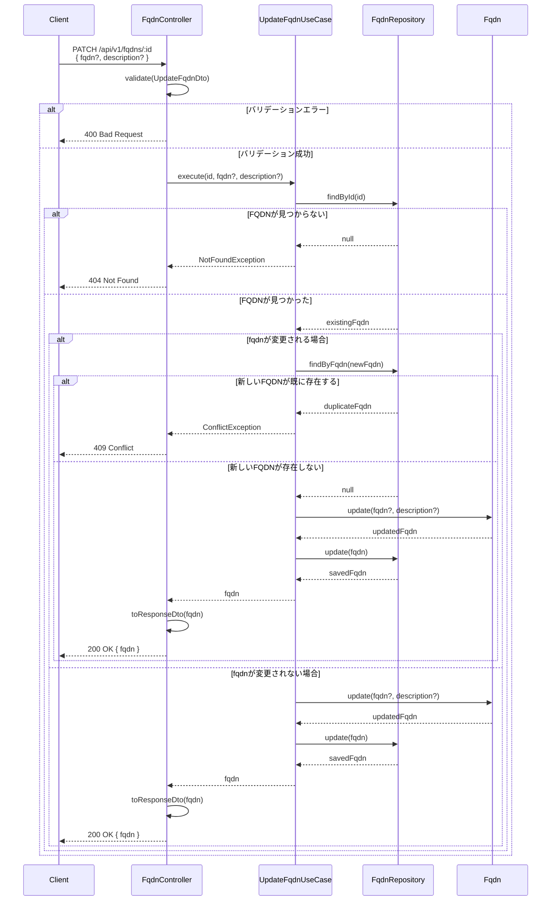
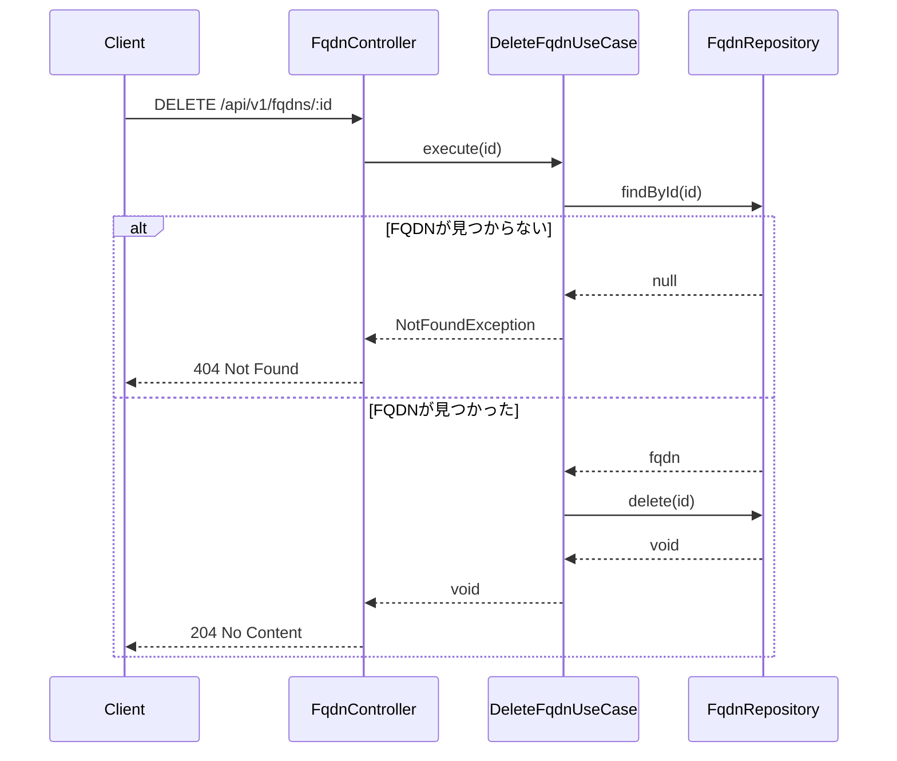
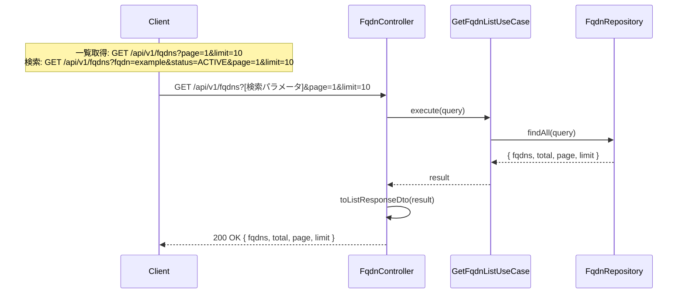
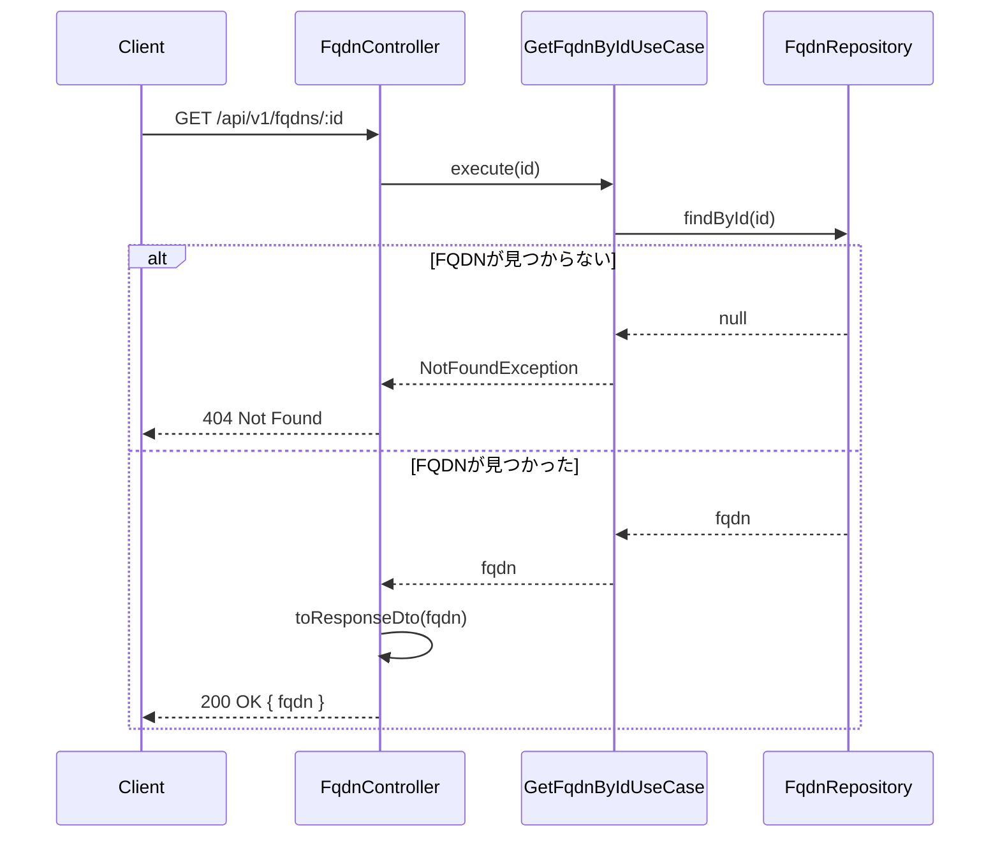
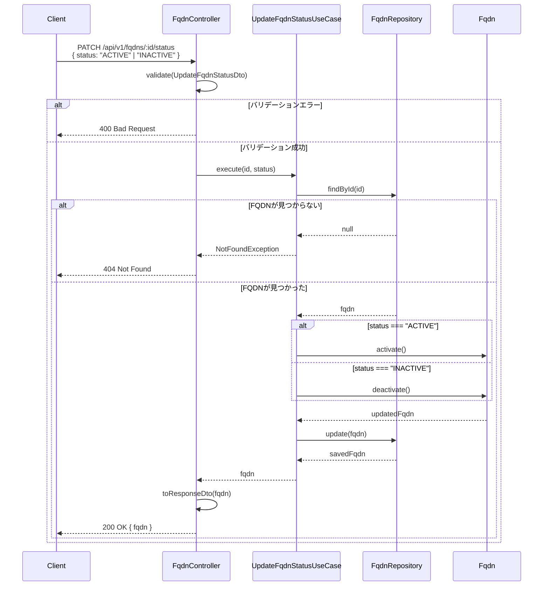

# シーケンス図 (Sequence Diagrams)

## FQDN作成フロー

```mermaid
sequenceDiagram
    participant Client
    participant FqdnController
    participant CreateFqdnUseCase
    participant FqdnRepository
    participant Fqdn

    Client->>FqdnController: POST /api/v1/fqdns<br/>{ fqdn, description? }
    FqdnController->>FqdnController: validate(CreateFqdnDto)
    
    alt バリデーションエラー
        FqdnController-->>Client: 400 Bad Request
    else バリデーション成功
        FqdnController->>CreateFqdnUseCase: execute(fqdn, description?)
        
        CreateFqdnUseCase->>FqdnRepository: findByFqdn(fqdn)
        
        alt FQDNが既に存在する
            FqdnRepository-->>CreateFqdnUseCase: existingFqdn
            CreateFqdnUseCase-->>FqdnController: ConflictException
            FqdnController-->>Client: 409 Conflict
        else FQDNが存在しない
            FqdnRepository-->>CreateFqdnUseCase: null
            
            CreateFqdnUseCase->>Fqdn: Fqdn.create(fqdn, description?)
            Fqdn-->>CreateFqdnUseCase: fqdn (status: ACTIVE)
            
            CreateFqdnUseCase->>FqdnRepository: create(fqdn)
            FqdnRepository-->>CreateFqdnUseCase: savedFqdn
            
            CreateFqdnUseCase-->>FqdnController: fqdn
            FqdnController->>FqdnController: toResponseDto(fqdn)
            FqdnController-->>Client: 201 Created { fqdn }
        end
    end
```

## FQDN更新フロー

```mermaid
sequenceDiagram
    participant Client
    participant FqdnController
    participant UpdateFqdnUseCase
    participant FqdnRepository
    participant Fqdn

    Client->>FqdnController: PATCH /api/v1/fqdns/:id<br/>{ fqdn?, description? }
    FqdnController->>FqdnController: validate(UpdateFqdnDto)
    
    alt バリデーションエラー
        FqdnController-->>Client: 400 Bad Request
    else バリデーション成功
        FqdnController->>UpdateFqdnUseCase: execute(id, fqdn?, description?)
        
        UpdateFqdnUseCase->>FqdnRepository: findById(id)
        
        alt FQDNが見つからない
            FqdnRepository-->>UpdateFqdnUseCase: null
            UpdateFqdnUseCase-->>FqdnController: NotFoundException
            FqdnController-->>Client: 404 Not Found
        else FQDNが見つかった
            FqdnRepository-->>UpdateFqdnUseCase: existingFqdn
            
            alt fqdnが変更される場合
                UpdateFqdnUseCase->>FqdnRepository: findByFqdn(newFqdn)
                
                alt 新しいFQDNが既に存在する
                    FqdnRepository-->>UpdateFqdnUseCase: duplicateFqdn
                    UpdateFqdnUseCase-->>FqdnController: ConflictException
                    FqdnController-->>Client: 409 Conflict
                else 新しいFQDNが存在しない
                    FqdnRepository-->>UpdateFqdnUseCase: null
                    
                    UpdateFqdnUseCase->>Fqdn: update(fqdn?, description?)
                    Fqdn-->>UpdateFqdnUseCase: updatedFqdn
                    
                    UpdateFqdnUseCase->>FqdnRepository: update(fqdn)
                    FqdnRepository-->>UpdateFqdnUseCase: savedFqdn
                    
                    UpdateFqdnUseCase-->>FqdnController: fqdn
                    FqdnController->>FqdnController: toResponseDto(fqdn)
                    FqdnController-->>Client: 200 OK { fqdn }
                end
            else fqdnが変更されない場合
                UpdateFqdnUseCase->>Fqdn: update(fqdn?, description?)
                Fqdn-->>UpdateFqdnUseCase: updatedFqdn
                
                UpdateFqdnUseCase->>FqdnRepository: update(fqdn)
                FqdnRepository-->>UpdateFqdnUseCase: savedFqdn
                
                UpdateFqdnUseCase-->>FqdnController: fqdn
                FqdnController->>FqdnController: toResponseDto(fqdn)
                FqdnController-->>Client: 200 OK { fqdn }
            end
        end
    end
```

## FQDN削除フロー

```mermaid
sequenceDiagram
    participant Client
    participant FqdnController
    participant DeleteFqdnUseCase
    participant FqdnRepository

    Client->>FqdnController: DELETE /api/v1/fqdns/:id
    FqdnController->>DeleteFqdnUseCase: execute(id)
    
    DeleteFqdnUseCase->>FqdnRepository: findById(id)
    
    alt FQDNが見つからない
        FqdnRepository-->>DeleteFqdnUseCase: null
        DeleteFqdnUseCase-->>FqdnController: NotFoundException
        FqdnController-->>Client: 404 Not Found
    else FQDNが見つかった
        FqdnRepository-->>DeleteFqdnUseCase: fqdn
        
        DeleteFqdnUseCase->>FqdnRepository: delete(id)
        FqdnRepository-->>DeleteFqdnUseCase: void
        
        DeleteFqdnUseCase-->>FqdnController: void
        FqdnController-->>Client: 204 No Content
    end
```

## FQDN一覧取得・検索フロー

```mermaid
sequenceDiagram
    participant Client
    participant FqdnController
    participant GetFqdnListUseCase
    participant FqdnRepository

    Note over Client: 一覧取得: GET /api/v1/fqdns?page=1&limit=10<br/>検索: GET /api/v1/fqdns?fqdn=example&status=ACTIVE&page=1&limit=10
    
    Client->>FqdnController: GET /api/v1/fqdns?[検索パラメータ]&page=1&limit=10
    FqdnController->>GetFqdnListUseCase: execute(query)
    
    GetFqdnListUseCase->>FqdnRepository: findAll(query)
    FqdnRepository-->>GetFqdnListUseCase: { fqdns, total, page, limit }
    
    GetFqdnListUseCase-->>FqdnController: result
    FqdnController->>FqdnController: toListResponseDto(result)
    FqdnController-->>Client: 200 OK { fqdns, total, page, limit }
```

## FQDN詳細取得フロー

```mermaid
sequenceDiagram
    participant Client
    participant FqdnController
    participant GetFqdnByIdUseCase
    participant FqdnRepository

    Client->>FqdnController: GET /api/v1/fqdns/:id
    FqdnController->>GetFqdnByIdUseCase: execute(id)
    
    GetFqdnByIdUseCase->>FqdnRepository: findById(id)
    
    alt FQDNが見つからない
        FqdnRepository-->>GetFqdnByIdUseCase: null
        GetFqdnByIdUseCase-->>FqdnController: NotFoundException
        FqdnController-->>Client: 404 Not Found
    else FQDNが見つかった
        FqdnRepository-->>GetFqdnByIdUseCase: fqdn
        GetFqdnByIdUseCase-->>FqdnController: fqdn
        FqdnController->>FqdnController: toResponseDto(fqdn)
        FqdnController-->>Client: 200 OK { fqdn }
    end
```

## FQDNステータス更新フロー

```mermaid
sequenceDiagram
    participant Client
    participant FqdnController
    participant UpdateFqdnStatusUseCase
    participant FqdnRepository
    participant Fqdn

    Client->>FqdnController: PATCH /api/v1/fqdns/:id/status<br/>{ status: "ACTIVE" | "INACTIVE" }
    FqdnController->>FqdnController: validate(UpdateFqdnStatusDto)
    
    alt バリデーションエラー
        FqdnController-->>Client: 400 Bad Request
    else バリデーション成功
        FqdnController->>UpdateFqdnStatusUseCase: execute(id, status)
        
        UpdateFqdnStatusUseCase->>FqdnRepository: findById(id)
        
        alt FQDNが見つからない
            FqdnRepository-->>UpdateFqdnStatusUseCase: null
            UpdateFqdnStatusUseCase-->>FqdnController: NotFoundException
            FqdnController-->>Client: 404 Not Found
        else FQDNが見つかった
            FqdnRepository-->>UpdateFqdnStatusUseCase: fqdn
            
            alt status === "ACTIVE"
                UpdateFqdnStatusUseCase->>Fqdn: activate()
            else status === "INACTIVE"
                UpdateFqdnStatusUseCase->>Fqdn: deactivate()
            end
            
            Fqdn-->>UpdateFqdnStatusUseCase: updatedFqdn
            
            UpdateFqdnStatusUseCase->>FqdnRepository: update(fqdn)
            FqdnRepository-->>UpdateFqdnStatusUseCase: savedFqdn
            
            UpdateFqdnStatusUseCase-->>FqdnController: fqdn
            FqdnController->>FqdnController: toResponseDto(fqdn)
            FqdnController-->>Client: 200 OK { fqdn }
        end
    end
```

