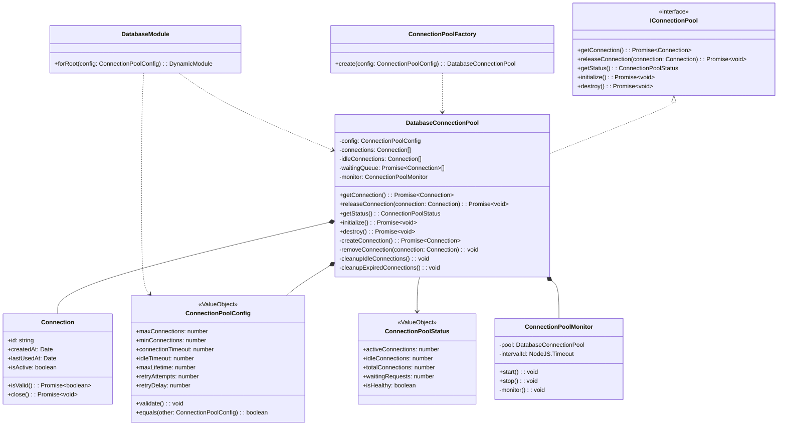
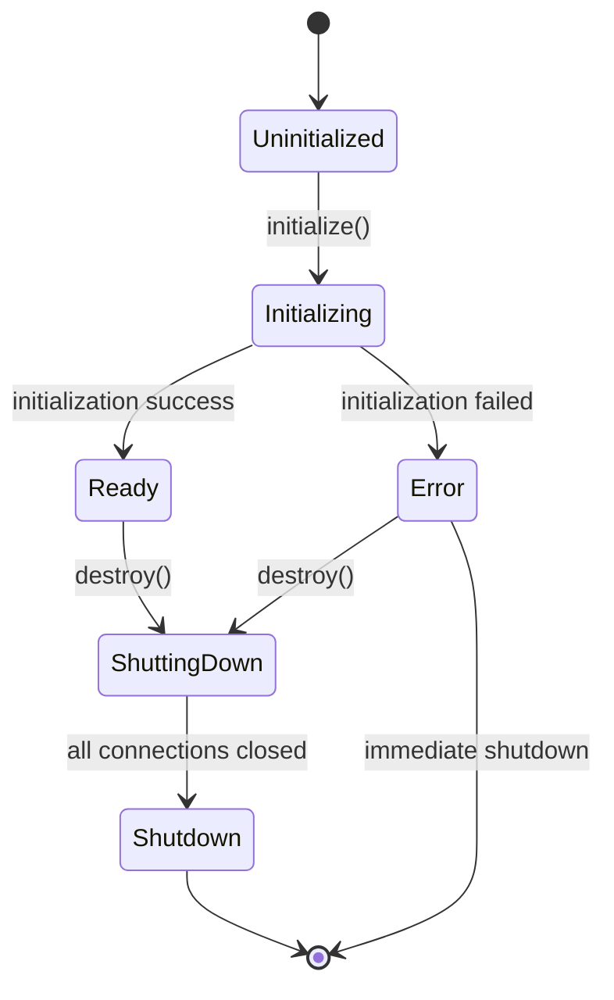
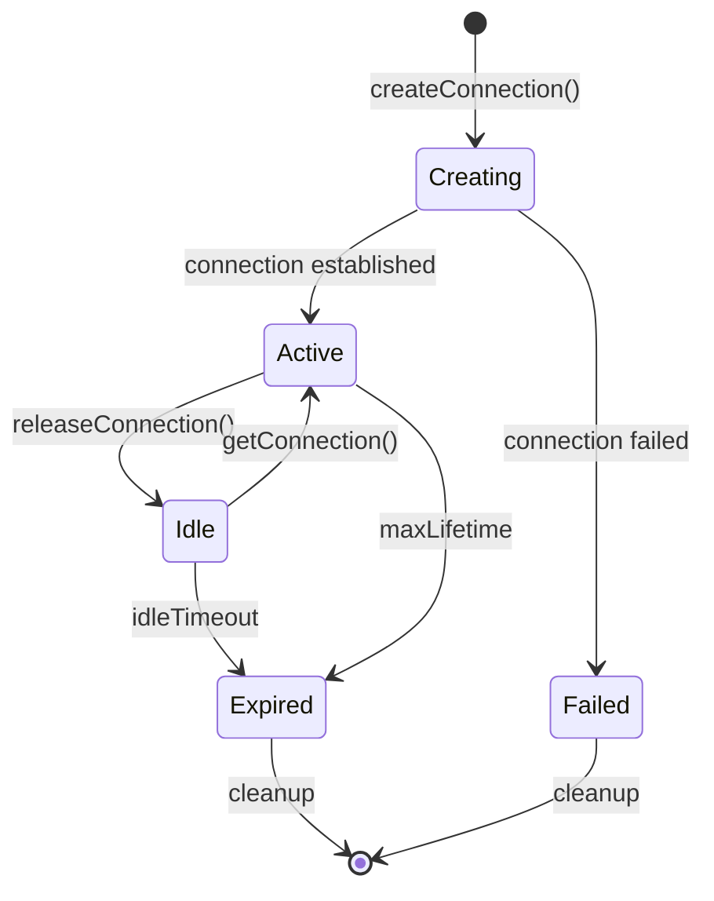

# クラス図 (Class Diagrams)

## データベース接続プール関連クラス

```mermaid
classDiagram
    %% Domain Layer
    class IConnectionPool {
        <<interface>>
        +getConnection(): Promise~Connection~
        +releaseConnection(connection: Connection): Promise~void~
        +getStatus(): ConnectionPoolStatus
        +initialize(): Promise~void~
        +destroy(): Promise~void~
    }
    
    class ConnectionPoolConfig {
        <<ValueObject>>
        +maxConnections: number
        +minConnections: number
        +connectionTimeout: number
        +idleTimeout: number
        +maxLifetime: number
        +retryAttempts: number
        +retryDelay: number
        +validate(): void
        +equals(other: ConnectionPoolConfig): boolean
    }
    
    class ConnectionPoolStatus {
        <<ValueObject>>
        +activeConnections: number
        +idleConnections: number
        +totalConnections: number
        +waitingRequests: number
        +isHealthy: boolean
    }
    
    %% Infrastructure Layer
    class DatabaseConnectionPool {
        -config: ConnectionPoolConfig
        -connections: Connection[]
        -idleConnections: Connection[]
        -waitingQueue: Promise~Connection~[]
        -monitor: ConnectionPoolMonitor
        +getConnection(): Promise~Connection~
        +releaseConnection(connection: Connection): Promise~void~
        +getStatus(): ConnectionPoolStatus
        +initialize(): Promise~void~
        +destroy(): Promise~void~
        -createConnection(): Promise~Connection~
        -removeConnection(connection: Connection): void
        -cleanupIdleConnections(): void
        -cleanupExpiredConnections(): void
    }
    
    class ConnectionPoolMonitor {
        -pool: DatabaseConnectionPool
        -intervalId: NodeJS.Timeout
        +start(): void
        +stop(): void
        -monitor(): void
    }
    
    class ConnectionPoolFactory {
        +create(config: ConnectionPoolConfig): DatabaseConnectionPool
    }
    
    class Connection {
        +id: string
        +createdAt: Date
        +lastUsedAt: Date
        +isActive: boolean
        +isValid(): Promise~boolean~
        +close(): Promise~void~
    }
    
    %% NestJS Module
    class DatabaseModule {
        +forRoot(config: ConnectionPoolConfig): DynamicModule
    }
    
    %% Relationships
    IConnectionPool <|.. DatabaseConnectionPool
    DatabaseConnectionPool *-- ConnectionPoolConfig
    DatabaseConnectionPool *-- Connection
    DatabaseConnectionPool --> ConnectionPoolStatus
    DatabaseConnectionPool *-- ConnectionPoolMonitor
    ConnectionPoolFactory ..> DatabaseConnectionPool
    DatabaseModule ..> DatabaseConnectionPool
    DatabaseModule ..> ConnectionPoolConfig
```

## 接続プールの状態遷移

```mermaid
stateDiagram-v2
    [*] --> Uninitialized
    Uninitialized --> Initializing: initialize()
    Initializing --> Ready: initialization success
    Initializing --> Error: initialization failed
    Ready --> ShuttingDown: destroy()
    ShuttingDown --> Shutdown: all connections closed
    Shutdown --> [*]
    Error --> ShuttingDown: destroy()
    Error --> [*]: immediate shutdown
```

## 接続のライフサイクル

```mermaid
stateDiagram-v2
    [*] --> Creating: createConnection()
    Creating --> Active: connection established
    Creating --> Failed: connection failed
    Active --> Idle: releaseConnection()
    Idle --> Active: getConnection()
    Idle --> Expired: idleTimeout
    Active --> Expired: maxLifetime
    Expired --> [*]: cleanup
    Failed --> [*]: cleanup
```

