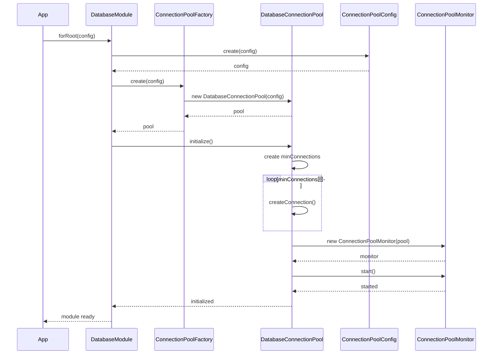
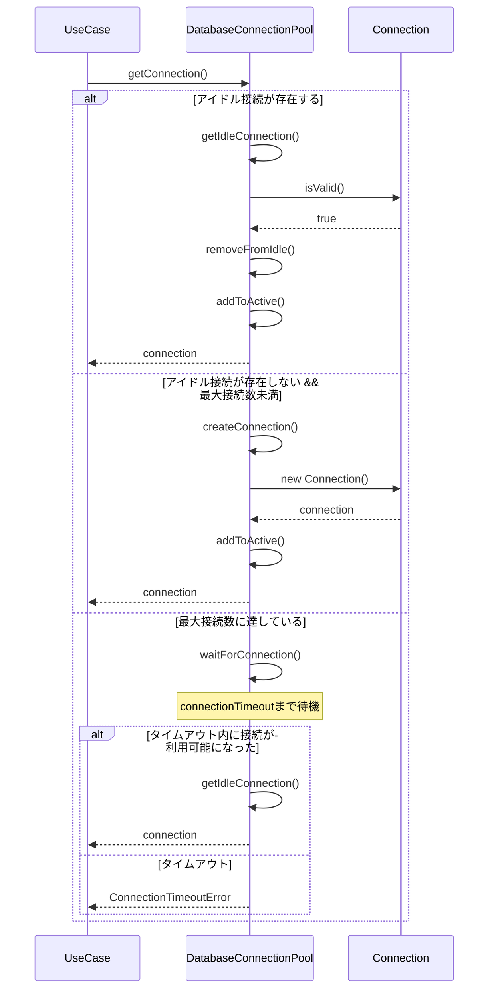
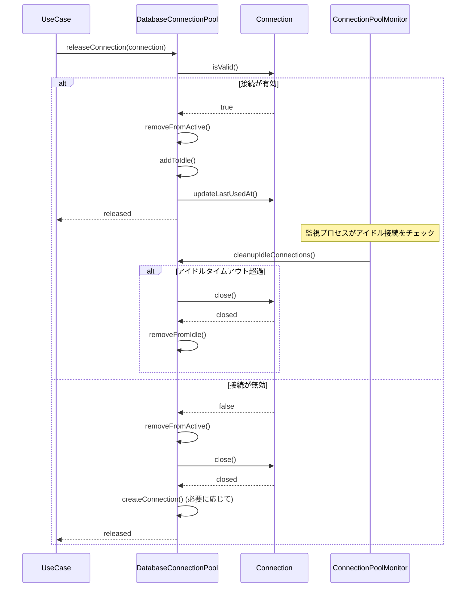
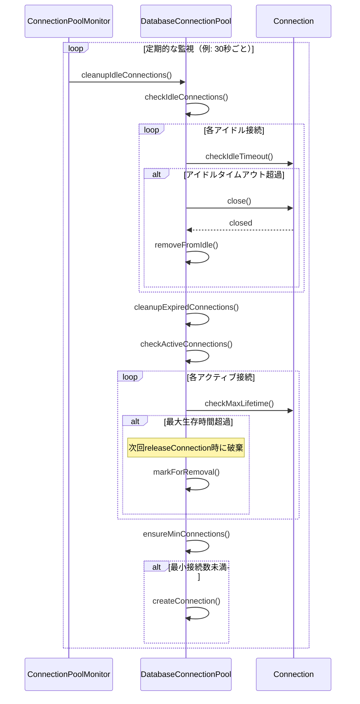
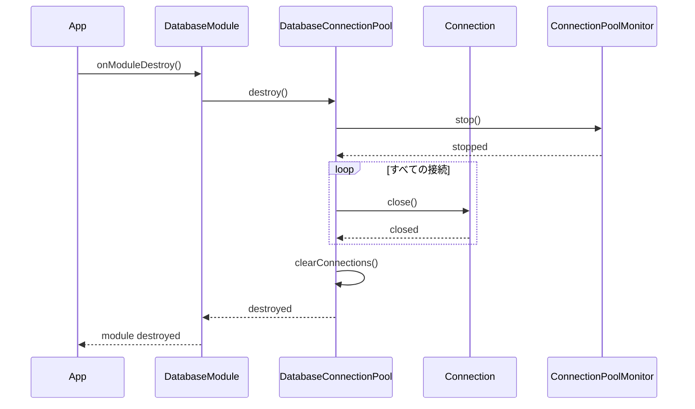
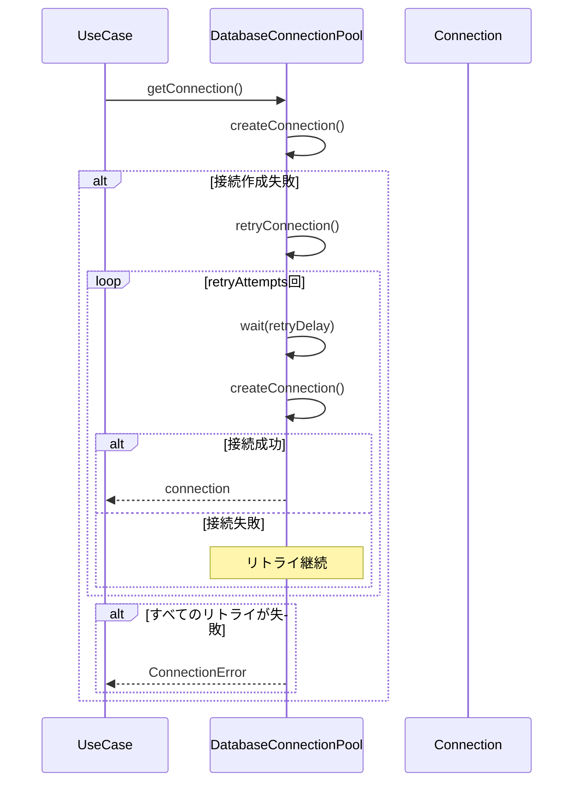

# シーケンス図 (Sequence Diagrams)

## 接続プール初期化フロー

```mermaid
sequenceDiagram
    participant App
    participant DatabaseModule
    participant ConnectionPoolFactory
    participant DatabaseConnectionPool
    participant ConnectionPoolConfig
    participant ConnectionPoolMonitor

    App->>DatabaseModule: forRoot(config)
    DatabaseModule->>ConnectionPoolConfig: create(config)
    ConnectionPoolConfig-->>DatabaseModule: config
    DatabaseModule->>ConnectionPoolFactory: create(config)
    ConnectionPoolFactory->>DatabaseConnectionPool: new DatabaseConnectionPool(config)
    DatabaseConnectionPool-->>ConnectionPoolFactory: pool
    ConnectionPoolFactory-->>DatabaseModule: pool
    DatabaseModule->>DatabaseConnectionPool: initialize()
    DatabaseConnectionPool->>DatabaseConnectionPool: create minConnections
    loop minConnections回
        DatabaseConnectionPool->>DatabaseConnectionPool: createConnection()
    end
    DatabaseConnectionPool->>ConnectionPoolMonitor: new ConnectionPoolMonitor(pool)
    ConnectionPoolMonitor-->>DatabaseConnectionPool: monitor
    DatabaseConnectionPool->>ConnectionPoolMonitor: start()
    ConnectionPoolMonitor-->>DatabaseConnectionPool: started
    DatabaseConnectionPool-->>DatabaseModule: initialized
    DatabaseModule-->>App: module ready
```

## 接続取得フロー（正常系）

```mermaid
sequenceDiagram
    participant UseCase
    participant DatabaseConnectionPool
    participant Connection

    UseCase->>DatabaseConnectionPool: getConnection()
    
    alt アイドル接続が存在する
        DatabaseConnectionPool->>DatabaseConnectionPool: getIdleConnection()
        DatabaseConnectionPool->>Connection: isValid()
        Connection-->>DatabaseConnectionPool: true
        DatabaseConnectionPool->>DatabaseConnectionPool: removeFromIdle()
        DatabaseConnectionPool->>DatabaseConnectionPool: addToActive()
        DatabaseConnectionPool-->>UseCase: connection
    else アイドル接続が存在しない && 最大接続数未満
        DatabaseConnectionPool->>DatabaseConnectionPool: createConnection()
        DatabaseConnectionPool->>Connection: new Connection()
        Connection-->>DatabaseConnectionPool: connection
        DatabaseConnectionPool->>DatabaseConnectionPool: addToActive()
        DatabaseConnectionPool-->>UseCase: connection
    else 最大接続数に達している
        DatabaseConnectionPool->>DatabaseConnectionPool: waitForConnection()
        Note over DatabaseConnectionPool: connectionTimeoutまで待機
        alt タイムアウト内に接続が利用可能になった
            DatabaseConnectionPool->>DatabaseConnectionPool: getIdleConnection()
            DatabaseConnectionPool-->>UseCase: connection
        else タイムアウト
            DatabaseConnectionPool-->>UseCase: ConnectionTimeoutError
        end
    end
```

## 接続解放フロー

```mermaid
sequenceDiagram
    participant UseCase
    participant DatabaseConnectionPool
    participant Connection
    participant ConnectionPoolMonitor

    UseCase->>DatabaseConnectionPool: releaseConnection(connection)
    DatabaseConnectionPool->>Connection: isValid()
    
    alt 接続が有効
        Connection-->>DatabaseConnectionPool: true
        DatabaseConnectionPool->>DatabaseConnectionPool: removeFromActive()
        DatabaseConnectionPool->>DatabaseConnectionPool: addToIdle()
        DatabaseConnectionPool->>Connection: updateLastUsedAt()
        DatabaseConnectionPool-->>UseCase: released
        
        Note over ConnectionPoolMonitor: 監視プロセスがアイドル接続をチェック
        ConnectionPoolMonitor->>DatabaseConnectionPool: cleanupIdleConnections()
        alt アイドルタイムアウト超過
            DatabaseConnectionPool->>Connection: close()
            Connection-->>DatabaseConnectionPool: closed
            DatabaseConnectionPool->>DatabaseConnectionPool: removeFromIdle()
        end
    else 接続が無効
        Connection-->>DatabaseConnectionPool: false
        DatabaseConnectionPool->>DatabaseConnectionPool: removeFromActive()
        DatabaseConnectionPool->>Connection: close()
        Connection-->>DatabaseConnectionPool: closed
        DatabaseConnectionPool->>DatabaseConnectionPool: createConnection() (必要に応じて)
        DatabaseConnectionPool-->>UseCase: released
    end
```

## 接続プール監視フロー

```mermaid
sequenceDiagram
    participant ConnectionPoolMonitor
    participant DatabaseConnectionPool
    participant Connection

    loop 定期的な監視（例: 30秒ごと）
        ConnectionPoolMonitor->>DatabaseConnectionPool: cleanupIdleConnections()
        DatabaseConnectionPool->>DatabaseConnectionPool: checkIdleConnections()
        
        loop 各アイドル接続
            DatabaseConnectionPool->>Connection: checkIdleTimeout()
            alt アイドルタイムアウト超過
                DatabaseConnectionPool->>Connection: close()
                Connection-->>DatabaseConnectionPool: closed
                DatabaseConnectionPool->>DatabaseConnectionPool: removeFromIdle()
            end
        end
        
        DatabaseConnectionPool->>DatabaseConnectionPool: cleanupExpiredConnections()
        DatabaseConnectionPool->>DatabaseConnectionPool: checkActiveConnections()
        
        loop 各アクティブ接続
            DatabaseConnectionPool->>Connection: checkMaxLifetime()
            alt 最大生存時間超過
                Note over DatabaseConnectionPool: 次回releaseConnection時に破棄
                DatabaseConnectionPool->>DatabaseConnectionPool: markForRemoval()
            end
        end
        
        DatabaseConnectionPool->>DatabaseConnectionPool: ensureMinConnections()
        alt 最小接続数未満
            DatabaseConnectionPool->>DatabaseConnectionPool: createConnection()
        end
    end
```

## 接続プール終了フロー

```mermaid
sequenceDiagram
    participant App
    participant DatabaseModule
    participant DatabaseConnectionPool
    participant Connection

    App->>DatabaseModule: onModuleDestroy()
    DatabaseModule->>DatabaseConnectionPool: destroy()
    DatabaseConnectionPool->>ConnectionPoolMonitor: stop()
    ConnectionPoolMonitor-->>DatabaseConnectionPool: stopped
    
    loop すべての接続
        DatabaseConnectionPool->>Connection: close()
        Connection-->>DatabaseConnectionPool: closed
    end
    
    DatabaseConnectionPool->>DatabaseConnectionPool: clearConnections()
    DatabaseConnectionPool-->>DatabaseModule: destroyed
    DatabaseModule-->>App: module destroyed
```

## エラーハンドリングとリトライフロー

```mermaid
sequenceDiagram
    participant UseCase
    participant DatabaseConnectionPool
    participant Connection

    UseCase->>DatabaseConnectionPool: getConnection()
    DatabaseConnectionPool->>DatabaseConnectionPool: createConnection()
    
    alt 接続作成失敗
        DatabaseConnectionPool->>DatabaseConnectionPool: retryConnection()
        loop retryAttempts回
            DatabaseConnectionPool->>DatabaseConnectionPool: wait(retryDelay)
            DatabaseConnectionPool->>DatabaseConnectionPool: createConnection()
            alt 接続成功
                DatabaseConnectionPool-->>UseCase: connection
            else 接続失敗
                Note over DatabaseConnectionPool: リトライ継続
            end
        end
        
        alt すべてのリトライが失敗
            DatabaseConnectionPool-->>UseCase: ConnectionError
        end
    end
```

